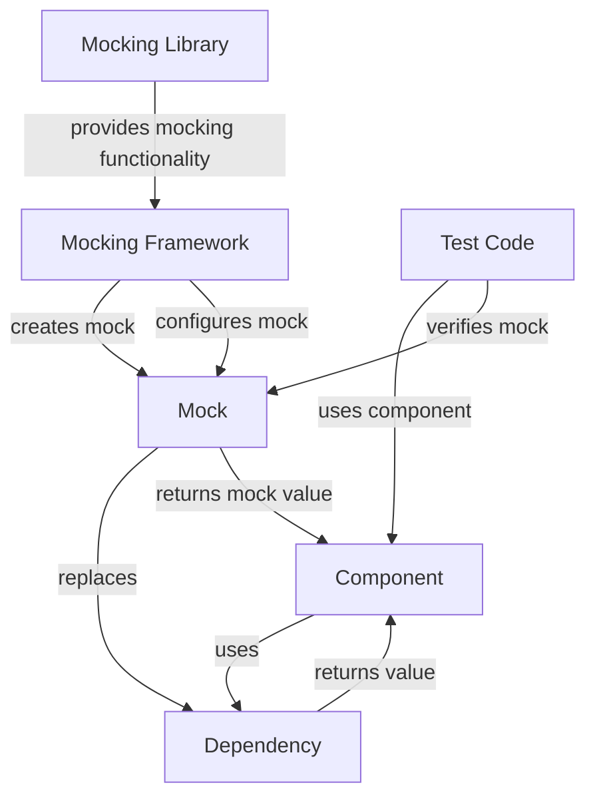

## Introduction
Unit testing is a crucial part of software development, ensuring that individual components of the codebase function as expected. However, when dealing with complex systems, unit testing can become challenging due to dependencies between components. This is where **mocking** comes into play. Mocking involves replacing dependencies with fake implementations, allowing for more efficient and effective testing. In this article, we will explore the concept of unit test mocking, its alternative approaches, and provide a performance comparison.

> **Note:** Mocking is not a replacement for integration testing, but rather a complementary technique to ensure that individual components work correctly.

## Core Concepts
To understand unit test mocking, we need to define some key terms:
* **Dependency**: a component that is required by another component to function correctly.
* **Mock**: a fake implementation of a dependency, used to isolate the component being tested.
* **Stub**: a simple mock that returns a predefined value.
* **Mock object**: a more complex mock that can be configured to behave in different ways.

> **Warning:** Overusing mocks can lead to **mockitis**, where the tests become too tightly coupled to the mock implementations, making it difficult to refactor the code.

## How It Works Internally
When using a mocking framework, the following steps occur:
1. **Create a mock**: the framework creates a fake implementation of the dependency.
2. **Configure the mock**: the test code configures the mock to behave in a specific way.
3. **Use the mock**: the component being tested uses the mock instead of the real dependency.
4. **Verify the mock**: the test code verifies that the mock was used correctly.

> **Tip:** Use a mocking framework that supports **auto-mocking**, which can automatically create mocks for dependencies.

## Code Examples
### Example 1: Basic Mocking with Mockito
```java
// Import Mockito library
import org.mockito.Mockito;

// Define the dependency interface
interface Dependency {
    String getValue();
}

// Define the component being tested
class Component {
    private Dependency dependency;

    public Component(Dependency dependency) {
        this.dependency = dependency;
    }

    public String getComponentValue() {
        return dependency.getValue();
    }
}

// Create a test class
public class ComponentTest {
    @Test
    public void testGetComponentValue() {
        // Create a mock dependency
        Dependency mockDependency = Mockito.mock(Dependency.class);

        // Configure the mock to return a value
        Mockito.when(mockDependency.getValue()).thenReturn("Mock Value");

        // Create the component being tested
        Component component = new Component(mockDependency);

        // Verify the component value
        assertEquals("Mock Value", component.getComponentValue());
    }
}
```

### Example 2: Real-World Pattern with Spring Boot
```java
// Import Spring Boot library
import org.springframework.boot.test.mock.mockito.MockBean;
import org.springframework.boot.test.context.SpringBootTest;

// Define the dependency interface
interface UserService {
    User getUser(Long id);
}

// Define the component being tested
@Service
class OrderService {
    @Autowired
    private UserService userService;

    public Order getOrder(Long id) {
        User user = userService.getUser(id);
        // ...
    }
}

// Create a test class
@SpringBootTest
public class OrderServiceTest {
    @MockBean
    private UserService userService;

    @Test
    public void testGetOrder() {
        // Configure the mock to return a user
        User user = new User(1L, "John Doe");
        when(userService.getUser(1L)).thenReturn(user);

        // Create the component being tested
        OrderService orderService = new OrderService();

        // Verify the order
        Order order = orderService.getOrder(1L);
        // ...
    }
}
```

### Example 3: Advanced Mocking with PowerMock
```java
// Import PowerMock library
import org.powermock.api.mockito.PowerMockito;

// Define the dependency class
class Dependency {
    public static String getValue() {
        return "Real Value";
    }
}

// Define the component being tested
class Component {
    public String getComponentValue() {
        return Dependency.getValue();
    }
}

// Create a test class
public class ComponentTest {
    @Test
    public void testGetComponentValue() {
        // Create a mock dependency
        PowerMockito.mockStatic(Dependency.class);

        // Configure the mock to return a value
        PowerMockito.when(Dependency.getValue()).thenReturn("Mock Value");

        // Create the component being tested
        Component component = new Component();

        // Verify the component value
        assertEquals("Mock Value", component.getComponentValue());
    }
}
```

## Visual Diagram

This diagram illustrates the relationship between the component being tested, the dependency, the mock, and the mocking framework.

## Comparison
| Approach | Time Complexity | Space Complexity | Pros | Cons | Best For |
| --- | --- | --- | --- | --- | --- |
| Mocking | O(1) | O(1) | Fast, efficient, and easy to use | Can be overused, leading to **mockitis** | Unit testing, integration testing |
| Stubbing | O(1) | O(1) | Simple and easy to implement | Limited functionality | Unit testing, simple dependencies |
| Faking | O(n) | O(n) | More realistic than mocking | Slower and more complex than mocking | Integration testing, complex dependencies |
| Test-Driven Development (TDD) | O(n) | O(n) | Ensures test coverage and design | Can be time-consuming and challenging | Complex systems, critical components |

## Real-world Use Cases
* **Netflix**: uses mocking to test its complex microservices architecture.
* **Amazon**: employs stubbing to test its e-commerce platform.
* **Google**: utilizes faking to test its complex machine learning algorithms.
* **Microsoft**: uses TDD to develop its Azure cloud platform.

## Common Pitfalls
* **Overusing mocks**: can lead to **mockitis**, making it difficult to refactor the code.
* **Insufficient test coverage**: can result in bugs and issues going undetected.
* **Incorrect mock configuration**: can lead to false positives or false negatives.
* **Not using a mocking framework**: can make mocking more complex and time-consuming.

> **Warning:** Be careful not to overuse mocks, as this can lead to **mockitis**.

## Interview Tips
* **What is mocking, and how does it work?**: The candidate should explain the concept of mocking, its benefits, and how it works internally.
* **How do you choose between mocking and stubbing?**: The candidate should discuss the pros and cons of each approach and provide examples of when to use each.
* **Can you give an example of a mocking framework?**: The candidate should provide a specific example of a mocking framework, such as Mockito or PowerMock.

> **Interview:** Be prepared to answer questions about mocking, stubbing, and faking, and provide examples of how you have used these techniques in the past.

## Key Takeaways
* Mocking is a powerful technique for unit testing and integration testing.
* Mocking frameworks, such as Mockito and PowerMock, can simplify the mocking process.
* Stubbing is a simpler alternative to mocking, but with limited functionality.
* Faking is a more realistic approach, but slower and more complex than mocking.
* TDD ensures test coverage and design, but can be time-consuming and challenging.
* Overusing mocks can lead to **mockitis**, making it difficult to refactor the code.
* Insufficient test coverage can result in bugs and issues going undetected.
* Incorrect mock configuration can lead to false positives or false negatives.