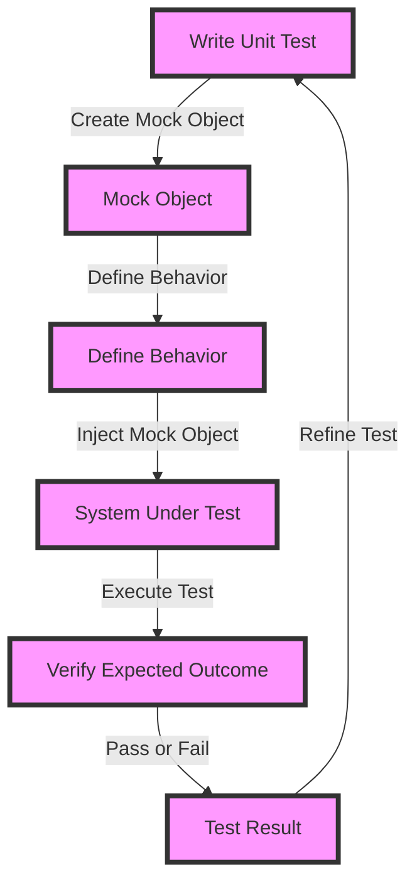

## Introduction
Unit testing is a crucial aspect of software development that ensures individual components of a system function as expected. However, writing reliable unit tests can be challenging, especially when dealing with complex systems that have multiple dependencies. **Mocking** is a technique used to isolate dependencies and make unit tests more efficient. In this section, we will explore the best practices for asserting reliable unit test mocking in production.

> **Note:** Mocking is not a replacement for integration testing. It's essential to write both unit tests and integration tests to ensure the overall quality of the system.

Unit testing is relevant in real-world scenarios, such as when working on a large-scale e-commerce platform. For instance, when developing a payment gateway, it's crucial to write unit tests to ensure that the payment processing logic is correct. Without reliable unit tests, bugs can go undetected, leading to financial losses and damage to the company's reputation.

## Core Concepts
To understand unit test mocking, it's essential to grasp the following core concepts:

* **Dependency injection**: a design pattern that allows components to be loosely coupled, making it easier to test and maintain the system.
* **Mock object**: a simulated object that mimics the behavior of a real object, used to isolate dependencies and make unit tests more efficient.
* **Test double**: a general term for mock objects, stubs, and fakes, used to replace dependencies in unit tests.

> **Tip:** When writing unit tests, it's essential to follow the **Arrange-Act-Assert** pattern: set up the test environment (arrange), execute the code being tested (act), and verify the expected outcome (assert).

## How It Works Internally
When using a mocking library, such as Mockito or Moq, the following steps occur internally:

1. **Create a mock object**: the mocking library creates a mock object that mimics the behavior of the real object.
2. **Define behavior**: the developer defines the behavior of the mock object, such as what methods to expect and what values to return.
3. **Inject mock object**: the mock object is injected into the system under test, replacing the real object.
4. **Execute test**: the unit test is executed, and the mock object is used to verify the expected behavior.

> **Warning:** Over-mocking can lead to **fragile tests**, which break when the system under test changes. It's essential to strike a balance between mocking and testing the real system.

## Code Examples
### Example 1: Basic Mocking
```java
// Import Mockito library
import org.mockito.Mockito;

// Define a simple class to test
public class Calculator {
    public int add(int a, int b) {
        return a + b;
    }
}

// Write a unit test using Mockito
public class CalculatorTest {
    @Test
    public void testAdd() {
        // Create a mock object
        Calculator calculator = Mockito.mock(Calculator.class);
        
        // Define behavior
        when(calculator.add(2, 3)).thenReturn(5);
        
        // Execute test
        int result = calculator.add(2, 3);
        assertEquals(5, result);
    }
}
```
### Example 2: Mocking a Dependency
```python
# Import the unittest library
import unittest
from unittest.mock import Mock

# Define a class to test
class PaymentGateway:
    def __init__(self, payment_processor):
        self.payment_processor = payment_processor
    
    def process_payment(self, amount):
        return self.payment_processor.charge(amount)

# Write a unit test using unittest.mock
class PaymentGatewayTest(unittest.TestCase):
    def test_process_payment(self):
        # Create a mock object
        payment_processor = Mock()
        
        # Define behavior
        payment_processor.charge.return_value = True
        
        # Create a payment gateway instance
        payment_gateway = PaymentGateway(payment_processor)
        
        # Execute test
        result = payment_gateway.process_payment(10)
        self.assertTrue(result)
```
### Example 3: Advanced Mocking with Stubbing
```typescript
// Import the jest library
import { jest } from '@jest/globals';

// Define a class to test
class UserService {
    private userRepository: UserRepository;
    
    constructor(userRepository: UserRepository) {
        this.userRepository = userRepository;
    }
    
    public async getUser(id: number): Promise<User> {
        return this.userRepository.findById(id);
    }
}

// Write a unit test using jest
describe('UserService', () => {
    it('should get a user by id', async () => {
        // Create a mock object
        const userRepository = jest.fn(() => ({
            findById: jest.fn(() => Promise.resolve({ id: 1, name: 'John Doe' })),
        }));
        
        // Create a user service instance
        const userService = new UserService(userRepository());
        
        // Execute test
        const user = await userService.getUser(1);
        expect(user).toEqual({ id: 1, name: 'John Doe' });
    });
});
```
## Visual Diagram

The diagram illustrates the process of writing a unit test, creating a mock object, defining its behavior, injecting it into the system under test, executing the test, and verifying the expected outcome.

## Comparison
| Approach | Time Complexity | Space Complexity | Pros | Cons | Best For |
| --- | --- | --- | --- | --- | --- |
| Mocking | O(1) | O(1) | Fast, efficient, and reliable | Can be overused, leading to fragile tests | Unit testing, integration testing |
| Stubbing | O(1) | O(1) | Fast and efficient | Limited to simple scenarios | Unit testing, integration testing |
| Faking | O(n) | O(n) | Realistic and comprehensive | Slow and resource-intensive | End-to-end testing, system testing |
| Integration Testing | O(n) | O(n) | Comprehensive and realistic | Slow and resource-intensive | End-to-end testing, system testing |

## Real-world Use Cases
* **Amazon**: uses mocking to test its e-commerce platform, ensuring that the payment processing logic is correct and efficient.
* **Google**: uses stubbing to test its search engine, verifying that the search results are accurate and relevant.
* **Microsoft**: uses faking to test its operating system, ensuring that the system is stable and secure.

## Common Pitfalls
* **Over-mocking**: using too many mock objects, leading to fragile tests that break when the system under test changes.
* **Under-mocking**: not using enough mock objects, leading to slow and resource-intensive tests.
* **Mocking the wrong dependency**: mocking the wrong dependency, leading to incorrect test results.
* **Not verifying the mock object**: not verifying the mock object, leading to incorrect test results.

> **Warning:** When using mocking, it's essential to verify the mock object to ensure that it's behaving as expected.

## Interview Tips
* **What is mocking, and how is it used in unit testing?**: A good answer should explain the concept of mocking, its benefits, and how it's used in unit testing.
* **How do you decide what to mock in a unit test?**: A good answer should explain the factors to consider when deciding what to mock, such as the complexity of the system under test and the dependencies involved.
* **What are some common pitfalls to avoid when using mocking?**: A good answer should explain the common pitfalls, such as over-mocking, under-mocking, and mocking the wrong dependency.

## Key Takeaways
* **Mocking is a powerful technique for unit testing**: it allows developers to isolate dependencies and make unit tests more efficient.
* **Mocking should be used judiciously**: it's essential to strike a balance between mocking and testing the real system.
* **Verification is key**: verifying the mock object is essential to ensure that it's behaving as expected.
* **Mocking libraries can simplify the process**: libraries like Mockito and Moq can simplify the process of creating and using mock objects.
* **Unit testing is just one part of the testing process**: it's essential to write both unit tests and integration tests to ensure the overall quality of the system.
* **Time complexity and space complexity are essential considerations**: when using mocking, it's essential to consider the time and space complexity of the tests.
* **Real-world examples can help illustrate the concept**: examples from companies like Amazon, Google, and Microsoft can help illustrate the concept of mocking and its benefits.
* **Common pitfalls should be avoided**: pitfalls like over-mocking, under-mocking, and mocking the wrong dependency should be avoided to ensure that the tests are reliable and efficient.