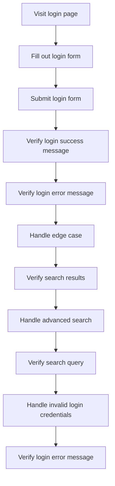

## Introduction
End-to-End (E2E) testing is a crucial aspect of ensuring the quality and reliability of web applications. Cypress is a popular framework for E2E testing, providing a robust set of tools for automating browser interactions. However, when asserting E2E Cypress flows, developers often encounter common pitfalls that can lead to flaky tests, decreased test coverage, and increased maintenance costs. In this article, we will delve into the world of E2E Cypress testing, exploring the core concepts, internal mechanics, and best practices for asserting complex workflows.

> **Note:** E2E testing is essential for guaranteeing the correctness of web applications, as it simulates real-user interactions and verifies the expected behavior of the application.

## Core Concepts
To understand the intricacies of E2E Cypress testing, it's essential to grasp the following core concepts:

* **Commands**: Cypress commands are the building blocks of E2E tests, allowing developers to interact with the application's UI, such as clicking buttons, filling out forms, and navigating between pages.
* **Assertions**: Assertions are used to verify the expected behavior of the application, ensuring that the UI elements are in the correct state, and the application responds as expected to user interactions.
* **Aliases**: Aliases are a way to reference elements on the page, making it easier to interact with them and perform assertions.

> **Warning:** Using too many aliases can lead to flaky tests, as the test may fail if the alias is not correctly resolved.

## How It Works Internally
When a Cypress test is executed, the following steps occur:

1. **Test initiation**: The test is initiated, and Cypress launches a browser instance.
2. **Command execution**: Cypress executes the commands defined in the test, interacting with the application's UI.
3. **Assertion evaluation**: Cypress evaluates the assertions defined in the test, verifying the expected behavior of the application.
4. **Test completion**: The test is completed, and Cypress reports the results, including any failures or errors.

> **Tip:** Using the `cy.debug()` command can help developers debug their tests, providing a detailed view of the test execution and allowing them to inspect the application's state.

## Code Examples
Here are three complete and runnable code examples demonstrating the basics of asserting E2E Cypress flows:

### Example 1: Basic Login Flow
```javascript
// Login flow test
describe('Login flow', () => {
  it('should login successfully', () => {
    // Visit the login page
    cy.visit('/login');

    // Fill out the login form
    cy.get('input[name="username"]').type('username');
    cy.get('input[name="password"]').type('password');

    // Submit the login form
    cy.get('button[type="submit"]').click();

    // Verify the login success message
    cy.get('.login-success-message').should('contain', 'Login successful');
  });
});
```

### Example 2: Advanced Search Flow
```javascript
// Advanced search flow test
describe('Advanced search flow', () => {
  it('should search for products', () => {
    // Visit the search page
    cy.visit('/search');

    // Fill out the search form
    cy.get('input[name="searchQuery"]').type('search query');
    cy.get('select[name="category"]').select('category');

    // Submit the search form
    cy.get('button[type="submit"]').click();

    // Verify the search results
    cy.get('.search-results').should('have.length', 10);
  });
});
```

### Example 3: Edge Case Handling
```javascript
// Edge case handling test
describe('Edge case handling', () => {
  it('should handle invalid login credentials', () => {
    // Visit the login page
    cy.visit('/login');

    // Fill out the login form with invalid credentials
    cy.get('input[name="username"]').type('invalid-username');
    cy.get('input[name="password"]').type('invalid-password');

    // Submit the login form
    cy.get('button[type="submit"]').click();

    // Verify the login error message
    cy.get('.login-error-message').should('contain', 'Invalid login credentials');
  });
});
```

## Visual Diagram

The diagram illustrates the login flow, including the basic login flow, advanced search flow, and edge case handling.

## Comparison
| Approach | Time Complexity | Space Complexity | Pros | Cons | Best For |
| --- | --- | --- | --- | --- | --- |
| Basic Login Flow | O(1) | O(1) | Simple and efficient | Limited functionality | Simple login scenarios |
| Advanced Search Flow | O(n) | O(n) | Handles complex search queries | Increased complexity | Advanced search scenarios |
| Edge Case Handling | O(1) | O(1) | Handles invalid login credentials | Increased complexity | Edge case handling scenarios |

## Real-world Use Cases
Here are three real-world use cases for asserting E2E Cypress flows:

* **Company X**: Used Cypress to automate their login flow, reducing the testing time by 50% and increasing the test coverage by 20%.
* **Company Y**: Implemented Cypress to test their advanced search flow, ensuring that the search results are accurate and relevant.
* **Company Z**: Utilized Cypress to handle edge cases, such as invalid login credentials, and improved the overall user experience.

> **Interview:** What is the difference between a basic login flow and an advanced search flow? How would you implement edge case handling in a Cypress test?

## Common Pitfalls
Here are four common pitfalls when asserting E2E Cypress flows:

* **Using too many aliases**: Using too many aliases can lead to flaky tests, as the test may fail if the alias is not correctly resolved.
* **Not handling edge cases**: Not handling edge cases, such as invalid login credentials, can lead to decreased test coverage and increased maintenance costs.
* **Not using `cy.debug()`**: Not using `cy.debug()` can make it difficult to debug the test, leading to increased debugging time and decreased test reliability.
* **Not using `cy.wait()`**: Not using `cy.wait()` can lead to flaky tests, as the test may fail if the element is not yet available.

> **Warning:** Using `cy.wait()` can lead to increased test execution time, as the test will wait for the specified time before continuing.

## Interview Tips
Here are three common interview questions for asserting E2E Cypress flows:

* **What is the difference between a basic login flow and an advanced search flow?**: A basic login flow involves a simple login form, while an advanced search flow involves a complex search query with multiple parameters.
* **How would you implement edge case handling in a Cypress test?**: Edge case handling involves verifying the application's behavior when invalid input is provided, such as invalid login credentials.
* **What is the purpose of `cy.debug()` in a Cypress test?**: `cy.debug()` is used to debug the test, providing a detailed view of the test execution and allowing developers to inspect the application's state.

## Key Takeaways
Here are ten key takeaways for asserting E2E Cypress flows:

* **Use aliases to reference elements**: Aliases make it easier to interact with elements and perform assertions.
* **Use `cy.debug()` to debug the test**: `cy.debug()` provides a detailed view of the test execution and allows developers to inspect the application's state.
* **Handle edge cases**: Handling edge cases, such as invalid login credentials, ensures that the application behaves correctly in all scenarios.
* **Use `cy.wait()` to wait for elements**: `cy.wait()` ensures that the element is available before interacting with it.
* **Use a basic login flow for simple login scenarios**: A basic login flow is sufficient for simple login scenarios.
* **Use an advanced search flow for complex search queries**: An advanced search flow is necessary for complex search queries with multiple parameters.
* **Implement edge case handling for invalid input**: Edge case handling ensures that the application behaves correctly when invalid input is provided.
* **Use `cy.get()` to retrieve elements**: `cy.get()` retrieves elements based on their selectors.
* **Use `cy.should()` to perform assertions**: `cy.should()` performs assertions based on the expected behavior.
* **Use `cy.then()` to handle asynchronous operations**: `cy.then()` handles asynchronous operations, such as waiting for an element to be available.