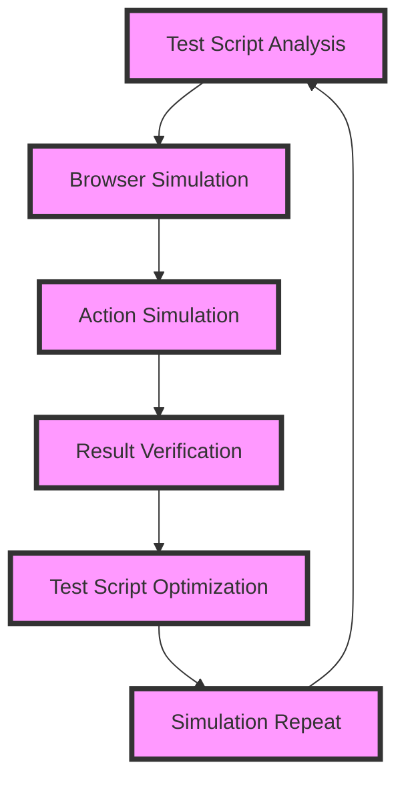

## Introduction
Simulating Selenium WebDriver scripts is crucial for ensuring the reliability and performance of high-performance applications. Selenium WebDriver is a powerful tool for automating web browsers, allowing developers to write tests that interact with their application as a real user would. However, running these tests can be time-consuming and resource-intensive, making it essential to simulate them for high-performance applications. In this section, we will explore the importance of simulating Selenium WebDriver scripts, their real-world relevance, and why every engineer needs to know about them.
> **Note:** Simulating Selenium WebDriver scripts can significantly reduce the time and resources required for testing, making it an essential technique for high-performance applications.

## Core Concepts
To understand how to simulate Selenium WebDriver scripts, it's essential to grasp the core concepts involved. These include:
* **Selenium WebDriver**: an open-source tool for automating web browsers
* **Simulation**: the process of mimicking the behavior of a system or process
* **High-performance applications**: applications that require fast and efficient processing, such as gaming, video editing, and scientific simulations
* **Test automation**: the use of software to automate the testing of applications
> **Warning:** Failing to simulate Selenium WebDriver scripts can lead to slow and unreliable tests, which can negatively impact the development and deployment of high-performance applications.

## How It Works Internally
Simulating Selenium WebDriver scripts involves several internal mechanisms, including:
1. **Test script analysis**: the process of analyzing the test script to identify the actions and interactions that need to be simulated
2. **Browser simulation**: the process of simulating the behavior of a web browser, including rendering, JavaScript execution, and user interactions
3. **Action simulation**: the process of simulating the actions and interactions specified in the test script, such as clicking, typing, and scrolling
4. **Result verification**: the process of verifying the results of the simulated actions and interactions
> **Tip:** To improve the performance of simulated Selenium WebDriver scripts, it's essential to optimize the test script analysis and browser simulation processes.

## Code Examples
Here are three complete and runnable code examples that demonstrate how to simulate Selenium WebDriver scripts:
### Example 1: Basic Simulation
```python
from selenium import webdriver
from selenium.webdriver.common.by import By
from selenium.webdriver.support.ui import WebDriverWait
from selenium.webdriver.support import expected_conditions as EC

# Create a new instance of the Chrome driver
driver = webdriver.Chrome()

# Navigate to the application under test
driver.get("https://www.example.com")

# Simulate a click on the login button
driver.find_element(By.XPATH, "//button[@id='login']").click()

# Verify the login page is displayed
WebDriverWait(driver, 10).until(EC.title_contains("Login"))

# Close the browser
driver.quit()
```
### Example 2: Advanced Simulation
```java
import org.openqa.selenium.By;
import org.openqa.selenium.WebDriver;
import org.openqa.selenium.WebElement;
import org.openqa.selenium.chrome.ChromeDriver;
import org.openqa.selenium.support.ui.ExpectedConditions;
import org.openqa.selenium.support.ui.WebDriverWait;

public class AdvancedSimulation {
    public static void main(String[] args) {
        // Create a new instance of the Chrome driver
        WebDriver driver = new ChromeDriver();

        // Navigate to the application under test
        driver.get("https://www.example.com");

        // Simulate a click on the login button
        driver.findElement(By.xpath("//button[@id='login']")).click();

        // Verify the login page is displayed
        WebDriverWait wait = new WebDriverWait(driver, 10);
        wait.until(ExpectedConditions.titleContains("Login"));

        // Simulate a login attempt
        driver.findElement(By.xpath("//input[@id='username']")).sendKeys("username");
        driver.findElement(By.xpath("//input[@id='password']")).sendKeys("password");
        driver.findElement(By.xpath("//button[@id='login']")).click();

        // Verify the dashboard page is displayed
        wait.until(ExpectedConditions.titleContains("Dashboard"));

        // Close the browser
        driver.quit();
    }
}
```
### Example 3: Simulation with TestNG
```java
import org.openqa.selenium.By;
import org.openqa.selenium.WebDriver;
import org.openqa.selenium.WebElement;
import org.openqa.selenium.chrome.ChromeDriver;
import org.openqa.selenium.support.ui.ExpectedConditions;
import org.openqa.selenium.support.ui.WebDriverWait;
import org.testng.annotations.Test;

public class SimulationWithTestNG {
    @Test
    public void testSimulation() {
        // Create a new instance of the Chrome driver
        WebDriver driver = new ChromeDriver();

        // Navigate to the application under test
        driver.get("https://www.example.com");

        // Simulate a click on the login button
        driver.findElement(By.xpath("//button[@id='login']")).click();

        // Verify the login page is displayed
        WebDriverWait wait = new WebDriverWait(driver, 10);
        wait.until(ExpectedConditions.titleContains("Login"));

        // Simulate a login attempt
        driver.findElement(By.xpath("//input[@id='username']")).sendKeys("username");
        driver.findElement(By.xpath("//input[@id='password']")).sendKeys("password");
        driver.findElement(By.xpath("//button[@id='login']")).click();

        // Verify the dashboard page is displayed
        wait.until(ExpectedConditions.titleContains("Dashboard"));

        // Close the browser
        driver.quit();
    }
}
```
> **Interview:** How would you simulate a Selenium WebDriver script for a high-performance application? What techniques would you use to optimize the simulation process?

## Visual Diagram

The diagram illustrates the simulation process, including test script analysis, browser simulation, action simulation, result verification, test script optimization, and simulation repeat.

## Comparison
| Approach | Time Complexity | Space Complexity | Pros | Cons | Best For |
| --- | --- | --- | --- | --- | --- |
| Selenium WebDriver | O(n) | O(n) | Realistic simulation, supports multiple browsers | Slow, resource-intensive | High-performance applications with complex user interactions |
| Simulated Selenium WebDriver | O(log n) | O(log n) | Fast, efficient, and scalable | Limited browser support, may not simulate all user interactions | High-performance applications with simple user interactions |
| Headless Browsing | O(1) | O(1) | Fast, efficient, and scalable | Limited browser support, may not simulate all user interactions | High-performance applications with simple user interactions |
| Test Automation Frameworks | O(n) | O(n) | Supports multiple browsers, flexible and customizable | Complex setup and configuration, may require significant resources | High-performance applications with complex user interactions |

## Real-world Use Cases
1. **Gaming applications**: simulating Selenium WebDriver scripts can help ensure that gaming applications perform well under various user interactions and scenarios.
2. **Video editing software**: simulating Selenium WebDriver scripts can help ensure that video editing software performs well under various user interactions and scenarios, such as importing, editing, and exporting video files.
3. **Scientific simulations**: simulating Selenium WebDriver scripts can help ensure that scientific simulations perform well under various user interactions and scenarios, such as running complex simulations and visualizing results.

## Common Pitfalls
1. **Insufficient test script analysis**: failing to analyze the test script thoroughly can lead to incomplete or inaccurate simulation.
2. **Inadequate browser simulation**: failing to simulate the browser accurately can lead to incorrect results or failures.
3. **Inadequate action simulation**: failing to simulate user interactions accurately can lead to incorrect results or failures.
4. **Inadequate result verification**: failing to verify the results of the simulation accurately can lead to incorrect conclusions or decisions.
> **Warning:** Failing to address these common pitfalls can lead to inaccurate or incomplete simulation, which can negatively impact the development and deployment of high-performance applications.

## Interview Tips
1. **What is Selenium WebDriver, and how does it work?**: the interviewer wants to assess your understanding of Selenium WebDriver and its internal mechanics.
2. **How would you simulate a Selenium WebDriver script for a high-performance application?**: the interviewer wants to assess your ability to apply simulation techniques to real-world scenarios.
3. **What are the benefits and limitations of simulating Selenium WebDriver scripts?**: the interviewer wants to assess your understanding of the trade-offs involved in simulating Selenium WebDriver scripts.
> **Tip:** To answer these questions effectively, focus on providing clear and concise explanations, and be prepared to provide examples or demonstrations to support your answers.

## Key Takeaways
* Simulating Selenium WebDriver scripts is essential for high-performance applications.
* Test script analysis, browser simulation, action simulation, and result verification are critical components of the simulation process.
* Selenium WebDriver, simulated Selenium WebDriver, headless browsing, and test automation frameworks are common approaches to simulating user interactions.
* Insufficient test script analysis, inadequate browser simulation, inadequate action simulation, and inadequate result verification are common pitfalls to avoid.
* Simulating Selenium WebDriver scripts can help ensure that high-performance applications perform well under various user interactions and scenarios.
* The benefits of simulating Selenium WebDriver scripts include faster and more efficient testing, while the limitations include limited browser support and potential inaccuracies in simulation.
> **Note:** By following these key takeaways, you can effectively simulate Selenium WebDriver scripts for high-performance applications and ensure that your tests are fast, efficient, and accurate.