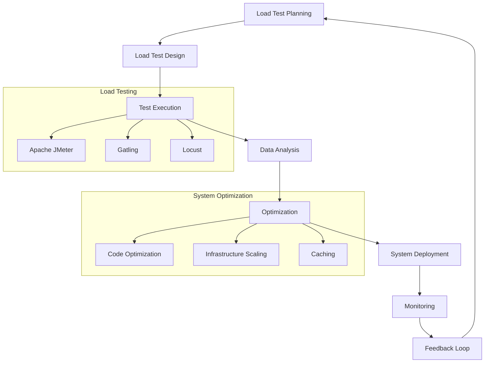

## Introduction
End-to-end load testing is a crucial aspect of ensuring the reliability and performance of software systems. It involves simulating a large number of users or requests to test the system's behavior under various loads, identifying potential bottlenecks, and optimizing its performance. In this guide, we will delve into the world of end-to-end load testing concurrency, exploring its importance, core concepts, and best practices. **Every engineer should understand** the significance of load testing, as it directly impacts the user experience and overall system reliability.

> **Note:** Load testing is often overlooked in the development process, but it's essential to ensure that the system can handle the expected traffic and usage.

## Core Concepts
To understand end-to-end load testing concurrency, we need to grasp the following key concepts:

* **Concurrency**: The ability of a system to handle multiple requests or tasks simultaneously.
* **Load testing**: The process of simulating a large number of users or requests to test the system's performance under various loads.
* **Throughput**: The rate at which the system can process requests or tasks.
* **Latency**: The time it takes for the system to respond to a request.
* **Scalability**: The ability of the system to handle increased loads without compromising performance.

> **Tip:** When designing a load testing strategy, consider the system's expected usage patterns, including peak hours, user behavior, and traffic spikes.

## How It Works Internally
End-to-end load testing concurrency involves simulating a large number of users or requests to test the system's behavior under various loads. Here's a step-by-step breakdown of the process:

1. **Test planning**: Identify the system's expected usage patterns, including peak hours, user behavior, and traffic spikes.
2. **Test design**: Create a test plan, including the types of tests to be performed, the number of users or requests, and the test duration.
3. **Test execution**: Execute the test plan using load testing tools, such as Apache JMeter or Gatling.
4. **Data analysis**: Analyze the test results, including throughput, latency, and error rates.
5. **Optimization**: Identify bottlenecks and optimize the system's performance based on the test results.

> **Warning:** Failing to properly plan and execute load tests can lead to inaccurate results, which can compromise the system's reliability and performance.

## Code Examples
Here are three complete and runnable code examples demonstrating end-to-end load testing concurrency:

### Example 1: Basic Load Testing using Apache JMeter
```java
import org.apache.jmeter.control.gui.TestPlanGui;
import org.apache.jmeter.engine.StandardJMeterEngine;
import org.apache.jmeter.protocol.http.control.Header;
import org.apache.jmeter.protocol.http.control.HeaderManager;
import org.apache.jmeter.protocol.http.gui.HeaderPanel;
import org.apache.jmeter.protocol.http.sampler.HTTPSamplerProxy;

public class BasicLoadTest {
    public static void main(String[] args) {
        // Create a new JMeter engine
        StandardJMeterEngine jmeter = new StandardJMeterEngine();

        // Create a new HTTP sampler
        HTTPSamplerProxy sampler = new HTTPSamplerProxy();
        sampler.setMethod("GET");
        sampler.setPath("/");

        // Create a new header manager
        HeaderManager headerManager = new HeaderManager();
        headerManager.addHeader(new Header("Accept", "application/json"));

        // Add the sampler and header manager to the test plan
        TestPlanGui testPlan = new TestPlanGui();
        testPlan.addTestElement(sampler);
        testPlan.addTestElement(headerManager);

        // Run the test plan
        jmeter.configure(testPlan);
        jmeter.run();
    }
}
```

### Example 2: Load Testing using Gatling
```scala
import io.gatling.core.Predef._
import io.gatling.http.Predef._

class LoadTest extends Simulation {
  val httpProtocol = http
    .baseUrl("https://example.com")
    .acceptHeader("application/json")

  val scn = scenario("Load Test")
    .exec(
      http("Get Request")
        .get("/")
        .headers(Map("Accept" -> "application/json"))
    )

  setUp(
    scn.inject(rampUsers(100) over 10)
  ).protocols(httpProtocol)
}
```

### Example 3: Advanced Load Testing using Locust
```python
from locust import HttpLocust, TaskSet, task

class LoadTest(TaskSet):
    @task
    def get_request(self):
        self.client.get("/")

class LoadTestLocust(HttpLocust):
    task_set = LoadTest
    min_wait = 0
    max_wait = 10
```

## Visual Diagram

This diagram illustrates the end-to-end load testing concurrency process, including test planning, design, execution, data analysis, optimization, and system deployment.

## Comparison
| Tool | Time Complexity | Space Complexity | Pros | Cons | Best For |
| --- | --- | --- | --- | --- | --- |
| Apache JMeter | O(n) | O(n) | Flexible, scalable, and extensible | Steep learning curve, resource-intensive | Large-scale load testing |
| Gatling | O(n) | O(n) | Easy to use, high-performance, and scalable | Limited support for protocols other than HTTP | Web application load testing |
| Locust | O(n) | O(n) | Easy to use, scalable, and extensible | Limited support for advanced features | Small- to medium-scale load testing |

> **Interview:** When asked about load testing tools, be prepared to discuss the pros and cons of each tool, including their time and space complexity, and provide examples of when to use each tool.

## Real-world Use Cases
Here are three real-world examples of end-to-end load testing concurrency:

1. **Amazon**: Amazon uses load testing to ensure that its e-commerce platform can handle massive traffic spikes during peak sales periods, such as Black Friday and Cyber Monday.
2. **Google**: Google uses load testing to optimize the performance of its search engine, ensuring that it can handle billions of search queries per day.
3. **Netflix**: Netflix uses load testing to ensure that its streaming service can handle large numbers of concurrent users, providing a seamless viewing experience for its subscribers.

## Common Pitfalls
Here are four common mistakes to avoid when performing end-to-end load testing concurrency:

1. **Insufficient test planning**: Failing to properly plan and design load tests can lead to inaccurate results and compromise the system's reliability.
2. **Inadequate test infrastructure**: Using inadequate test infrastructure, such as insufficient hardware or software resources, can limit the effectiveness of load tests.
3. **Inconsistent test execution**: Failing to execute load tests consistently can lead to variable results and make it difficult to identify trends and patterns.
4. **Inadequate data analysis**: Failing to properly analyze load test data can lead to missed opportunities for optimization and performance improvement.

> **Tip:** When performing load tests, ensure that you have a clear understanding of the system's expected usage patterns and that you are using the right tools and infrastructure for the job.

## Interview Tips
Here are three common interview questions related to end-to-end load testing concurrency, along with example answers:

1. **What is load testing, and why is it important?**
	* Weak answer: "Load testing is just about throwing a lot of traffic at a system to see if it breaks."
	* Strong answer: "Load testing is a critical aspect of ensuring the reliability and performance of software systems. It involves simulating a large number of users or requests to test the system's behavior under various loads, identifying potential bottlenecks, and optimizing its performance."
2. **How do you design a load testing strategy?**
	* Weak answer: "I just use a tool like Apache JMeter and throw a lot of traffic at the system."
	* Strong answer: "I start by understanding the system's expected usage patterns, including peak hours, user behavior, and traffic spikes. Then, I design a test plan that includes the types of tests to be performed, the number of users or requests, and the test duration. I also ensure that I have the right tools and infrastructure in place to execute the tests effectively."
3. **What are some common load testing tools, and when would you use each?**
	* Weak answer: "I just use Apache JMeter for all my load testing needs."
	* Strong answer: "There are several load testing tools available, each with its own strengths and weaknesses. Apache JMeter is a flexible and scalable tool that's well-suited for large-scale load testing. Gatling is a high-performance tool that's well-suited for web application load testing. Locust is a easy-to-use tool that's well-suited for small- to medium-scale load testing. The choice of tool depends on the specific needs of the project and the system being tested."

## Key Takeaways
Here are ten key takeaways to remember when performing end-to-end load testing concurrency:

* **Load testing is crucial for ensuring system reliability and performance**.
* **Understand the system's expected usage patterns** before designing a load testing strategy.
* **Choose the right load testing tool** for the job, considering factors such as scalability, ease of use, and support for protocols.
* **Design a comprehensive test plan** that includes the types of tests to be performed, the number of users or requests, and the test duration.
* **Execute load tests consistently** to ensure accurate and reliable results.
* **Analyze load test data thoroughly** to identify trends and patterns and optimize system performance.
* **Avoid common pitfalls**, such as insufficient test planning, inadequate test infrastructure, and inconsistent test execution.
* **Use load testing to identify bottlenecks** and optimize system performance.
* **Continuously monitor and optimize** the system to ensure that it can handle changing usage patterns and traffic spikes.
* **Use feedback loops** to refine the load testing strategy and improve system reliability and performance.