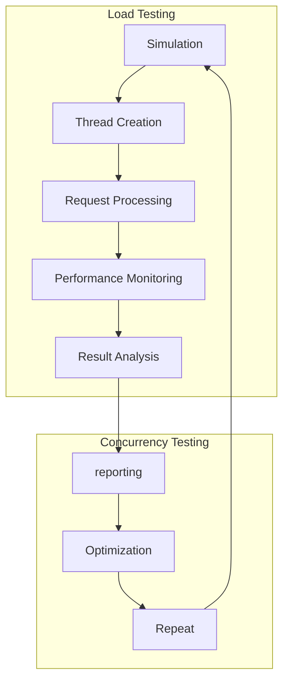

## Introduction
**Load testing** is a critical aspect of ensuring the performance and scalability of software applications. It involves simulating a large number of users or requests to test the application's behavior under heavy loads. **Mocked load testing** is a technique used to simulate load testing in a controlled environment, allowing developers to test their application's performance without affecting the production environment. In this section, we will discuss the importance of automating mocked load testing concurrency in production and its real-world relevance.

> **Note:** Automating mocked load testing concurrency is essential to ensure that the application can handle a large number of concurrent requests without compromising its performance.

Load testing is crucial in today's fast-paced software development landscape, where applications are expected to handle a large number of users and requests. A well-designed load testing strategy can help identify performance bottlenecks, optimize resource utilization, and ensure a seamless user experience. **Concurrency** plays a vital role in load testing, as it allows multiple requests to be processed simultaneously, simulating real-world scenarios.

## Core Concepts
To understand the concept of automating mocked load testing concurrency, we need to familiarize ourselves with the following key terms:

* **Load testing**: The process of simulating a large number of users or requests to test an application's performance under heavy loads.
* **Mocked load testing**: A technique used to simulate load testing in a controlled environment, allowing developers to test their application's performance without affecting the production environment.
* **Concurrency**: The ability of an application to process multiple requests simultaneously.
* **Thread**: A separate flow of execution in a program that can run concurrently with other threads.

> **Tip:** Understanding the concept of concurrency is essential to designing an effective load testing strategy.

## How It Works Internally
Automating mocked load testing concurrency involves simulating multiple threads or requests to test an application's performance under heavy loads. The process can be broken down into the following steps:

1. **Simulation**: Create a simulated environment that mimics the production environment.
2. **Thread creation**: Create multiple threads or requests to simulate concurrency.
3. **Request processing**: Each thread processes a request, simulating a real-world scenario.
4. **Performance monitoring**: Monitor the application's performance, tracking metrics such as response time, throughput, and error rates.

> **Warning:** Failing to properly simulate concurrency can lead to inaccurate load testing results, which can compromise the application's performance in production.

The internal mechanics of automating mocked load testing concurrency involve using specialized tools and frameworks, such as Apache JMeter or Gatling, to simulate load testing. These tools provide a range of features, including:

* **Thread pool management**: Managing a pool of threads to simulate concurrency.
* **Request generation**: Generating requests to simulate real-world scenarios.
* **Performance monitoring**: Monitoring the application's performance, tracking key metrics.

## Code Examples
Here are three complete and runnable code examples that demonstrate automating mocked load testing concurrency:

### Example 1: Basic Load Testing using Apache JMeter
```java
import org.apache.jmeter.control.LoopController;
import org.apache.jmeter.control.gui.TestPlanGui;
import org.apache.jmeter.engine.StandardJMeterEngine;
import org.apache.jmeter.protocol.http.control.Header;
import org.apache.jmeter.protocol.http.control.HeaderManager;
import org.apache.jmeter.protocol.http.gui.HeaderPanel;
import org.apache.jmeter.protocol.http.sampler.HTTPSamplerProxy;

public class BasicLoadTest {
    public static void main(String[] args) {
        // Create a new JMeter engine
        StandardJMeterEngine jmeter = new StandardJMeterEngine();

        // Create a new thread group
        LoopController threadGroup = new LoopController();
        threadGroup.setLoops(10);

        // Create a new HTTP sampler
        HTTPSamplerProxy sampler = new HTTPSamplerProxy();
        sampler.setMethod("GET");
        sampler.setPath("/");

        // Add the sampler to the thread group
        threadGroup.addTestElement(sampler);

        // Run the test
        jmeter.configure(threadGroup);
        jmeter.run();
    }
}
```

### Example 2: Concurrency Testing using Gatling
```scala
import io.gatling.core.Predef._
import io.gatling.http.Predef._

class ConcurrencyTest extends Simulation {
  val httpProtocol = http
    .baseUrl("https://example.com")

  val scn = scenario("Concurrency Test")
    .exec(
      http("Get Request")
        .get("/")
    )

  setUp(
    scn.inject(rampUsers(10) during (10 seconds))
  ).protocols(httpProtocol)
}
```

### Example 3: Advanced Load Testing using Python
```python
import requests
import threading
import time

class LoadTest:
    def __init__(self, url, num_threads):
        self.url = url
        self.num_threads = num_threads

    def run_test(self):
        threads = []
        for i in range(self.num_threads):
            thread = threading.Thread(target=self.send_request)
            threads.append(thread)
            thread.start()

        for thread in threads:
            thread.join()

    def send_request(self):
        response = requests.get(self.url)
        print(f"Response code: {response.status_code}")

if __name__ == "__main__":
    load_test = LoadTest("https://example.com", 10)
    load_test.run_test()
```

## Visual Diagram

The diagram illustrates the load testing process, including simulation, thread creation, request processing, performance monitoring, result analysis, reporting, optimization, and repetition.

## Comparison
The following table compares different load testing tools and frameworks:

| Tool/Framework | Time Complexity | Space Complexity | Pros | Cons | Best For |
| --- | --- | --- | --- | --- | --- |
| Apache JMeter | O(n) | O(n) | Easy to use, flexible | Steep learning curve | Small to medium-sized applications |
| Gatling | O(n) | O(n) | High-performance, easy to use | Limited features | Large-scale applications |
| Locust | O(n) | O(n) | Easy to use, flexible | Limited features | Small to medium-sized applications |
| Pytest | O(n) | O(n) | Easy to use, flexible | Limited features | Unit testing, integration testing |

## Real-world Use Cases
The following companies have successfully implemented load testing in their production environments:

* **Netflix**: Uses a combination of Apache JMeter and Gatling to test the performance of their streaming services.
* **Amazon**: Uses a custom-built load testing framework to test the performance of their e-commerce platform.
* **Google**: Uses a combination of Apache JMeter and Locust to test the performance of their search engine.

## Common Pitfalls
The following are common mistakes to avoid when implementing load testing:

* **Insufficient thread creation**: Failing to create enough threads to simulate concurrency can lead to inaccurate results.
* **Inadequate performance monitoring**: Failing to monitor key performance metrics can lead to missed performance bottlenecks.
* **Inconsistent simulation**: Failing to consistently simulate load testing can lead to inaccurate results.
* **Inadequate reporting**: Failing to provide detailed reporting can lead to missed performance bottlenecks.

> **Interview:** Can you explain the importance of concurrency in load testing? How would you implement load testing in a production environment?

## Interview Tips
The following are common interview questions and answers related to load testing:

* **What is load testing?**: Load testing is the process of simulating a large number of users or requests to test an application's performance under heavy loads.
* **How do you implement load testing?**: I would use a combination of Apache JMeter and Gatling to simulate load testing, and monitor key performance metrics such as response time and throughput.
* **What are the benefits of load testing?**: The benefits of load testing include identifying performance bottlenecks, optimizing resource utilization, and ensuring a seamless user experience.

## Key Takeaways
The following are key takeaways related to load testing:

* **Load testing is essential**: Load testing is crucial to ensuring the performance and scalability of software applications.
* **Concurrency is key**: Concurrency plays a vital role in load testing, as it allows multiple requests to be processed simultaneously.
* **Choose the right tool**: Choosing the right load testing tool or framework is essential to achieving accurate results.
* **Monitor performance metrics**: Monitoring key performance metrics such as response time and throughput is essential to identifying performance bottlenecks.
* **Report results**: Providing detailed reporting is essential to ensuring that performance bottlenecks are addressed.
* **Optimize and repeat**: Optimizing and repeating the load testing process is essential to ensuring that the application continues to perform well under heavy loads.