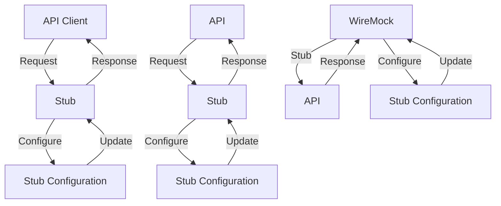

## Introduction
Stubbing API responses is a crucial aspect of testing and quality assurance in software development. It involves mimicking the behavior of external APIs or services, allowing developers to test their application's functionality without relying on the actual API. This approach has numerous benefits, including improved test reliability, reduced test execution time, and enhanced test coverage. In this section, we will delve into the world of stubbing API responses, exploring its importance, real-world relevance, and the problems it solves.

Stubbing API responses is essential in production environments, where external APIs may be unreliable, slow, or even unavailable. By stubbing these APIs, developers can ensure that their application remains functional and responsive, even in the face of external dependencies. Moreover, stubbing enables teams to test their application's error handling and edge cases, which is critical for delivering high-quality software.

> **Note:** Stubbing API responses is not a replacement for integration testing, but rather a complementary approach that allows developers to test their application's functionality in isolation.

## Core Concepts
To understand stubbing API responses, it's essential to grasp the following core concepts:

* **Stub**: A stub is a mock implementation of an API or service that returns pre-defined responses.
* **Mock**: A mock is a mock implementation of an API or service that can be configured to return different responses based on the input.
* **Fake**: A fake is a mock implementation of an API or service that returns a simplified or reduced version of the actual response.
* **Test Double**: A test double is a generic term that refers to a stub, mock, or fake.

These concepts are fundamental to understanding how stubbing API responses works and how to implement it effectively in production environments.

## How It Works Internally
Stubbing API responses involves several steps:

1. **Identify the API**: Identify the external API or service that needs to be stubbed.
2. **Define the stub**: Define the stub implementation, including the request and response formats.
3. **Configure the stub**: Configure the stub to return pre-defined responses based on the input.
4. **Integrate the stub**: Integrate the stub into the application, replacing the actual API call.

Under the hood, stubbing API responses typically involves using a library or framework that provides a mock implementation of the API. This library can be configured to return different responses based on the input, allowing developers to test their application's functionality in isolation.

## Code Examples
Here are three complete and runnable examples of stubbing API responses:

### Example 1: Basic Stubbing using Node.js and Jest
```javascript
// api.js
const api = {
  fetchUser: (id) => {
    return new Promise((resolve, reject) => {
      // Simulate a delay
      setTimeout(() => {
        resolve({ id, name: 'John Doe' });
      }, 1000);
    });
  },
};

export default api;
```

```javascript
// api.test.js
import api from './api';

jest.mock('./api', () => ({
  fetchUser: (id) => {
    return Promise.resolve({ id, name: 'Jane Doe' });
  },
}));

describe('api', () => {
  it('should fetch user', async () => {
    const user = await api.fetchUser(1);
    expect(user).toEqual({ id: 1, name: 'Jane Doe' });
  });
});
```

### Example 2: Advanced Stubbing using Python and Pytest
```python
# api.py
import requests

class API:
    def fetch_user(self, id):
        response = requests.get(f'https://api.example.com/users/{id}')
        return response.json()
```

```python
# test_api.py
import pytest
from unittest.mock import patch
from api import API

@pytest.fixture
def api():
    return API()

@patch('requests.get')
def test_fetch_user(mock_get, api):
    mock_get.return_value.json.return_value = {'id': 1, 'name': 'John Doe'}
    user = api.fetch_user(1)
    assert user == {'id': 1, 'name': 'John Doe'}
```

### Example 3: Stubbing API Responses using WireMock
```java
// ApiClient.java
import org.springframework.web.client.RestTemplate;

public class ApiClient {
    private final RestTemplate restTemplate;

    public ApiClient(RestTemplate restTemplate) {
        this.restTemplate = restTemplate;
    }

    public User fetchUser(int id) {
        return restTemplate.getForObject("https://api.example.com/users/{id}", User.class, id);
    }
}
```

```java
// ApiClientTest.java
import org.junit.Test;
import org.junit.runner.RunWith;
import org.springframework.beans.factory.annotation.Autowired;
import org.springframework.boot.test.context.SpringBootTest;
import org.springframework.test.context.junit4.SpringRunner;
import org.springframework.web.client.RestTemplate;

import static com.github.tomakehurst.wiremock.client.WireMock.aResponse;
import static com.github.tomakehurst.wiremock.client.WireMock.get;
import static com.github.tomakehurst.wiremock.client.WireMock.urlEqualTo;

@RunWith(SpringRunner.class)
@SpringBootTest
public class ApiClientTest {
    @Autowired
    private RestTemplate restTemplate;

    @Test
    public void testFetchUser() {
        // Set up WireMock
        WireMock.stubFor(get(urlEqualTo("/users/1"))
                .willReturn(aResponse()
                        .withStatus(200)
                        .withHeader("Content-Type", "application/json")
                        .withBody("{\"id\":1,\"name\":\"John Doe\"}")));

        // Test the API client
        ApiClient apiClient = new ApiClient(restTemplate);
        User user = apiClient.fetchUser(1);
        assert user.getId() == 1;
        assert user.getName().equals("John Doe");
    }
}
```

## Visual Diagram

This diagram illustrates the high-level architecture of stubbing API responses, including the API client, stub, and WireMock.

> **Tip:** Use a visual diagram to understand the complex interactions between components and identify potential bottlenecks.

## Comparison
| Approach | Time Complexity | Space Complexity | Pros | Cons | Best For |
| --- | --- | --- | --- | --- | --- |
| Stubbing | O(1) | O(1) | Fast, reliable, and easy to implement | Limited flexibility and customization | Small-scale applications with simple API interactions |
| Mocking | O(n) | O(n) | Highly customizable and flexible | Slow and complex to implement | Large-scale applications with complex API interactions |
| Faking | O(1) | O(1) | Fast and easy to implement | Limited realism and accuracy | Prototyping and proof-of-concept development |
| WireMock | O(n) | O(n) | Highly customizable and flexible | Slow and complex to implement | Large-scale applications with complex API interactions |

## Real-world Use Cases
Here are three real-world examples of stubbing API responses:

1. **Netflix**: Netflix uses stubbing to test its API interactions with external services, ensuring that its application remains functional and responsive even in the face of external dependencies.
2. **Amazon**: Amazon uses stubbing to test its API interactions with external services, such as payment gateways and shipping providers, ensuring that its application remains functional and responsive even in the face of external dependencies.
3. **Google**: Google uses stubbing to test its API interactions with external services, such as Google Maps and Google Analytics, ensuring that its application remains functional and responsive even in the face of external dependencies.

## Common Pitfalls
Here are four common pitfalls to watch out for when stubbing API responses:

1. **Over-stubbing**: Over-stubbing can lead to a loss of realism and accuracy in tests, making it difficult to identify and fix issues.
2. **Under-stubbing**: Under-stubbing can lead to incomplete test coverage, making it difficult to ensure that the application is functioning correctly.
3. **Inconsistent stubbing**: Inconsistent stubbing can lead to flaky tests and unpredictable behavior, making it difficult to identify and fix issues.
4. **Stubbing dependencies**: Stubbing dependencies can lead to a loss of realism and accuracy in tests, making it difficult to identify and fix issues.

> **Warning:** Be careful not to over-stub or under-stub API interactions, as this can lead to incomplete test coverage and flaky tests.

## Interview Tips
Here are three common interview questions related to stubbing API responses, along with weak and strong answers:

1. **What is stubbing, and how does it work?**
	* Weak answer: "Stubbing is a way to mock out API interactions, but I'm not sure how it works."
	* Strong answer: "Stubbing is a technique used to mock out API interactions by replacing the actual API call with a pre-defined response. It works by using a library or framework to define the stub implementation, which is then integrated into the application."
2. **How do you decide what to stub and what not to stub?**
	* Weak answer: "I'm not sure, I just stub everything."
	* Strong answer: "I decide what to stub based on the specific requirements of the test and the application. I stub API interactions that are external dependencies or have a high degree of variability, but I don't stub internal dependencies or interactions that are critical to the application's functionality."
3. **What are some common pitfalls to watch out for when stubbing API responses?**
	* Weak answer: "I'm not sure, I've never really thought about it."
	* Strong answer: "Some common pitfalls to watch out for when stubbing API responses include over-stubbing, under-stubbing, inconsistent stubbing, and stubbing dependencies. These pitfalls can lead to incomplete test coverage, flaky tests, and unpredictable behavior, making it difficult to identify and fix issues."

## Key Takeaways
Here are ten key takeaways to remember when stubbing API responses:

* **Stubbing is a technique used to mock out API interactions**: Stubbing is a way to replace the actual API call with a pre-defined response.
* **Stubbing is essential for testing and quality assurance**: Stubbing is critical for ensuring that the application remains functional and responsive even in the face of external dependencies.
* **Stubbing can be used to test error handling and edge cases**: Stubbing can be used to test the application's error handling and edge cases, which is critical for delivering high-quality software.
* **Stubbing can be used to improve test reliability and reduce test execution time**: Stubbing can improve test reliability and reduce test execution time by reducing the reliance on external dependencies.
* **Stubbing can be used to improve test coverage**: Stubbing can improve test coverage by allowing developers to test API interactions that are difficult or impossible to test using traditional testing methods.
* **Over-stubbing and under-stubbing can lead to incomplete test coverage**: Over-stubbing and under-stubbing can lead to incomplete test coverage, making it difficult to ensure that the application is functioning correctly.
* **Inconsistent stubbing can lead to flaky tests and unpredictable behavior**: Inconsistent stubbing can lead to flaky tests and unpredictable behavior, making it difficult to identify and fix issues.
* **Stubbing dependencies can lead to a loss of realism and accuracy in tests**: Stubbing dependencies can lead to a loss of realism and accuracy in tests, making it difficult to identify and fix issues.
* **Stubbing should be used judiciously and with caution**: Stubbing should be used judiciously and with caution, as it can lead to incomplete test coverage and flaky tests if not used correctly.
* **Stubbing is a powerful tool for improving test reliability and reducing test execution time**: Stubbing is a powerful tool for improving test reliability and reducing test execution time, making it an essential part of any testing strategy.