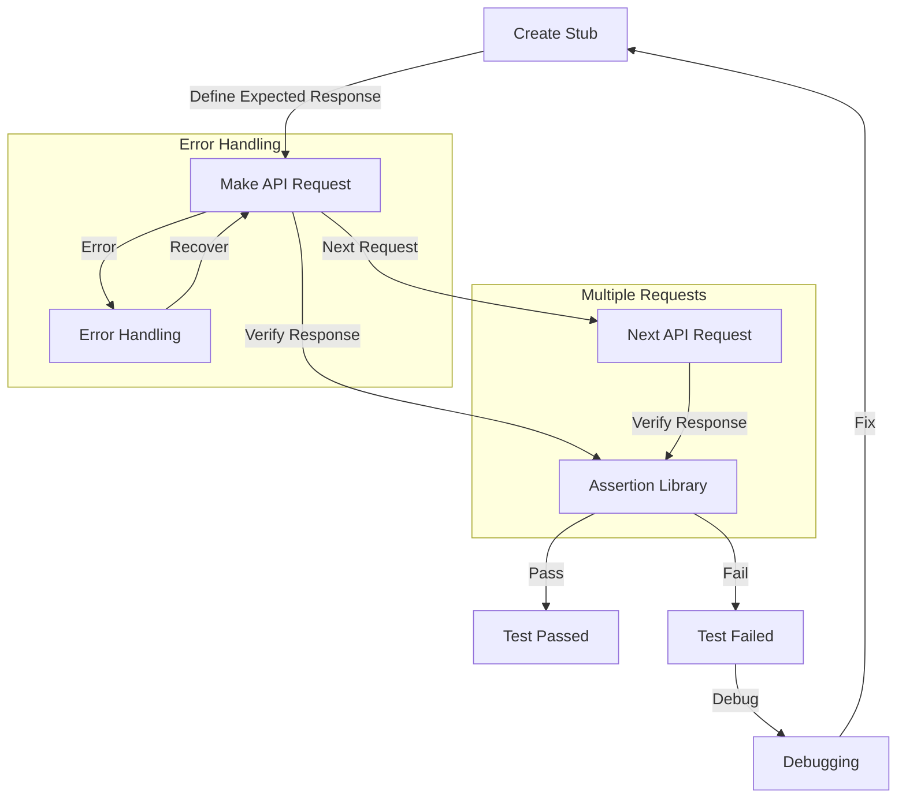

## Introduction
**Asserting Stubbing API responses** is a crucial aspect of testing high-performance applications. It involves verifying that the API responses are as expected, which is essential for ensuring the reliability and stability of the application. In this section, we will explore the importance of asserting stubbing API responses, its real-world relevance, and why every engineer should know about it. 
> **Note:** Asserting stubbing API responses is a critical step in the testing process, as it helps to identify and fix issues early on, reducing the risk of downstream problems.

In real-world scenarios, asserting stubbing API responses is essential for applications that rely heavily on external APIs. For instance, a payment gateway API may return a successful payment response, but the application must verify that the response is indeed valid and contains the expected data. Failure to do so can result in incorrect payment processing, leading to financial losses and damage to the application's reputation.

## Core Concepts
To understand asserting stubbing API responses, it's essential to grasp the following core concepts:
* **Stubbing**: The process of replacing an external dependency with a mock implementation, allowing the application to be tested in isolation.
* **API Response**: The data returned by an API in response to a request.
* **Assertion**: The act of verifying that the API response matches the expected result.

> **Tip:** When asserting stubbing API responses, it's essential to consider the **time complexity** of the assertion process, as it can impact the overall performance of the application. A well-implemented assertion process should have a time complexity of O(1), ensuring that it does not slow down the application.

Key terminology includes:
* **Mocking**: The process of creating a mock implementation of an external dependency.
* **Stub**: A mock implementation of an external dependency.
* **Assertion Library**: A library used to verify that the API response matches the expected result.

## How It Works Internally
Asserting stubbing API responses involves the following steps:
1. **Create a Stub**: Create a mock implementation of the external API.
2. **Define the Expected Response**: Define the expected API response, including the data and headers.
3. **Make the API Request**: Make the API request to the stubbed API.
4. **Verify the Response**: Verify that the API response matches the expected result using an assertion library.

> **Warning:** When asserting stubbing API responses, it's essential to ensure that the stubbed API is properly configured to return the expected response. Failure to do so can result in false positives or false negatives, leading to incorrect test results.

The under-the-hood mechanics of asserting stubbing API responses involve the use of **reflection** and **introspection** to verify the API response. The assertion library uses reflection to inspect the API response and verify that it matches the expected result.

## Code Examples
### Example 1: Basic Stubbing and Assertion
```javascript
const assert = require('assert');
const axios = require('axios');

// Create a stub for the external API
const stub = {
  get: (url) => {
    return Promise.resolve({
      status: 200,
      data: { id: 1, name: 'John Doe' },
    });
  },
};

// Define the expected response
const expectedResponse = {
  status: 200,
  data: { id: 1, name: 'John Doe' },
};

// Make the API request to the stubbed API
axios.get('https://api.example.com/users/1', { stub })
  .then((response) => {
    // Verify the response using the assertion library
    assert.deepStrictEqual(response, expectedResponse);
  })
  .catch((error) => {
    console.error(error);
  });
```
### Example 2: Advanced Stubbing and Assertion with Error Handling
```javascript
const assert = require('assert');
const axios = require('axios');

// Create a stub for the external API with error handling
const stub = {
  get: (url) => {
    if (url === 'https://api.example.com/users/1') {
      return Promise.resolve({
        status: 200,
        data: { id: 1, name: 'John Doe' },
      });
    } else {
      return Promise.reject({
        status: 404,
        message: 'Not Found',
      });
    }
  },
};

// Define the expected response
const expectedResponse = {
  status: 200,
  data: { id: 1, name: 'John Doe' },
};

// Make the API request to the stubbed API
axios.get('https://api.example.com/users/1', { stub })
  .then((response) => {
    // Verify the response using the assertion library
    assert.deepStrictEqual(response, expectedResponse);
  })
  .catch((error) => {
    console.error(error);
  });
```
### Example 3: Stubbing and Assertion with Multiple API Requests
```javascript
const assert = require('assert');
const axios = require('axios');

// Create a stub for the external API with multiple requests
const stub = {
  get: (url) => {
    if (url === 'https://api.example.com/users/1') {
      return Promise.resolve({
        status: 200,
        data: { id: 1, name: 'John Doe' },
      });
    } else if (url === 'https://api.example.com/users/2') {
      return Promise.resolve({
        status: 200,
        data: { id: 2, name: 'Jane Doe' },
      });
    } else {
      return Promise.reject({
        status: 404,
        message: 'Not Found',
      });
    }
  },
};

// Define the expected responses
const expectedResponses = [
  {
    status: 200,
    data: { id: 1, name: 'John Doe' },
  },
  {
    status: 200,
    data: { id: 2, name: 'Jane Doe' },
  },
];

// Make the API requests to the stubbed API
Promise.all([
  axios.get('https://api.example.com/users/1', { stub }),
  axios.get('https://api.example.com/users/2', { stub }),
])
  .then((responses) => {
    // Verify the responses using the assertion library
    assert.deepStrictEqual(responses, expectedResponses);
  })
  .catch((error) => {
    console.error(error);
  });
```
## Visual Diagram

The diagram illustrates the process of asserting stubbing API responses, including creating a stub, defining the expected response, making the API request, and verifying the response using an assertion library. It also shows the error handling and multiple requests subgraphs.

## Comparison
| Approach | Time Complexity | Space Complexity | Pros | Cons | Best For |
| --- | --- | --- | --- | --- | --- |
| Manual Stubbing | O(1) | O(1) | Easy to implement, flexible | Time-consuming, prone to errors | Small-scale applications |
| Automated Stubbing | O(n) | O(n) | Efficient, scalable | Complex setup, limited flexibility | Large-scale applications |
| Mocking Libraries | O(1) | O(1) | Easy to use, flexible | Limited control, dependencies | Medium-scale applications |
| API Simulation | O(n) | O(n) | Realistic simulation, flexible | Complex setup, resource-intensive | Large-scale applications |

## Real-world Use Cases
1. **Payment Gateway API**: A payment gateway API may return a successful payment response, but the application must verify that the response is indeed valid and contains the expected data.
2. **Social Media API**: A social media API may return a list of user profiles, but the application must verify that the response contains the expected data and is properly formatted.
3. **E-commerce API**: An e-commerce API may return a list of products, but the application must verify that the response contains the expected data and is properly formatted.

## Common Pitfalls
1. **Insufficient Error Handling**: Failing to handle errors properly can result in false positives or false negatives, leading to incorrect test results.
2. **Inadequate Stubbing**: Failing to properly stub the external API can result in incorrect test results or errors.
3. **Inconsistent Assertion**: Failing to consistently use the assertion library can result in incorrect test results or errors.
4. **Lack of Testing**: Failing to thoroughly test the application can result in errors or bugs going undetected.

> **Interview:** When asked about asserting stubbing API responses in an interview, be sure to mention the importance of proper error handling, adequate stubbing, and consistent assertion. Also, highlight the benefits of using mocking libraries and API simulation.

## Key Takeaways
* Asserting stubbing API responses is a critical step in the testing process.
* Proper error handling is essential for accurate test results.
* Adequate stubbing is necessary for realistic simulation.
* Consistent assertion is crucial for accurate test results.
* Mocking libraries and API simulation can simplify the testing process.
* Time complexity and space complexity should be considered when implementing asserting stubbing API responses.
* Real-world applications, such as payment gateway APIs, social media APIs, and e-commerce APIs, rely on asserting stubbing API responses for accurate and reliable results.