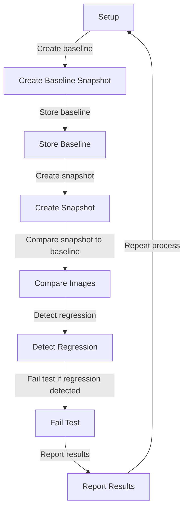

## Introduction
Visual regression testing is a crucial aspect of ensuring the quality and consistency of web applications. It involves taking snapshots of a web page's visual representation and comparing them to a baseline to detect any changes or regressions. This technique is essential in maintaining the integrity of a web application's user interface and user experience. In this section, we will delve into the world of visual regression testing, exploring its importance, real-world relevance, and the role it plays in the development of robust and reliable software systems.

Visual regression testing is not just a nicety, but a necessity in today's fast-paced software development landscape. With the ever-increasing complexity of web applications and the rapid pace of development, it is easy for visual regressions to sneak into the codebase, causing unexpected and unwanted changes to the user interface. By incorporating visual regression testing into the development workflow, developers can catch these regressions early on, ensuring that the application's visual representation remains consistent and stable.

> **Note:** Visual regression testing is not a replacement for traditional unit testing or integration testing, but rather a complementary technique that focuses on the visual aspects of the application.

## Core Concepts
Visual regression testing involves several key concepts, including:

* **Baseline**: A reference snapshot of the web page's visual representation, used as a basis for comparison.
* **Snapshot**: A screenshot of the web page's current visual representation, taken during testing.
* **Comparison**: The process of comparing the snapshot to the baseline to detect any changes or regressions.
* **Threshold**: A tolerance value used to determine whether a change is significant enough to be considered a regression.

Understanding these concepts is essential for implementing effective visual regression testing. By grasping the fundamentals of visual regression testing, developers can design and implement robust testing strategies that ensure the visual integrity of their web applications.

## How It Works Internally
Visual regression testing typically involves the following steps:

1. **Setup**: The testing framework is configured to take snapshots of the web page's visual representation.
2. **Baseline creation**: A baseline snapshot is created and stored for future comparison.
3. **Snapshot creation**: A new snapshot is taken during testing, representing the current visual state of the web page.
4. **Comparison**: The new snapshot is compared to the baseline using image comparison algorithms.
5. **Regression detection**: If the comparison reveals significant changes, a regression is detected, and the test fails.

Under the hood, visual regression testing frameworks use various image comparison algorithms, such as pixel-to-pixel comparison or perceptual hashing, to detect changes between the baseline and snapshot. These algorithms have different strengths and weaknesses, and the choice of algorithm depends on the specific use case and requirements.

> **Tip:** When choosing an image comparison algorithm, consider the trade-off between accuracy and performance. Pixel-to-pixel comparison is accurate but slow, while perceptual hashing is faster but less accurate.

## Code Examples
Here are three complete and runnable code examples demonstrating visual regression testing using different frameworks and techniques:

### Example 1: Basic Visual Regression Testing with Jest and Puppeteer
```javascript
const puppeteer = require('puppeteer');
const jest = require('jest');

describe('Visual Regression Test', () => {
  it('should match baseline', async () => {
    const browser = await puppeteer.launch();
    const page = await browser.newPage();
    await page.goto('https://example.com');
    const snapshot = await page.screenshot({ path: 'snapshot.png' });
    const baseline = await fs.readFileSync('baseline.png');
    const comparison = await compareImages(snapshot, baseline);
    expect(comparison).toBe(true);
    await browser.close();
  });
});
```

### Example 2: Visual Regression Testing with Selenium and OpenCV
```python
import cv2
from selenium import webdriver

def compare_images(image1, image2):
    # Read images
    img1 = cv2.imread(image1)
    img2 = cv2.imread(image2)
    
    # Convert to grayscale
    gray1 = cv2.cvtColor(img1, cv2.COLOR_BGR2GRAY)
    gray2 = cv2.cvtColor(img2, cv2.COLOR_BGR2GRAY)
    
    # Compare images
    diff = cv2.absdiff(gray1, gray2)
    return diff.mean() < 0.1

# Create baseline
driver = webdriver.Chrome()
driver.get('https://example.com')
driver.save_screenshot('baseline.png')
driver.quit()

# Create snapshot
driver = webdriver.Chrome()
driver.get('https://example.com')
driver.save_screenshot('snapshot.png')
driver.quit()

# Compare images
comparison = compare_images('snapshot.png', 'baseline.png')
print(comparison)
```

### Example 3: Advanced Visual Regression Testing with Cypress and ImageMagick
```javascript
const cypress = require('cypress');
const imagemagick = require('imagemagick');

describe('Visual Regression Test', () => {
  it('should match baseline', () => {
    cy.visit('https://example.com')
      .get('body')
      .screenshot('snapshot', { capture: 'fullPage' });
    const baseline = cy.fixture('baseline.png');
    const comparison = imagemagick.compareImages('snapshot.png', baseline);
    expect(comparison).toBe(true);
  });
});
```

## Visual Diagram

This diagram illustrates the visual regression testing process, from setting up the testing framework to reporting the results.

## Comparison
The following table compares different visual regression testing frameworks and techniques:

| Framework | Time Complexity | Space Complexity | Pros | Cons | Best For |
| --- | --- | --- | --- | --- | --- |
| Jest and Puppeteer | O(n) | O(n) | Easy to set up, fast | Limited to web applications | Web development |
| Selenium and OpenCV | O(n^2) | O(n^2) | Flexible, supports multiple browsers | Slow, resource-intensive | Cross-browser testing |
| Cypress and ImageMagick | O(n) | O(n) | Fast, easy to use | Limited to web applications, requires ImageMagick installation | Web development |

> **Warning:** When choosing a visual regression testing framework, consider the trade-off between time complexity, space complexity, and ease of use.

## Real-world Use Cases
Visual regression testing is used in various production environments, including:

* **Google**: Uses visual regression testing to ensure the consistency of its web applications, such as Google Search and Google Maps.
* **Amazon**: Employs visual regression testing to verify the visual integrity of its e-commerce platform, including product pages and shopping cart functionality.
* **Microsoft**: Utilizes visual regression testing to ensure the quality of its web applications, including Office Online and Outlook.com.

## Common Pitfalls
When implementing visual regression testing, common pitfalls include:

* **Insufficient baseline coverage**: Failing to cover all possible scenarios and edge cases in the baseline, leading to false positives or false negatives.
* **Incorrect threshold values**: Setting threshold values too high or too low, resulting in false positives or false negatives.
* **Ignoring environmental factors**: Failing to account for environmental factors, such as screen resolution, browser type, or operating system, which can affect the visual representation of the web page.
* **Not updating baselines**: Failing to update baselines regularly, leading to outdated and irrelevant baselines.

> **Tip:** Regularly review and update baselines to ensure they remain relevant and effective.

## Interview Tips
When interviewing for a position that involves visual regression testing, be prepared to answer questions such as:

* **What is visual regression testing, and how does it differ from traditional testing?**
	+ Weak answer: "Visual regression testing is just taking screenshots and comparing them."
	+ Strong answer: "Visual regression testing is a technique that involves taking snapshots of a web page's visual representation and comparing them to a baseline to detect any changes or regressions. It differs from traditional testing in that it focuses on the visual aspects of the application, rather than the functional aspects."
* **How do you handle false positives or false negatives in visual regression testing?**
	+ Weak answer: "I just ignore them."
	+ Strong answer: "I investigate the cause of the false positive or false negative and adjust the threshold values or update the baseline as needed to ensure accurate results."
* **What tools or frameworks do you use for visual regression testing, and why?**
	+ Weak answer: "I use whatever tool is available."
	+ Strong answer: "I use a combination of tools and frameworks, such as Jest and Puppeteer, or Selenium and OpenCV, depending on the specific requirements of the project. I choose these tools because they offer a good balance between ease of use, performance, and flexibility."

## Key Takeaways
Here are the key takeaways from this discussion on visual regression testing:

* **Visual regression testing is a crucial aspect of ensuring the quality and consistency of web applications**.
* **It involves taking snapshots of a web page's visual representation and comparing them to a baseline to detect any changes or regressions**.
* **Threshold values and baseline coverage are critical factors in visual regression testing**.
* **Visual regression testing frameworks and tools, such as Jest and Puppeteer, or Selenium and OpenCV, can be used to automate the testing process**.
* **Regularly reviewing and updating baselines is essential to ensure they remain relevant and effective**.
* **Visual regression testing is not a replacement for traditional testing, but rather a complementary technique that focuses on the visual aspects of the application**.
* **Time complexity and space complexity are important considerations when choosing a visual regression testing framework or tool**.
* **Environmental factors, such as screen resolution, browser type, or operating system, can affect the visual representation of the web page and should be accounted for in visual regression testing**.