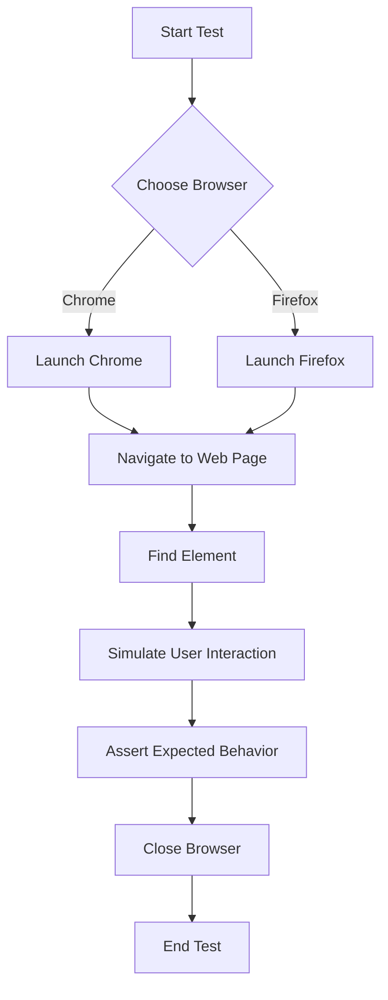

## Introduction
**Continuous Integration (CI) and Continuous Deployment (CD)** are crucial components of modern software development pipelines. One key aspect of ensuring the quality of web applications is **automated testing**, and **Selenium WebDriver** is a popular tool for this purpose. Selenium WebDriver is an open-source tool for automating web browsers, allowing developers to write tests that simulate user interactions with their applications. In this study guide, we will delve into the world of designing continuous systems with Selenium WebDriver scripts, exploring the core concepts, internal mechanics, and best practices for implementing these tests in a CI/CD pipeline.

## Core Concepts
To work effectively with Selenium WebDriver, it's essential to understand the following core concepts:
- **WebDriver**: The WebDriver API is the core interface for interacting with a browser. It provides methods for navigating to web pages, finding elements on a page, and simulating user interactions.
- **Test Automation Framework**: A test automation framework is a set of tools and libraries that help organize and execute automated tests. Popular frameworks for Selenium WebDriver include TestNG and JUnit.
- **Page Object Model (POM)**: The Page Object Model is a design pattern used in test automation to separate the test logic from the implementation details of the page. It helps to make tests more maintainable and easier to understand.
- **Element Locators**: Element locators are used to identify elements on a web page. Common locators include `id`, `name`, `xpath`, and `cssSelector`.

## How It Works Internally
When you run a Selenium WebDriver test, the following steps occur:
1. **Test Initialization**: The test automation framework initializes the test environment, including setting up the WebDriver instance and loading the test data.
2. **Browser Launch**: The WebDriver launches a browser instance, which can be a local browser or a remote browser in a cloud-based testing environment.
3. **Page Navigation**: The WebDriver navigates to the web page under test using the `get()` method.
4. **Element Location**: The WebDriver uses element locators to find elements on the page, such as buttons, text fields, or links.
5. **Action Simulation**: The WebDriver simulates user interactions with the elements, such as clicking buttons or entering text into text fields.
6. **Assertion**: The test asserts that the expected behavior occurred, such as verifying that a certain element is displayed or that a specific error message is shown.

> **Note:** Selenium WebDriver supports multiple programming languages, including Java, Python, Ruby, and C#.

## Code Examples
### Example 1: Basic Selenium WebDriver Test
```java
import org.openqa.selenium.By;
import org.openqa.selenium.WebDriver;
import org.openqa.selenium.WebElement;
import org.openqa.selenium.chrome.ChromeDriver;

public class BasicTest {
    public static void main(String[] args) {
        // Set up the WebDriver instance
        System.setProperty("webdriver.chrome.driver", "/path/to/chromedriver");
        WebDriver driver = new ChromeDriver();

        // Navigate to the web page
        driver.get("https://www.example.com");

        // Find an element on the page
        WebElement element = driver.findElement(By.name("q"));

        // Simulate user interaction
        element.sendKeys("Selenium WebDriver");

        // Close the browser
        driver.quit();
    }
}
```

### Example 2: Page Object Model (POM) Test
```java
import org.openqa.selenium.By;
import org.openqa.selenium.WebDriver;
import org.openqa.selenium.WebElement;
import org.openqa.selenium.chrome.ChromeDriver;

public class HomePage {
    private WebDriver driver;

    public HomePage(WebDriver driver) {
        this.driver = driver;
    }

    public void searchFor(String query) {
        // Find the search box element
        WebElement searchBox = driver.findElement(By.name("q"));

        // Enter the search query
        searchBox.sendKeys(query);

        // Submit the search form
        driver.findElement(By.name("btnK")).click();
    }
}

public class SearchTest {
    public static void main(String[] args) {
        // Set up the WebDriver instance
        System.setProperty("webdriver.chrome.driver", "/path/to/chromedriver");
        WebDriver driver = new ChromeDriver();

        // Navigate to the web page
        driver.get("https://www.example.com");

        // Create a HomePage object
        HomePage homePage = new HomePage(driver);

        // Search for a query
        homePage.searchFor("Selenium WebDriver");

        // Close the browser
        driver.quit();
    }
}
```

### Example 3: Advanced Selenium WebDriver Test with TestNG
```java
import org.openqa.selenium.By;
import org.openqa.selenium.WebDriver;
import org.openqa.selenium.WebElement;
import org.openqa.selenium.chrome.ChromeDriver;
import org.testng.annotations.Test;

public class AdvancedTest {
    private WebDriver driver;

    @Test
    public void testLogin() {
        // Set up the WebDriver instance
        System.setProperty("webdriver.chrome.driver", "/path/to/chromedriver");
        driver = new ChromeDriver();

        // Navigate to the web page
        driver.get("https://www.example.com/login");

        // Find the username and password fields
        WebElement usernameField = driver.findElement(By.name("username"));
        WebElement passwordField = driver.findElement(By.name("password"));

        // Enter the username and password
        usernameField.sendKeys("username");
        passwordField.sendKeys("password");

        // Submit the login form
        driver.findElement(By.name("login")).click();

        // Verify that the login was successful
        WebElement welcomeMessage = driver.findElement(By.xpath("//p[text()='Welcome, username!']"));
        assert welcomeMessage.isDisplayed();

        // Close the browser
        driver.quit();
    }
}
```

> **Warning:** Always ensure that the WebDriver instance is properly closed after the test is completed to avoid resource leaks.

## Visual Diagram

This diagram illustrates the basic steps involved in running a Selenium WebDriver test.

## Comparison
| Framework | Test Automation | Page Object Model | Element Locators | Browser Support |
| --- | --- | --- | --- | --- |
| TestNG | Yes | Yes | id, name, xpath, cssSelector | Chrome, Firefox, Edge |
| JUnit | Yes | Yes | id, name, xpath, cssSelector | Chrome, Firefox, Edge |
| Pytest | Yes | Yes | id, name, xpath, cssSelector | Chrome, Firefox, Edge |
| Unittest | Yes | No | id, name, xpath, cssSelector | Chrome, Firefox, Edge |

> **Tip:** When choosing a test automation framework, consider the level of support for page object models and element locators.

## Real-world Use Cases
1. **Google**: Google uses Selenium WebDriver to test its web applications, including Google Search and Google Maps.
2. **Amazon**: Amazon uses Selenium WebDriver to test its e-commerce platform, including the shopping cart and checkout process.
3. **Facebook**: Facebook uses Selenium WebDriver to test its web applications, including the news feed and messaging system.

## Common Pitfalls
1. **Incorrect Element Locators**: Using incorrect element locators can lead to test failures.
```java
// Incorrect element locator
WebElement element = driver.findElement(By.name(" incorrectName"));
```
```java
// Correct element locator
WebElement element = driver.findElement(By.name("correctName"));
```
2. **Insufficient Wait Times**: Insufficient wait times can lead to test failures due to slow page loading.
```java
// Insufficient wait time
driver.get("https://www.example.com");
WebElement element = driver.findElement(By.name("-element"));
```
```java
// Sufficient wait time
driver.get("https://www.example.com");
WebDriverWait wait = new WebDriverWait(driver, 10);
WebElement element = wait.until(ExpectedConditions.elementToBeClickable(By.name("element")));
```
3. **Browser Version Incompatibility**: Using an incompatible browser version can lead to test failures.
```java
// Incompatible browser version
System.setProperty("webdriver.chrome.driver", "/path/to/chromedriver");
driver = new ChromeDriver();
```
```java
// Compatible browser version
System.setProperty("webdriver.chrome.driver", "/path/to/chromedriver");
DesiredCapabilities capabilities = DesiredCapabilities.chrome();
capabilities.setVersion("compatibleVersion");
driver = new ChromeDriver(capabilities);
```
4. **Test Data Management**: Poor test data management can lead to test failures due to incorrect or missing test data.
```java
// Poor test data management
String testData = "incorrectData";
```
```java
// Good test data management
String testData = "correctData";
```

> **Interview:** When asked about common pitfalls in Selenium WebDriver testing, be sure to mention incorrect element locators, insufficient wait times, browser version incompatibility, and poor test data management.

## Interview Tips
1. **What is Selenium WebDriver?**: Be prepared to explain the basics of Selenium WebDriver, including its purpose, benefits, and limitations.
2. **How do you handle element locators?**: Be prepared to discuss the different types of element locators, including id, name, xpath, and cssSelector.
3. **What is the Page Object Model?**: Be prepared to explain the Page Object Model, including its benefits and how it is used in Selenium WebDriver testing.

## Key Takeaways
* **Selenium WebDriver is a powerful tool for automating web browsers**: It provides a flexible and efficient way to test web applications.
* **The Page Object Model is a design pattern used in test automation**: It helps to separate the test logic from the implementation details of the page.
* **Element locators are used to identify elements on a web page**: Common locators include id, name, xpath, and cssSelector.
* **Wait times are crucial in Selenium WebDriver testing**: Insufficient wait times can lead to test failures due to slow page loading.
* **Browser version incompatibility can lead to test failures**: Using an incompatible browser version can cause tests to fail.
* **Test data management is critical in Selenium WebDriver testing**: Poor test data management can lead to test failures due to incorrect or missing test data.
* **Selenium WebDriver supports multiple programming languages**: Including Java, Python, Ruby, and C#.
* **The WebDriver API is the core interface for interacting with a browser**: It provides methods for navigating to web pages, finding elements on a page, and simulating user interactions.