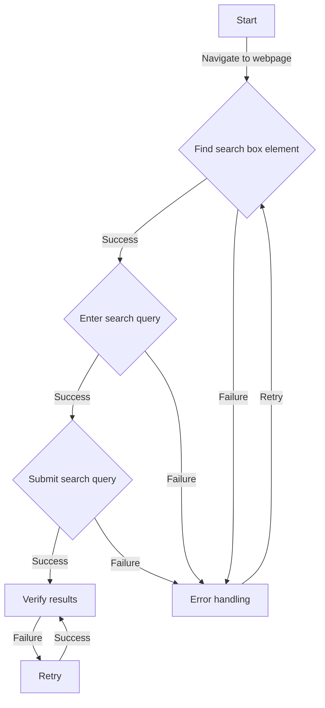

## Introduction
**Selenium WebDriver** is an open-source tool for automating web browsers, widely used in the testing and quality assurance (QA) industry. However, as the complexity of web applications increases, the performance of Selenium WebDriver scripts becomes a bottleneck. In this study, we will explore alternative approaches to Selenium WebDriver and compare their performance. We will delve into the core concepts, internal mechanics, and provide code examples to demonstrate the differences.

Selenium WebDriver scripts are widely used in production environments, but they can be slow and brittle. For instance, a simple test case that involves navigating to a webpage, filling out a form, and submitting it can take several seconds to execute. This can lead to long test suites and slow feedback loops. Alternative approaches, such as **Cypress** and **Playwright**, promise to improve performance and reliability. In this study, we will compare the performance of Selenium WebDriver scripts with these alternative approaches.

## Core Concepts
**Selenium WebDriver** is a protocol that allows you to automate web browsers. It provides a programming interface to interact with web pages, allowing you to write test cases that simulate user interactions. **Cypress**, on the other hand, is a JavaScript-based testing framework that uses a different approach to automate web browsers. Instead of using a protocol like Selenium WebDriver, Cypress uses a combination of browser extensions and JavaScript libraries to interact with web pages. **Playwright** is another alternative that uses a similar approach to Cypress.

> **Note:** The key difference between Selenium WebDriver and alternative approaches like Cypress and Playwright is the way they interact with web browsers. Selenium WebDriver uses a protocol, while Cypress and Playwright use a combination of browser extensions and JavaScript libraries.

## How It Works Internally
Selenium WebDriver scripts work by sending commands to a web browser through a protocol. The protocol is implemented by a **WebDriver** server, which receives commands from the test case and executes them on the web browser. The WebDriver server is responsible for managing the browser instance, navigating to web pages, and interacting with web elements.

Cypress, on the other hand, uses a **browser extension** to interact with web pages. The browser extension is installed in the web browser and provides a programming interface to interact with web pages. Cypress also uses a **JavaScript library** to simulate user interactions and verify the behavior of web pages.

Playwright uses a similar approach to Cypress, but with some key differences. Playwright uses a **browser instance** to interact with web pages, instead of a browser extension. This allows Playwright to provide more control over the browser instance and improve performance.

## Code Examples
### Example 1: Basic Selenium WebDriver Script
```java
import org.openqa.selenium.By;
import org.openqa.selenium.WebDriver;
import org.openqa.selenium.WebElement;
import org.openqa.selenium.chrome.ChromeDriver;

public class SeleniumExample {
    public static void main(String[] args) {
        // Create a new instance of the Chrome driver
        WebDriver driver = new ChromeDriver();

        // Navigate to the webpage
        driver.get("https://www.example.com");

        // Find the search box element
        WebElement searchBox = driver.findElement(By.name("q"));

        // Enter the search query
        searchBox.sendKeys("Selenium WebDriver");

        // Submit the search query
        searchBox.submit();

        // Close the browser instance
        driver.quit();
    }
}
```

### Example 2: Cypress Test Case
```javascript
describe('Example Test Case', () => {
    it('should navigate to the webpage and submit the search query', () => {
        // Navigate to the webpage
        cy.visit('https://www.example.com');

        // Find the search box element
        cy.get('input[name="q"]').type('Cypress');

        // Submit the search query
        cy.get('input[name="q"]').submit();
    });
});
```

### Example 3: Playwright Test Case
```javascript
const playwright = require('playwright');

(async () => {
    // Launch the browser instance
    const browser = await playwright.chromium.launch();

    // Create a new browser context
    const context = await browser.newContext();

    // Create a new page instance
    const page = await context.newPage();

    // Navigate to the webpage
    await page.goto('https://www.example.com');

    // Find the search box element
    const searchBox = await page.$('input[name="q"]');

    // Enter the search query
    await searchBox.type('Playwright');

    // Submit the search query
    await searchBox.submit();

    // Close the browser instance
    await browser.close();
})();
```

## Visual Diagram

This diagram illustrates the basic flow of a test case that navigates to a webpage, finds the search box element, enters a search query, submits the search query, and verifies the results.

## Comparison
| Approach | Time Complexity | Space Complexity | Pros | Cons | Best For |
| --- | --- | --- | --- | --- | --- |
| Selenium WebDriver | O(n) | O(n) | Wide support for browsers and programming languages | Slow and brittle | Legacy systems and complex web applications |
| Cypress | O(1) | O(1) | Fast and reliable, easy to use | Limited support for browsers and programming languages | Modern web applications and JavaScript-based systems |
| Playwright | O(1) | O(1) | Fast and reliable, flexible and customizable | Limited support for browsers and programming languages | Modern web applications and JavaScript-based systems |

> **Warning:** Selenium WebDriver can be slow and brittle, while Cypress and Playwright are faster and more reliable. However, Selenium WebDriver has wider support for browsers and programming languages.

## Real-world Use Cases
1. **Google**: Google uses Selenium WebDriver for testing its web applications, but has also started using Cypress and Playwright for newer projects.
2. **Amazon**: Amazon uses Selenium WebDriver for testing its web applications, but has also developed its own testing framework based on Cypress.
3. **Microsoft**: Microsoft uses Playwright for testing its web applications, including the Microsoft Edge browser.

> **Tip:** When choosing an approach, consider the complexity of your web application, the programming languages you use, and the browsers you support.

## Common Pitfalls
1. **Using Selenium WebDriver for simple test cases**: Selenium WebDriver can be overkill for simple test cases. Cypress and Playwright are better suited for simple test cases.
2. **Not using browser extensions**: Browser extensions can improve the performance and reliability of your test cases. Cypress and Playwright use browser extensions to interact with web pages.
3. **Not handling errors properly**: Errors can occur during test execution. Make sure to handle errors properly to avoid test failures.
4. **Not using retries**: Retries can improve the reliability of your test cases. Use retries to handle temporary errors and improve test reliability.

## Interview Tips
1. **What is the difference between Selenium WebDriver and Cypress?**: Selenium WebDriver uses a protocol to interact with web browsers, while Cypress uses a combination of browser extensions and JavaScript libraries.
2. **How does Playwright improve performance?**: Playwright uses a browser instance to interact with web pages, instead of a browser extension. This allows Playwright to provide more control over the browser instance and improve performance.
3. **What are the pros and cons of using Selenium WebDriver?**: Selenium WebDriver has wide support for browsers and programming languages, but can be slow and brittle.

> **Interview:** When answering interview questions, make sure to provide specific examples and explain the trade-offs between different approaches.

## Key Takeaways
* Selenium WebDriver is a protocol that allows you to automate web browsers.
* Cypress and Playwright are alternative approaches that use browser extensions and JavaScript libraries to interact with web pages.
* Selenium WebDriver can be slow and brittle, while Cypress and Playwright are faster and more reliable.
* Cypress and Playwright have limited support for browsers and programming languages.
* Playwright uses a browser instance to interact with web pages, instead of a browser extension.
* Retries can improve the reliability of your test cases.
* Error handling is crucial to avoid test failures.
* Browser extensions can improve the performance and reliability of your test cases.
* Consider the complexity of your web application, the programming languages you use, and the browsers you support when choosing an approach.