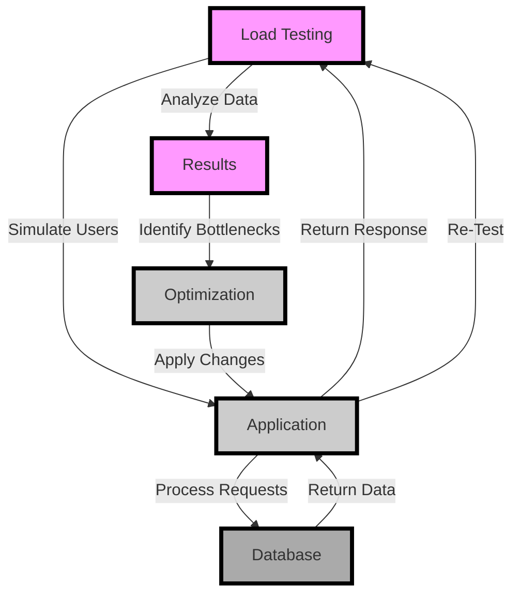

## Introduction
Load testing is a crucial step in ensuring the performance and scalability of high-performance applications. It involves simulating a large number of users or requests to measure the application's response time, throughput, and overall performance under heavy loads. **Verifying load testing concurrency** is essential to guarantee that the application can handle multiple requests simultaneously without significant performance degradation. In this article, we will delve into the world of load testing, exploring its core concepts, internal mechanics, and providing code examples to demonstrate its implementation.

> **Note:** Load testing is often confused with stress testing, but they serve different purposes. Load testing aims to measure the application's performance under normal and expected loads, while stress testing pushes the application to its limits to identify the breaking point.

## Core Concepts
To understand load testing, we need to familiarize ourselves with the following key concepts:

* **Concurrency**: The ability of an application to handle multiple requests simultaneously.
* **Throughput**: The rate at which an application can process requests.
* **Response Time**: The time it takes for an application to respond to a request.
* **Load**: The amount of work or requests an application is handling at a given time.

> **Tip:** When designing a load testing strategy, it's essential to consider the application's expected load and concurrency requirements to ensure accurate testing.

## How It Works Internally
Load testing involves simulating a large number of users or requests to measure the application's performance. Here's a step-by-step breakdown of the process:

1. **Test Planning**: Identify the testing goals, target audience, and expected load.
2. **Test Environment Setup**: Configure the test environment, including the load testing tool, application, and infrastructure.
3. **Test Execution**: Run the load test, simulating the desired number of users or requests.
4. **Data Analysis**: Collect and analyze the test data to identify performance bottlenecks and areas for improvement.

> **Warning:** Insufficient test planning and environment setup can lead to inaccurate test results and wasted resources.

## Code Examples
Here are three complete and runnable code examples demonstrating load testing using different tools and programming languages:

### Example 1: Basic Load Testing using Python and Locust
```python
from locust import HttpLocust, TaskSet, task

class UserBehavior(TaskSet):
    @task
    def index(self):
        self.client.get("/")

class WebsiteUser(HttpLocust):
    task_set = UserBehavior
    min_wait = 5000
    max_wait = 9000
```
This example uses Locust, a Python-based load testing tool, to simulate a simple website user.

### Example 2: Load Testing using Java and Gatling
```java
import io.gatling.javaapi.core.*;
import io.gatling.javaapi.http.*;

public class LoadTest extends Simulation {
    private static final HttpProtocolBuilder httpProtocol =
            http.protocol()
                    .baseUrl("https://example.com")
                    .acceptHeader("application/json");

    private static final ScenarioBuilder scn =
            scenario("Load Test")
                    .exec(
                            http("Get Index")
                                    .get("/")
                    );

    {
        setUp(
                scn.injectOpen(
                        nothingFor(4),
                        atOnceUsers(10),
                        rampUsers(10).during(10)
                ).protocols(httpProtocol)
        );
    }
}
```
This example uses Gatling, a Java-based load testing tool, to simulate a load test with a ramp-up of 10 users over 10 seconds.

### Example 3: Advanced Load Testing using Node.js and Artillery
```javascript
const artillery = require('artillery');
const { beforeAll, afterAll } = require('@artillery/test');

const config = {
  scenarios: [
    {
      name: 'Load Test',
      flow: [
        {
          get: {
            url: '/',
          },
        },
      ],
    },
  ],
  environments: {
    dev: {
      location: 'https://example.com',
    },
  },
};

beforeAll(() => {
  // Setup code
});

afterAll(() => {
  // Teardown code
});

artillery.run({
  config,
  output: 'load-test-report.json',
});
```
This example uses Artillery, a Node.js-based load testing tool, to simulate a load test with a custom scenario and environment configuration.

## Visual Diagram

This flowchart illustrates the load testing process, from simulating users to analyzing results and applying optimizations.

## Comparison
| Tool | Language | Ease of Use | Scalability | Cost |
| --- | --- | --- | --- | --- |
| Locust | Python | Easy | High | Free |
| Gatling | Java/Scala | Medium | High | Free |
| Artillery | Node.js | Easy | Medium | Free |
| JMeter | Java | Hard | High | Free |
| LoadRunner | C++ | Hard | High | Paid |

> **Interview:** When asked about load testing tools, be prepared to discuss the pros and cons of each option, including ease of use, scalability, and cost.

## Real-world Use Cases
Here are three production examples of load testing in action:

1. **Netflix**: Uses a combination of open-source and proprietary tools to simulate massive loads on their streaming service.
2. **Amazon**: Employs a load testing framework to ensure their e-commerce platform can handle millions of concurrent users.
3. **Google**: Utilizes a custom load testing solution to stress-test their search engine and other services.

## Common Pitfalls
Here are four common mistakes to avoid when load testing:

1. **Insufficient Test Planning**: Failing to define clear testing goals and objectives.
2. **Inadequate Environment Setup**: Not configuring the test environment to mimic real-world conditions.
3. **Incorrect Test Data**: Using unrealistic or incomplete test data.
4. **Inadequate Analysis**: Not properly analyzing test results to identify performance bottlenecks.

> **Warning:** These pitfalls can lead to inaccurate test results, wasted resources, and poor application performance.

## Interview Tips
Here are three common interview questions related to load testing, along with weak and strong answer examples:

1. **What is load testing, and why is it important?**
	* Weak answer: "Load testing is just about simulating a lot of users."
	* Strong answer: "Load testing is a critical step in ensuring the performance and scalability of high-performance applications. It involves simulating a large number of users or requests to measure the application's response time, throughput, and overall performance under heavy loads."
2. **How do you approach load testing?**
	* Weak answer: "I just use a tool and run some tests."
	* Strong answer: "I approach load testing by first defining clear testing goals and objectives, then configuring the test environment to mimic real-world conditions. I use a combination of open-source and proprietary tools to simulate a large number of users or requests and analyze the test results to identify performance bottlenecks."
3. **What are some common load testing tools?**
	* Weak answer: "I've heard of JMeter and LoadRunner."
	* Strong answer: "There are many load testing tools available, including Locust, Gatling, Artillery, JMeter, and LoadRunner. Each tool has its strengths and weaknesses, and the choice of tool depends on the specific testing requirements and environment."

## Key Takeaways
Here are ten key takeaways to remember when it comes to load testing:

* Load testing is essential for ensuring the performance and scalability of high-performance applications.
* Concurrency, throughput, and response time are critical metrics to measure during load testing.
* Load testing tools can be open-source or proprietary, and the choice of tool depends on the specific testing requirements and environment.
* Insufficient test planning and environment setup can lead to inaccurate test results and wasted resources.
* Analysis of test results is crucial to identifying performance bottlenecks and areas for improvement.
* Load testing should be performed regularly to ensure the application can handle changing loads and user expectations.
* A combination of automated and manual testing can provide comprehensive coverage of the application.
* Load testing can be used to identify issues with infrastructure, database, and application code.
* The goal of load testing is to ensure the application can handle the expected load and provide a good user experience.
* Load testing is an ongoing process that requires continuous monitoring and optimization to ensure the application remains performant and scalable.