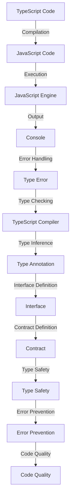

## Introduction
**TypeScript** is a statically typed, multi-paradigm programming language developed by Microsoft as a superset of **JavaScript**. It is designed to help developers catch errors at compile time, rather than runtime, which improves the overall quality and maintainability of the code. In this overview, we will explore the benefits of using TypeScript, its core concepts, and how it works internally. We will also provide code examples, visual diagrams, and real-world use cases to demonstrate its effectiveness.

> **Note:** TypeScript is not a replacement for JavaScript, but rather a tool to improve the development experience and reduce the likelihood of errors.

## Core Concepts
The core concepts of TypeScript include:

* **Static typing**: The ability to declare the type of a variable, function, or object at compile time.
* **Type inference**: The ability of the compiler to automatically infer the type of a variable or expression.
* **Type checking**: The process of verifying that the types of variables, functions, and objects are consistent with their declared types.
* **Interfaces**: A way to define the shape of an object, including its properties, methods, and events.

> **Tip:** Using interfaces can help you define a contract for your objects, making it easier to ensure that they conform to a specific shape.

## How It Works Internally
TypeScript works by compiling your code into JavaScript, which can then be executed by a JavaScript engine. The compilation process involves several steps:

1. **Parsing**: The TypeScript compiler parses the source code into an abstract syntax tree (AST).
2. **Type checking**: The compiler checks the types of variables, functions, and objects against their declared types.
3. **Type inference**: The compiler infers the types of variables and expressions that are not explicitly declared.
4. **Code generation**: The compiler generates JavaScript code from the AST.

> **Warning:** If you're not careful, you can end up with type errors that are not caught by the compiler. Make sure to use type annotations and interfaces to ensure that your code is type-safe.

## Code Examples
Here are three complete and runnable code examples that demonstrate the benefits of using TypeScript:

### Example 1: Basic Type Checking
```typescript
// Define a function that takes a string as an argument
function greet(name: string) {
  console.log(`Hello, ${name}!`);
}

// Call the function with a string argument
greet("Alice"); // Output: Hello, Alice!

// Try to call the function with a number argument
greet(42); // Error: Argument of type 'number' is not assignable to parameter of type 'string'.
```

### Example 2: Interface-Based Type Checking
```typescript
// Define an interface for a person
interface Person {
  name: string;
  age: number;
}

// Define a function that takes a person as an argument
function greetPerson(person: Person) {
  console.log(`Hello, ${person.name}! You are ${person.age} years old.`);
}

// Create a person object that conforms to the interface
const person: Person = {
  name: "Bob",
  age: 30,
};

// Call the function with the person object
greetPerson(person); // Output: Hello, Bob! You are 30 years old.

// Try to create a person object that does not conform to the interface
const invalidPerson = {
  name: "Charlie",
  // age: 25, // Commented out to demonstrate the error
};

// Try to call the function with the invalid person object
greetPerson(invalidPerson); // Error: Type '{ name: string; }' is missing the following properties from type 'Person': age.
```

### Example 3: Advanced Type Checking with Generics
```typescript
// Define a generic interface for a container
interface Container<T> {
  value: T;
}

// Define a function that takes a container as an argument
function getValue<T>(container: Container<T>): T {
  return container.value;
}

// Create a container for a string
const stringContainer: Container<string> = {
  value: "Hello",
};

// Call the function with the string container
const stringValue = getValue(stringContainer); // Output: Hello

// Create a container for a number
const numberContainer: Container<number> = {
  value: 42,
};

// Call the function with the number container
const numberValue = getValue(numberContainer); // Output: 42

// Try to create a container for an invalid type
const invalidContainer: Container<null> = {
  value: null,
};

// Try to call the function with the invalid container
getValue(invalidContainer); // Error: Type 'null' is not assignable to type 'T'.
```

## Visual Diagram

The diagram illustrates the flow of TypeScript code from compilation to execution, highlighting the role of type checking and inference in ensuring type safety and preventing errors.

## Comparison
| Approach | Time Complexity | Space Complexity | Pros | Cons | Best For |
| --- | --- | --- | --- | --- | --- |
| TypeScript | O(1) | O(n) | Statically typed, type safety, error prevention | Steeper learning curve, additional compilation step | Large-scale applications, enterprise software |
| JavaScript | O(1) | O(n) | Dynamically typed, flexible, rapid development | Error-prone, lacks type safety | Small-scale applications, prototyping |
| Flow | O(1) | O(n) | Statically typed, type safety, incremental compilation | Additional configuration, limited adoption | Medium-scale applications, teams with existing Flow experience |
| Dart | O(1) | O(n) | Statically typed, type safety, ahead-of-time compilation | Additional runtime, limited adoption | Mobile and web applications, teams with existing Dart experience |

## Real-world Use Cases
* **Microsoft**: Uses TypeScript for its Azure cloud platform and Visual Studio Code editor.
* **Google**: Uses TypeScript for its Angular framework and Google Cloud Platform.
* **Facebook**: Uses TypeScript for its React framework and Facebook Messenger application.

## Common Pitfalls
* **Not using type annotations**: Failing to use type annotations can lead to type errors and make it difficult to catch errors at compile time.
* **Not using interfaces**: Not using interfaces can make it difficult to define contracts and ensure type safety.
* **Not using generics**: Not using generics can make it difficult to write reusable and type-safe code.
* **Not using type inference**: Not using type inference can make it difficult to catch type errors and ensure type safety.

## Interview Tips
* **What is the difference between TypeScript and JavaScript?**: A strong answer should highlight the differences in typing, type safety, and error prevention.
* **How does TypeScript improve code quality?**: A strong answer should highlight the benefits of type safety, error prevention, and maintainability.
* **What is the role of interfaces in TypeScript?**: A strong answer should highlight the importance of interfaces in defining contracts and ensuring type safety.

## Key Takeaways
* **TypeScript is a statically typed language**: It provides type safety and error prevention at compile time.
* **TypeScript is a superset of JavaScript**: It provides additional features and functionality on top of JavaScript.
* **TypeScript uses type inference**: It automatically infers the types of variables and expressions.
* **TypeScript uses interfaces**: It defines contracts and ensures type safety.
* **TypeScript is widely adopted**: It is used by large companies such as Microsoft, Google, and Facebook.
* **TypeScript improves code quality**: It provides type safety, error prevention, and maintainability.
* **TypeScript has a steeper learning curve**: It requires additional knowledge and experience compared to JavaScript.
* **TypeScript is suitable for large-scale applications**: It provides type safety, error prevention, and maintainability, making it suitable for large-scale applications.