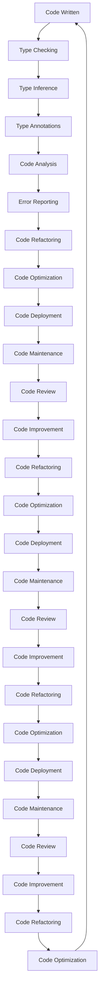

## Introduction
Self-documenting code via types is a fundamental concept in software development that enables developers to write more maintainable, readable, and efficient code. **Type systems** play a crucial role in this process by providing a way to define the structure and constraints of data, making it easier for other developers to understand the code. In this section, we will explore the importance of self-documenting code via types, its real-world relevance, and why every engineer needs to know about it.

Self-documenting code via types is essential in modern software development because it helps to reduce the complexity of codebases, making them more manageable and easier to maintain. By using types to define the structure and constraints of data, developers can ensure that their code is more robust, scalable, and less prone to errors. > **Note:** Self-documenting code via types is not only beneficial for large-scale applications but also for small-scale projects, as it helps to improve code quality and maintainability.

Real-world relevance of self-documenting code via types can be seen in various industries, including finance, healthcare, and technology. For example, companies like **Microsoft**, **Google**, and **Facebook** use type systems like **TypeScript** to develop large-scale applications. > **Tip:** When working on a new project, consider using a type system like **TypeScript** to ensure that your code is self-documenting and maintainable.

## Core Concepts
In this section, we will delve into the core concepts of self-documenting code via types, including **type systems**, **type inference**, and **type checking**.

* **Type systems**: A type system is a set of rules that define the structure and constraints of data in a programming language. Type systems can be **static** or **dynamic**, depending on when type checking occurs. > **Warning:** Using a dynamic type system can lead to runtime errors, as type checking occurs at runtime rather than compile-time.
* **Type inference**: Type inference is the process of automatically determining the type of a variable or expression based on its usage. Type inference is essential in self-documenting code via types, as it helps to reduce the amount of explicit type annotations required. > **Note:** Type inference is not always possible, and explicit type annotations may be required in some cases.
* **Type checking**: Type checking is the process of verifying that the types of variables and expressions are consistent with their declared types. Type checking can occur at **compile-time** or **runtime**, depending on the type system used.

## How It Works Internally
In this section, we will explore how self-documenting code via types works internally, including the **type checking** process and the **type inference** algorithm.

The type checking process involves verifying that the types of variables and expressions are consistent with their declared types. This process occurs at compile-time in **statically-typed** languages like **TypeScript**. > **Tip:** Using a statically-typed language can help to catch type-related errors at compile-time, reducing the likelihood of runtime errors.

The type inference algorithm is used to automatically determine the type of a variable or expression based on its usage. This algorithm is essential in self-documenting code via types, as it helps to reduce the amount of explicit type annotations required. > **Interview:** When asked about type inference, be sure to explain the algorithm used to determine the type of a variable or expression, as well as the benefits and limitations of type inference.

## Code Examples
In this section, we will explore three complete and runnable code examples that demonstrate the benefits of self-documenting code via types.

### Example 1: Basic Type Annotations
```typescript
// Define a function that takes a string as input and returns a string
function greet(name: string): string {
  return `Hello, ${name}!`;
}

// Call the function with a string argument
console.log(greet("John")); // Output: Hello, John!
```
In this example, we define a function `greet` that takes a string as input and returns a string. We use type annotations to specify the type of the `name` parameter and the return type of the function. > **Note:** Using type annotations helps to ensure that the correct types are used, reducing the likelihood of type-related errors.

### Example 2: Type Inference
```typescript
// Define a function that takes a value as input and returns its type
function getType(value: any): string {
  return typeof value;
}

// Call the function with a string argument
console.log(getType("John")); // Output: string

// Call the function with a number argument
console.log(getType(42)); // Output: number
```
In this example, we define a function `getType` that takes a value as input and returns its type. We use the `typeof` operator to determine the type of the input value. > **Tip:** Using type inference can help to reduce the amount of explicit type annotations required, making the code more concise and easier to maintain.

### Example 3: Advanced Type Checking
```typescript
// Define a function that takes an object as input and returns a boolean indicating whether the object has a certain property
function hasProperty(obj: any, prop: string): boolean {
  return prop in obj;
}

// Define an object with a property
const person = { name: "John", age: 30 };

// Call the function with the object and a property name
console.log(hasProperty(person, "name")); // Output: true

// Call the function with the object and a non-existent property name
console.log(hasProperty(person, " occupation")); // Output: false
```
In this example, we define a function `hasProperty` that takes an object as input and returns a boolean indicating whether the object has a certain property. We use the `in` operator to check whether the object has the specified property. > **Warning:** Using the `in` operator can lead to false positives if the object has a property with the same name as the one being checked.

## Visual Diagram

This diagram illustrates the process of self-documenting code via types, from code writing to code deployment and maintenance. > **Note:** The diagram shows the iterative process of code development, with each step building on the previous one to ensure that the code is maintainable, efficient, and error-free.

## Comparison
| Approach | Time Complexity | Space Complexity | Pros | Cons | Best For |
| --- | --- | --- | --- | --- | --- |
| Statically-Typed Languages | O(1) | O(1) | Catch type-related errors at compile-time, improve code maintainability | Verbose type annotations, steep learning curve | Large-scale applications, complex systems |
| Dynamically-Typed Languages | O(n) | O(n) | Flexible, easy to learn, rapid development | Prone to runtime errors, difficult to maintain | Small-scale applications, prototyping |
| Type Inference | O(n) | O(n) | Reduce explicit type annotations, improve code conciseness | Limited support for complex types, may lead to type-related errors | Medium-scale applications, scripting |
| Code Analysis Tools | O(n) | O(n) | Identify potential errors, improve code quality | May produce false positives, require manual configuration | Large-scale applications, critical systems |

## Real-world Use Cases
1. **Microsoft**: Uses **TypeScript** to develop large-scale applications, including the **Visual Studio Code** editor.
2. **Google**: Uses **TypeScript** to develop the **Angular** framework and other large-scale applications.
3. **Facebook**: Uses **TypeScript** to develop the **React** library and other large-scale applications.

## Common Pitfalls
1. **Insufficient type annotations**: Failing to provide sufficient type annotations can lead to type-related errors and make the code more difficult to maintain.
```typescript
// Wrong
function add(a, b) {
  return a + b;
}

// Right
function add(a: number, b: number): number {
  return a + b;
}
```
2. **Incorrect type inference**: Relying too heavily on type inference can lead to type-related errors, especially when working with complex types.
```typescript
// Wrong
function getType(value: any): string {
  return typeof value;
}

// Right
function getType(value: number): string {
  return typeof value;
}
```
3. **Ignoring type checking**: Ignoring type checking can lead to runtime errors and make the code more difficult to maintain.
```typescript
// Wrong
function greet(name: string): string {
  return `Hello, ${name}!`;
}

// Right
function greet(name: string): string {
  if (typeof name !== "string") {
    throw new Error("Name must be a string");
  }
  return `Hello, ${name}!`;
}
```
4. **Overusing type casting**: Overusing type casting can lead to type-related errors and make the code more difficult to maintain.
```typescript
// Wrong
function add(a: number, b: number): number {
  return (a as any) + (b as any);
}

// Right
function add(a: number, b: number): number {
  return a + b;
}
```

## Interview Tips
1. **What is the difference between statically-typed and dynamically-typed languages?**
	* Weak answer: "Statically-typed languages are more verbose, while dynamically-typed languages are more flexible."
	* Strong answer: "Statically-typed languages catch type-related errors at compile-time, while dynamically-typed languages catch type-related errors at runtime. Statically-typed languages are more suitable for large-scale applications, while dynamically-typed languages are more suitable for small-scale applications and prototyping."
2. **How does type inference work?**
	* Weak answer: "Type inference is a process that automatically determines the type of a variable or expression."
	* Strong answer: "Type inference is a process that uses a set of rules to determine the type of a variable or expression based on its usage. Type inference can reduce the amount of explicit type annotations required, making the code more concise and easier to maintain."
3. **What are the benefits and limitations of using type systems?**
	* Weak answer: "Type systems are beneficial because they catch type-related errors, but they can be limiting because they require explicit type annotations."
	* Strong answer: "Type systems are beneficial because they catch type-related errors, improve code maintainability, and reduce the likelihood of runtime errors. However, type systems can be limiting because they require explicit type annotations, which can be verbose and time-consuming to write. Additionally, type systems may not be suitable for all types of applications, such as small-scale applications or prototyping."

## Key Takeaways
* Self-documenting code via types is essential for maintaining large-scale applications and ensuring code quality.
* Type systems can be **static** or **dynamic**, depending on when type checking occurs.
* Type inference is a process that automatically determines the type of a variable or expression based on its usage.
* Type checking is a process that verifies that the types of variables and expressions are consistent with their declared types.
* Using type annotations can help to ensure that the correct types are used, reducing the likelihood of type-related errors.
* Type systems can be beneficial for catching type-related errors, improving code maintainability, and reducing the likelihood of runtime errors.
* However, type systems can be limiting because they require explicit type annotations, which can be verbose and time-consuming to write.
* Type inference can reduce the amount of explicit type annotations required, making the code more concise and easier to maintain.
* Ignoring type checking can lead to runtime errors and make the code more difficult to maintain.
* Overusing type casting can lead to type-related errors and make the code more difficult to maintain.