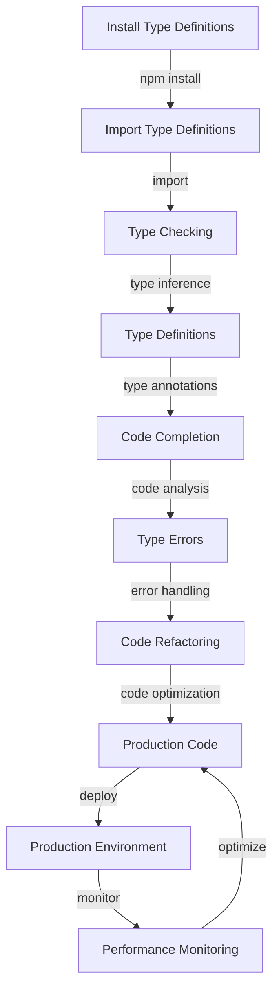

## Introduction
TypeScript is a statically typed, multi-paradigm programming language developed by Microsoft. It is designed to help developers catch errors early and improve code maintainability, thus making it a crucial tool for large and complex applications. **TypeScript** is particularly important in today's web development landscape, where JavaScript libraries and frameworks are ubiquitous. The `@types` namespace is a key feature of TypeScript that allows it to work seamlessly with any JavaScript library, making it an essential tool for developers working with popular libraries like React, Angular, and Vue.js.

> **Note:** The `@types` namespace is a collection of type definitions for popular JavaScript libraries, making it possible for developers to use these libraries in their TypeScript projects.

In real-world scenarios, developers often encounter situations where they need to integrate multiple JavaScript libraries into their projects. This can lead to issues with code maintainability, scalability, and debugging. TypeScript, with its robust typing system and `@types` namespace, provides a solution to these problems by enabling developers to write more maintainable, efficient, and error-free code.

## Core Concepts
To understand how TypeScript works with JavaScript libraries via `@types`, it's essential to grasp the following core concepts:
- **Type Definitions**: Type definitions are files that contain type information for a particular JavaScript library. These files are typically written in TypeScript and are used to define the types of variables, functions, and classes in the library.
- **Type Checking**: Type checking is the process of verifying that the types of variables, functions, and classes in a program are correct. TypeScript performs type checking at compile-time, which helps catch errors early in the development process.
- **Type Inference**: Type inference is the process of automatically determining the types of variables, functions, and classes in a program. TypeScript uses type inference to reduce the need for explicit type annotations, making it easier to write code.

> **Tip:** Understanding type definitions, type checking, and type inference is crucial for working effectively with TypeScript and `@types`.

## How It Works Internally
When a developer uses a JavaScript library in a TypeScript project, the `@types` namespace provides the necessary type definitions for the library. Here's a step-by-step breakdown of how it works:
1. **Installing Type Definitions**: The developer installs the type definitions for the JavaScript library using npm or yarn.
2. **Importing Type Definitions**: The developer imports the type definitions into their TypeScript project using the `import` statement.
3. **Type Checking**: TypeScript performs type checking on the code, using the type definitions to verify that the types of variables, functions, and classes are correct.
4. **Type Inference**: TypeScript uses type inference to automatically determine the types of variables, functions, and classes in the code.

> **Warning:** Failure to install the correct type definitions for a JavaScript library can lead to type errors and make it difficult to work with the library in a TypeScript project.

## Code Examples
### Example 1: Basic Usage
```typescript
// Import the type definitions for the jQuery library
import * as $ from 'jquery';

// Use the jQuery library in the code
$(document).ready(() => {
  console.log('jQuery is ready!');
});
```
This example demonstrates how to import the type definitions for the jQuery library and use it in a TypeScript project.

### Example 2: Real-World Pattern
```typescript
// Import the type definitions for the React library
import * as React from 'react';
import * as ReactDOM from 'react-dom';

// Define a React component
interface Props {
  name: string;
}

const Greeting: React.FC<Props> = (props) => {
  return <h1>Hello, {props.name}!</h1>;
};

// Render the React component
ReactDOM.render(<Greeting name="John" />, document.getElementById('root'));
```
This example demonstrates how to use the React library in a TypeScript project, including defining a React component and rendering it to the DOM.

### Example 3: Advanced Usage
```typescript
// Import the type definitions for the Redux library
import { createStore, combineReducers } from 'redux';

// Define a Redux reducer
interface State {
  counter: number;
}

const reducer = (state: State = { counter: 0 }, action: any) => {
  switch (action.type) {
    case 'INCREMENT':
      return { counter: state.counter + 1 };
    default:
      return state;
  }
};

// Create a Redux store
const store = createStore(reducer);

// Dispatch an action to the Redux store
store.dispatch({ type: 'INCREMENT' });
```
This example demonstrates how to use the Redux library in a TypeScript project, including defining a Redux reducer and creating a Redux store.

## Visual Diagram

This diagram illustrates the process of working with TypeScript and `@types`, from installing type definitions to deploying production code.

## Comparison
| Approach | Time Complexity | Space Complexity | Pros | Cons | Best For |
| --- | --- | --- | --- | --- | --- |
| Manual Type Definitions | O(n) | O(n) | Customizable, flexible | Time-consuming, error-prone | Small projects, prototyping |
| `@types` Namespace | O(1) | O(1) | Convenient, scalable | Limited control, dependencies | Large projects, enterprise applications |
| Type Inference | O(n) | O(n) | Efficient, automated | Limited control, complexity | Medium-sized projects, development teams |
| Code Generation | O(n) | O(n) | Fast, automated | Limited control, dependencies | Large projects, enterprise applications |

> **Interview:** What are the advantages and disadvantages of using the `@types` namespace in a TypeScript project? How does it compare to manual type definitions and type inference?

## Real-world Use Cases
1. **Microsoft**: Microsoft uses TypeScript and `@types` in many of its internal projects, including the Visual Studio Code editor and the Azure cloud platform.
2. **Google**: Google uses TypeScript and `@types` in its Angular framework and other internal projects.
3. **Facebook**: Facebook uses TypeScript and `@types` in its React framework and other internal projects.

## Common Pitfalls
1. **Missing Type Definitions**: Failing to install the correct type definitions for a JavaScript library can lead to type errors and make it difficult to work with the library in a TypeScript project.
2. **Incorrect Type Annotations**: Incorrectly annotating types in a TypeScript project can lead to type errors and make it difficult to work with the code.
3. **Type Inference Issues**: Type inference can sometimes lead to incorrect type annotations, especially in complex codebases.
4. **Dependency Conflicts**: Dependency conflicts can occur when using multiple JavaScript libraries with different type definitions.

> **Tip:** To avoid common pitfalls, make sure to install the correct type definitions for JavaScript libraries, correctly annotate types, and use type inference judiciously.

## Interview Tips
1. **What is TypeScript?**: Be prepared to explain the basics of TypeScript, including its typing system and `@types` namespace.
2. **How does `@types` work?**: Be prepared to explain how the `@types` namespace works, including its role in providing type definitions for JavaScript libraries.
3. **What are the benefits of using TypeScript?**: Be prepared to explain the benefits of using TypeScript, including its ability to catch errors early and improve code maintainability.

## Key Takeaways
* **TypeScript is a statically typed language**: TypeScript is designed to help developers catch errors early and improve code maintainability.
* **`@types` namespace provides type definitions**: The `@types` namespace provides type definitions for popular JavaScript libraries, making it easier to work with these libraries in TypeScript projects.
* **Type inference is automated**: Type inference is a feature of TypeScript that automatically determines the types of variables, functions, and classes in a program.
* **Type checking is crucial**: Type checking is the process of verifying that the types of variables, functions, and classes in a program are correct.
* **Dependency conflicts can occur**: Dependency conflicts can occur when using multiple JavaScript libraries with different type definitions.
* **Type annotations are essential**: Correctly annotating types in a TypeScript project is essential for avoiding type errors and ensuring code maintainability.
* **TypeScript is scalable**: TypeScript is designed to work with large and complex applications, making it a popular choice for enterprise development teams.
* **TypeScript has a large ecosystem**: TypeScript has a large ecosystem of tools and libraries, including the `@types` namespace and popular frameworks like React and Angular.
* **TypeScript is constantly evolving**: TypeScript is constantly evolving, with new features and improvements being added regularly.