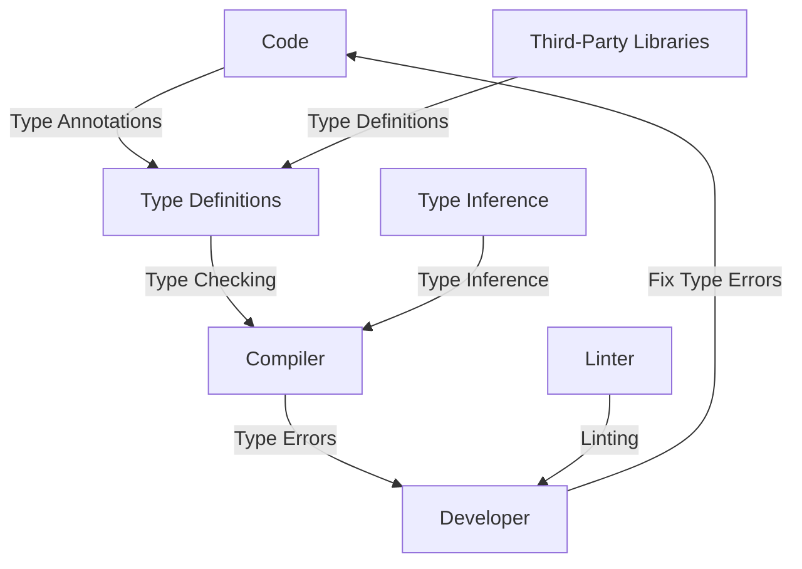

## Introduction
Type definitions are a crucial aspect of maintaining large-scale JavaScript applications, especially when using TypeScript. They provide a way to define the structure of data and ensure that the code is type-safe. However, one of the significant drawbacks of type definitions is that they can lag behind libraries. This lag can lead to maintenance issues, bugs, and even security vulnerabilities. In this section, we will explore what type definitions are, why they are essential, and the real-world relevance of keeping them up-to-date.

> **Note:** Type definitions are not unique to TypeScript and are used in other programming languages such as C#, Java, and Python.

Type definitions are essentially a contract between the developer and the compiler, specifying the shape of the data. They help catch type-related errors at compile-time, reducing the likelihood of runtime errors. For example, when using a third-party library, type definitions can ensure that the correct types are used, preventing errors that can occur when using incorrect types.

## Core Concepts
To understand the drawbacks of type definitions lagging behind libraries, it's essential to grasp the core concepts of type definitions. Here are some key terms:

* **Type Definition:** A type definition is a declaration of the structure of a type, including its properties, methods, and relationships with other types.
* **Type Checking:** Type checking is the process of verifying that the types used in the code conform to the type definitions.
* **Type Inference:** Type inference is the ability of the compiler to automatically determine the types of variables, function parameters, and return types based on the code.

> **Warning:** Failing to keep type definitions up-to-date can lead to type-related errors, which can be challenging to debug and fix.

## How It Works Internally
When using TypeScript, the compiler checks the code against the type definitions to ensure type safety. Here's a step-by-step overview of how it works:

1. The developer writes the code, including type annotations.
2. The compiler reads the code and type definitions.
3. The compiler checks the code against the type definitions to ensure type safety.
4. If type errors are found, the compiler reports them to the developer.
5. The developer fixes the type errors, and the process repeats.

> **Tip:** Using a linter, such as TSLint, can help catch type-related errors and enforce coding standards.

## Code Examples
Here are three complete and runnable code examples that demonstrate the importance of keeping type definitions up-to-date:

### Example 1: Basic Type Definition
```typescript
// Define a simple type definition for a user
interface User {
  name: string;
  age: number;
}

// Create a function that takes a user as an argument
function greetUser(user: User) {
  console.log(`Hello, ${user.name}! You are ${user.age} years old.`);
}

// Create a user object
const user: User = {
  name: 'John Doe',
  age: 30,
};

// Call the greetUser function
greetUser(user);
```

### Example 2: Real-World Type Definition
```typescript
// Define a type definition for a library that provides a fetch function
interface FetchOptions {
  url: string;
  method: string;
  headers: { [key: string]: string };
}

// Define a type definition for the fetch function
interface Fetch {
  (options: FetchOptions): Promise<any>;
}

// Create a fetch function that conforms to the type definition
const fetch: Fetch = (options: FetchOptions) => {
  // Implement the fetch function
  return Promise.resolve({ data: 'Hello, World!' });
};

// Use the fetch function
fetch({ url: 'https://example.com', method: 'GET', headers: { 'Content-Type': 'application/json' } })
  .then((response) => console.log(response))
  .catch((error) => console.error(error));
```

### Example 3: Advanced Type Definition
```typescript
// Define a type definition for a generic class
interface Container<T> {
  value: T;
}

// Create a generic class that conforms to the type definition
class ContainerClass<T> implements Container<T> {
  constructor(public value: T) {}
}

// Create a container object
const container: Container<string> = new ContainerClass('Hello, World!');

// Use the container object
console.log(container.value);
```

## Visual Diagram

The diagram illustrates the flow of type definitions, type checking, and type inference. It shows how the code, type definitions, and compiler interact to ensure type safety.

> **Note:** The diagram is a simplified representation of the type checking process and is not exhaustive.

## Comparison
| Approach | Time Complexity | Space Complexity | Pros | Cons | Best For |
| --- | --- | --- | --- | --- | --- |
| Manual Type Definitions | O(1) | O(1) | Provides explicit control over type definitions | Time-consuming and prone to errors | Small-scale applications |
| Automated Type Definitions | O(n) | O(n) | Reduces time and effort required for type definitions | May not cover all edge cases | Large-scale applications |
| Type Inference | O(n) | O(n) | Automatically determines types, reducing errors | May not work well with complex types | Applications with simple type structures |
| Hybrid Approach | O(n) | O(n) | Combines manual and automated type definitions | Requires careful planning and maintenance | Applications with complex type structures |

## Real-world Use Cases
Here are three real-world use cases that demonstrate the importance of keeping type definitions up-to-date:

1. **Google's Closure Compiler:** Google's Closure Compiler uses type definitions to optimize JavaScript code for production environments. By keeping type definitions up-to-date, developers can ensure that the compiler can effectively optimize the code.
2. **Microsoft's TypeScript:** Microsoft's TypeScript is a popular superset of JavaScript that provides optional static typing. By keeping type definitions up-to-date, developers can ensure that the TypeScript compiler can effectively check the code for type errors.
3. **Facebook's React:** Facebook's React is a popular JavaScript library for building user interfaces. By keeping type definitions up-to-date, developers can ensure that the React components are type-safe and can be effectively optimized for production environments.

## Common Pitfalls
Here are four common pitfalls that developers may encounter when working with type definitions:

1. **Outdated Type Definitions:** Failing to keep type definitions up-to-date can lead to type-related errors and maintenance issues.
2. **Incorrect Type Annotations:** Using incorrect type annotations can lead to type-related errors and make it challenging to debug the code.
3. **Insufficient Type Checking:** Failing to perform sufficient type checking can lead to type-related errors and make it challenging to debug the code.
4. **Overly Complex Type Structures:** Using overly complex type structures can make it challenging to maintain and optimize the code.

> **Warning:** Failing to address these pitfalls can lead to significant maintenance issues and bugs in the code.

## Interview Tips
Here are three common interview questions that may be asked when discussing type definitions:

1. **What is the purpose of type definitions in TypeScript?**
	* Weak answer: Type definitions are used to define the structure of data.
	* Strong answer: Type definitions are used to define the structure of data and ensure that the code is type-safe, reducing the likelihood of runtime errors.
2. **How do you keep type definitions up-to-date in a large-scale application?**
	* Weak answer: I use a linter to check for type errors.
	* Strong answer: I use a combination of manual and automated type definitions, and I regularly review and update the type definitions to ensure they are accurate and up-to-date.
3. **What are some common pitfalls when working with type definitions?**
	* Weak answer: I'm not sure.
	* Strong answer: Some common pitfalls include outdated type definitions, incorrect type annotations, insufficient type checking, and overly complex type structures.

## Key Takeaways
Here are ten key takeaways to remember when working with type definitions:

* Type definitions are essential for ensuring type safety and reducing the likelihood of runtime errors.
* Keeping type definitions up-to-date is crucial for maintaining large-scale applications.
* Using a combination of manual and automated type definitions can help reduce errors and maintenance issues.
* Type inference can be used to automatically determine types, reducing errors and maintenance issues.
* Overly complex type structures can make it challenging to maintain and optimize the code.
* Failing to keep type definitions up-to-date can lead to significant maintenance issues and bugs in the code.
* Using a linter can help catch type-related errors and enforce coding standards.
* Type definitions can be used to optimize JavaScript code for production environments.
* Type definitions can be used to ensure that React components are type-safe and can be effectively optimized for production environments.
* Keeping type definitions up-to-date requires careful planning and maintenance.