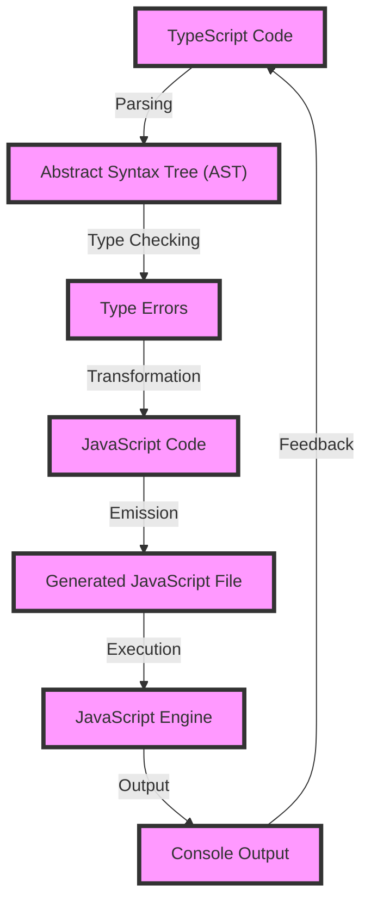

## Introduction
TypeScript is a superset of JavaScript that adds optional static typing and other features to improve the development experience. It's designed to help developers catch errors early and improve code maintainability, thus making it a crucial tool for large-scale JavaScript applications. As of now, the latest versions of TypeScript are 4.x and 5.x, each with its own set of key features and improvements. In this overview, we'll explore the key features of each version, their differences, and how they can be used in real-world applications.

> **Note:** TypeScript is not a replacement for JavaScript, but rather a tool to enhance its capabilities and make it more efficient for developers.

TypeScript has become increasingly popular in the industry, with companies like Microsoft, Google, and Facebook using it in their production environments. Its real-world relevance lies in its ability to provide better code completion, type checking, and error handling, resulting in faster development and reduced bugs.

## Core Concepts
To understand the differences between TypeScript 4.x and 5.x, it's essential to grasp the core concepts of the language. Here are some key terms and definitions:

* **Type Inference:** TypeScript's ability to automatically infer the types of variables, function parameters, and return types.
* **Type Checking:** The process of verifying that the types of variables, function parameters, and return types match the expected types.
* **Modules:** Independent pieces of code that can be imported and used in other parts of the application.
* **Interfaces:** Abstract contracts that define the structure of objects, including properties, methods, and events.

> **Tip:** Understanding the core concepts of TypeScript is crucial for effective use of the language. It's recommended to start with the basics and gradually move on to more advanced topics.

## How It Works Internally
TypeScript works by compiling the code into JavaScript, which can then be run by any JavaScript engine. The compilation process involves several steps:

1. **Parsing:** The TypeScript compiler reads the source code and breaks it down into an abstract syntax tree (AST).
2. **Type Checking:** The compiler checks the AST for type errors and reports any issues.
3. **Transformation:** The compiler transforms the AST into JavaScript code.
4. **Emission:** The compiler writes the generated JavaScript code to a file.

> **Warning:** TypeScript is not a runtime environment, and it does not execute the code. It only compiles the code into JavaScript, which is then executed by the JavaScript engine.

## Code Examples
Here are three complete and runnable code examples that demonstrate the key features of TypeScript 4.x and 5.x:

### Example 1: Basic Type Inference (TypeScript 4.x)
```typescript
// Define a function that takes a string and returns a string
function greet(name: string): string {
  return `Hello, ${name}!`;
}

// Call the function with a string argument
console.log(greet('Alice')); // Output: "Hello, Alice!"
```

### Example 2: Advanced Type Checking (TypeScript 5.x)
```typescript
// Define an interface for a person
interface Person {
  name: string;
  age: number;
}

// Define a function that takes a person and returns a string
function introduce(person: Person): string {
  return `My name is ${person.name}, and I am ${person.age} years old.`;
}

// Create a person object
const person: Person = {
  name: 'Bob',
  age: 30,
};

// Call the function with the person object
console.log(introduce(person)); // Output: "My name is Bob, and I am 30 years old."
```

### Example 3: Module Imports (TypeScript 5.x)
```typescript
// Define a module that exports a function
// math.ts
export function add(a: number, b: number): number {
  return a + b;
}

// Import the module and use the function
// main.ts
import { add } from './math';

const result = add(2, 3);
console.log(result); // Output: 5
```

## Visual Diagram

This diagram illustrates the compilation process of TypeScript, from parsing to emission, and the execution of the generated JavaScript code.

## Comparison
Here's a comparison table of the key features of TypeScript 4.x and 5.x:

| Feature | TypeScript 4.x | TypeScript 5.x |
| --- | --- | --- |
| Type Inference | Basic type inference | Advanced type inference with support for conditional types |
| Type Checking | Basic type checking | Advanced type checking with support for intersection types |
| Modules | Support for ES6 modules | Support for ES6 modules and CommonJS modules |
| Interfaces | Support for interfaces | Support for interfaces with support for generic types |
| Performance | Improved performance with caching | Improved performance with caching and incremental compilation |

## Real-world Use Cases
Here are three real-world use cases of TypeScript in production environments:

1. **Microsoft:** Microsoft uses TypeScript in its Azure platform to build scalable and maintainable cloud applications.
2. **Google:** Google uses TypeScript in its Google Cloud Platform to build cloud-based applications with improved code quality and maintainability.
3. **Facebook:** Facebook uses TypeScript in its React framework to build scalable and maintainable front-end applications.

> **Interview:** What are some real-world use cases of TypeScript in production environments? How does TypeScript improve code quality and maintainability?

## Common Pitfalls
Here are four common pitfalls to avoid when using TypeScript:

1. **Incorrect Type Annotations:** Incorrect type annotations can lead to type errors and compilation issues.
```typescript
// Incorrect type annotation
function greet(name: number): string {
  return `Hello, ${name}!`;
}
```
2. **Missing Type Checking:** Missing type checking can lead to runtime errors and bugs.
```typescript
// Missing type checking
function add(a: number, b: string): number {
  return a + b;
}
```
3. **Incorrect Module Imports:** Incorrect module imports can lead to compilation issues and errors.
```typescript
// Incorrect module import
import { add } from './math';
```
4. **Insufficient Error Handling:** Insufficient error handling can lead to runtime errors and bugs.
```typescript
// Insufficient error handling
function divide(a: number, b: number): number {
  return a / b;
}
```

## Interview Tips
Here are three common interview questions related to TypeScript, along with some tips on how to answer them:

1. **What are the benefits of using TypeScript?**
	* Weak answer: "TypeScript is a superset of JavaScript that adds optional static typing."
	* Strong answer: "TypeScript provides several benefits, including improved code quality, maintainability, and scalability. It also helps catch errors early and provides better code completion and error handling."
2. **How does TypeScript improve code quality and maintainability?**
	* Weak answer: "TypeScript improves code quality and maintainability by providing optional static typing."
	* Strong answer: "TypeScript improves code quality and maintainability by providing advanced type checking, conditional types, and intersection types. It also helps catch errors early and provides better code completion and error handling."
3. **What are some common pitfalls to avoid when using TypeScript?**
	* Weak answer: "One common pitfall to avoid when using TypeScript is incorrect type annotations."
	* Strong answer: "There are several common pitfalls to avoid when using TypeScript, including incorrect type annotations, missing type checking, incorrect module imports, and insufficient error handling. It's essential to follow best practices and use advanced type checking features to avoid these pitfalls."

## Key Takeaways
Here are ten key takeaways to remember when using TypeScript:

* **TypeScript is a superset of JavaScript that adds optional static typing.**
* **TypeScript provides improved code quality, maintainability, and scalability.**
* **TypeScript helps catch errors early and provides better code completion and error handling.**
* **TypeScript supports advanced type checking features, including conditional types and intersection types.**
* **TypeScript supports ES6 modules and CommonJS modules.**
* **TypeScript provides improved performance with caching and incremental compilation.**
* **Incorrect type annotations can lead to type errors and compilation issues.**
* **Missing type checking can lead to runtime errors and bugs.**
* **Insufficient error handling can lead to runtime errors and bugs.**
* **Following best practices and using advanced type checking features can help avoid common pitfalls when using TypeScript.**