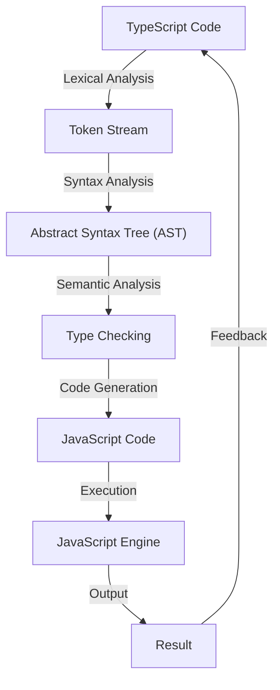

## Introduction
**TypeScript** is a **typed superset of JavaScript** that allows developers to write more maintainable, efficient, and scalable code. It was created by Microsoft and first released in 2012. The primary goal of TypeScript is to address the limitations of JavaScript, particularly in large and complex projects. By adding optional static typing, TypeScript helps developers catch errors early and improve code quality. In this overview, we will explore the core concepts, internal mechanics, and real-world applications of TypeScript.

> **Note:** TypeScript is fully compatible with existing JavaScript code and libraries, making it an attractive choice for developers looking to improve their codebase.

## Core Concepts
The core concepts of TypeScript include:

* **Type annotations**: Developers can add type annotations to their code to specify the expected types of variables, function parameters, and return values.
* **Type inference**: TypeScript can automatically infer the types of variables and expressions based on their usage.
* **Interfaces**: Interfaces define the shape of objects, including the properties, methods, and their types.
* **Classes**: Classes are used to define object-oriented programming (OOP) concepts, such as inheritance, polymorphism, and encapsulation.
* **Modules**: Modules allow developers to organize and structure their code into reusable components.

> **Warning:** TypeScript is not a replacement for JavaScript, but rather a superset that adds additional features and functionality.

## How It Works Internally
TypeScript works by compiling the typed code into plain JavaScript, which can then be executed by any JavaScript engine. The compilation process involves the following steps:

1. **Lexical analysis**: The TypeScript compiler breaks the code into individual tokens, such as keywords, identifiers, and literals.
2. **Syntax analysis**: The compiler analyzes the tokens to ensure that the code conforms to the TypeScript syntax.
3. **Semantic analysis**: The compiler checks the code for semantic errors, such as type mismatches and undefined variables.
4. **Type checking**: The compiler checks the code for type errors, such as assigning a string to a variable declared as a number.
5. **Code generation**: The compiler generates the equivalent JavaScript code, taking into account the type annotations and other TypeScript features.

## Code Examples
### Example 1: Basic Type Annotations
```typescript
// Declare a variable with a type annotation
let name: string = 'John Doe';

// Try to assign a number to the variable
name = 42; // Error: Type 'number' is not assignable to type 'string'.
```
### Example 2: Interface and Class
```typescript
// Define an interface for a person
interface Person {
  name: string;
  age: number;
}

// Define a class that implements the interface
class Employee implements Person {
  name: string;
  age: number;
  department: string;

  constructor(name: string, age: number, department: string) {
    this.name = name;
    this.age = age;
    this.department = department;
  }
}

// Create an instance of the class
const employee = new Employee('John Doe', 30, 'Sales');
```
### Example 3: Advanced Type Checking
```typescript
// Define a function that takes a union type as a parameter
function processValue(value: string | number) {
  if (typeof value === 'string') {
    console.log(`Received a string: ${value}`);
  } else {
    console.log(`Received a number: ${value}`);
  }
}

// Call the function with a string and a number
processValue('Hello'); // Output: Received a string: Hello
processValue(42); // Output: Received a number: 42
```
## Visual Diagram

The diagram illustrates the internal workflow of the TypeScript compiler, from lexical analysis to code generation and execution.

## Comparison
| Approach | Time Complexity | Space Complexity | Pros | Cons | Best For |
| --- | --- | --- | --- | --- | --- |
| TypeScript | O(n) | O(n) | Optional static typing, improved code quality, better error messages | Additional compilation step, learning curve | Large-scale JavaScript projects, complex applications |
| JavaScript | O(n) | O(n) | Dynamic typing, flexible, widely adopted | Error-prone, harder to maintain | Small-scale projects, rapid prototyping |
| Flow | O(n) | O(n) | Static type checking, compatible with JavaScript | Additional configuration, less adopted | Medium-scale projects, codebases with existing Flow setup |
| Dart | O(n) | O(n) | Statically typed, compiled to JavaScript, fast execution | Steeper learning curve, less adopted | High-performance applications, mobile and web development |

## Real-world Use Cases
* **Microsoft**: Uses TypeScript for its Azure cloud platform, Office Online, and other large-scale projects.
* **Google**: Uses TypeScript for its Angular framework, which is widely adopted in the industry.
* **Airbnb**: Uses TypeScript for its web and mobile applications, citing improved code quality and maintainability.
* **LinkedIn**: Uses TypeScript for its web and mobile applications, taking advantage of its optional static typing and improved error messages.

## Common Pitfalls
* **Incorrect type annotations**: Using incorrect type annotations can lead to type errors and decreased code quality.
* **Ignoring type warnings**: Ignoring type warnings can lead to runtime errors and decreased code reliability.
* **Overusing the `any` type**: Overusing the `any` type can defeat the purpose of using TypeScript and lead to decreased code quality.
* **Not using interfaces**: Not using interfaces can lead to tightly coupled code and decreased maintainability.

> **Tip:** Use the `--noImplicitAny` flag to prevent the TypeScript compiler from implicitly assigning the `any` type to variables.

## Interview Tips
* **What is the difference between TypeScript and JavaScript?**: A strong answer would highlight the optional static typing, improved code quality, and better error messages in TypeScript.
* **How do you handle type errors in TypeScript?**: A strong answer would discuss the use of type annotations, interfaces, and type guards to handle type errors.
* **What are some common pitfalls when using TypeScript?**: A strong answer would mention incorrect type annotations, ignoring type warnings, overusing the `any` type, and not using interfaces.

## Key Takeaways
* **TypeScript is a typed superset of JavaScript**: It adds optional static typing, improved code quality, and better error messages to JavaScript.
* **Type annotations are essential**: They help the TypeScript compiler catch type errors and improve code quality.
* **Interfaces and type guards are useful**: They help define the shape of objects and handle type errors in a more elegant way.
* **The `any` type should be used sparingly**: It can defeat the purpose of using TypeScript and lead to decreased code quality.
* **TypeScript is widely adopted**: It is used by large companies like Microsoft, Google, and Airbnb for their large-scale projects.
* **TypeScript has a learning curve**: It requires developers to understand its syntax, semantics, and best practices.
* **TypeScript is compatible with existing JavaScript code**: It can be easily integrated into existing JavaScript projects, making it an attractive choice for developers.