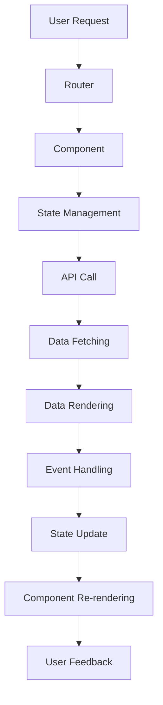

## Introduction
Large-scale frontend development refers to the process of building complex, scalable, and maintainable web applications using popular frameworks such as React, Angular, and Vue. As the complexity of web applications increases, the need for a well-structured and efficient frontend architecture becomes crucial. In this section, we will explore the importance of large-scale frontend development, its real-world relevance, and why every engineer needs to know about it.

> **Note:** Large-scale frontend development is not just about writing more code; it's about creating a maintainable, scalable, and performant architecture that can handle the complexities of modern web applications.

Real-world examples of large-scale frontend development include e-commerce platforms like Amazon, social media platforms like Facebook, and productivity suites like Google Workspace. These applications require a robust and efficient frontend architecture to handle millions of users, complex workflows, and large amounts of data.

## Core Concepts
To understand large-scale frontend development, we need to grasp some core concepts:

* **Modularity**: Breaking down the application into smaller, independent modules that can be developed, tested, and maintained separately.
* **Component-based architecture**: Building the application using reusable UI components that can be composed together to form complex interfaces.
* **State management**: Managing the application's state in a predictable and scalable way, using techniques like Redux or MobX.
* **Routing**: Handling client-side routing and navigation, using libraries like React Router or Angular Router.

> **Tip:** When building large-scale frontend applications, it's essential to establish a clear and consistent coding standard, to ensure that the codebase is maintainable and scalable.

## How It Works Internally
Let's take a closer look at how large-scale frontend applications work internally:

1. **Module loading**: The application loads the required modules, using techniques like lazy loading or code splitting.
2. **Component rendering**: The components are rendered, using a virtual DOM or a templating engine.
3. **State management**: The application's state is managed, using a state management library or a custom implementation.
4. **Event handling**: The application handles user events, such as clicks or keyboard input, using event listeners and handlers.
5. **Routing**: The application handles client-side routing, using a routing library or a custom implementation.

> **Warning:** When building large-scale frontend applications, it's essential to avoid common pitfalls like tight coupling, complex dependencies, and inefficient rendering.

## Code Examples
Here are three complete and runnable code examples, demonstrating basic, real-world, and advanced usage of large-scale frontend development:

### Example 1: Basic Usage
```typescript
// Import the required modules
import React from 'react';
import ReactDOM from 'react-dom';

// Define a simple component
const Hello = () => {
  return <h1>Hello World!</h1>;
};

// Render the component
ReactDOM.render(<Hello />, document.getElementById('root'));
```

### Example 2: Real-world Pattern
```typescript
// Import the required modules
import React, { useState, useEffect } from 'react';
import axios from 'axios';

// Define a component that fetches data from an API
const DataFetcher = () => {
  const [data, setData] = useState([]);
  const [error, setError] = useState(null);

  useEffect(() => {
    axios.get('https://api.example.com/data')
      .then(response => {
        setData(response.data);
      })
      .catch(error => {
        setError(error);
      });
  }, []);

  return (
    <div>
      {data.map(item => (
        <p key={item.id}>{item.name}</p>
      ))}
      {error && <p>Error: {error.message}</p>}
    </div>
  );
};
```

### Example 3: Advanced Usage
```typescript
// Import the required modules
import React, { useState, useEffect, useContext } from 'react';
import { BrowserRouter, Route, Switch } from 'react-router-dom';
import { UserContext } from './UserContext';

// Define a component that uses a context API and client-side routing
const App = () => {
  const { user, logout } = useContext(UserContext);
  const [loading, setLoading] = useState(false);

  useEffect(() => {
    // Fetch user data from an API
    axios.get('https://api.example.com/user')
      .then(response => {
        // Update the user context
        user.setData(response.data);
      })
      .catch(error => {
        // Handle the error
        console.error(error);
      });
  }, [user]);

  return (
    <BrowserRouter>
      <Switch>
        <Route path="/login" component={Login} />
        <Route path="/dashboard" component={Dashboard} />
      </Switch>
      {loading && <p>Loading...</p>}
      {user.isAuthenticated && (
        <button onClick={logout}>Logout</button>
      )}
    </BrowserRouter>
  );
};
```

## Visual Diagram

This diagram illustrates the flow of a large-scale frontend application, from user request to component re-rendering.

## Comparison
Here's a comparison of different approaches to large-scale frontend development:

| Approach | Time Complexity | Space Complexity | Pros | Cons | Best For |
| --- | --- | --- | --- | --- | --- |
| Monolithic Architecture | O(n) | O(n) | Simple, easy to implement | Tight coupling, difficult to maintain | Small applications |
| Microservices Architecture | O(n^2) | O(n) | Scalable, flexible | Complex, difficult to implement | Large applications |
| Component-based Architecture | O(n) | O(n) | Reusable, maintainable | Steep learning curve | Medium to large applications |
| Server-side Rendering | O(n) | O(n) | Fast, SEO-friendly | Complex, difficult to implement | Applications with high traffic |

> **Interview:** When asked about the trade-offs between different approaches to large-scale frontend development, be sure to discuss the time and space complexity, pros, and cons of each approach.

## Real-world Use Cases
Here are three real-world examples of large-scale frontend development:

1. **Amazon**: Amazon's e-commerce platform is a classic example of large-scale frontend development. The application uses a component-based architecture, with a complex state management system and a custom routing library.
2. **Facebook**: Facebook's social media platform is another example of large-scale frontend development. The application uses a monolithic architecture, with a complex event handling system and a custom state management library.
3. **Google Workspace**: Google Workspace is a productivity suite that includes a range of applications, such as Gmail, Google Drive, and Google Docs. The application uses a microservices architecture, with a complex state management system and a custom routing library.

## Common Pitfalls
Here are four common pitfalls to avoid when building large-scale frontend applications:

1. **Tight coupling**: Avoid tight coupling between components, as it can make the application difficult to maintain and scale.
2. **Complex dependencies**: Avoid complex dependencies between components, as it can make the application difficult to understand and debug.
3. **Inefficient rendering**: Avoid inefficient rendering, as it can make the application slow and unresponsive.
4. **Poor state management**: Avoid poor state management, as it can make the application difficult to maintain and scale.

> **Warning:** When building large-scale frontend applications, be sure to avoid these common pitfalls, and instead focus on creating a maintainable, scalable, and performant architecture.

## Interview Tips
Here are three common interview questions related to large-scale frontend development, along with weak and strong answers:

1. **What is the difference between a monolithic architecture and a microservices architecture?**
	* Weak answer: "A monolithic architecture is when everything is in one place, and a microservices architecture is when everything is split up."
	* Strong answer: "A monolithic architecture is a single, self-contained application, whereas a microservices architecture is a collection of small, independent services that communicate with each other. The key difference is that a microservices architecture is more scalable and flexible, but also more complex and difficult to implement."
2. **How do you handle state management in a large-scale frontend application?**
	* Weak answer: "I use a state management library like Redux or MobX."
	* Strong answer: "I use a combination of state management libraries and custom solutions, depending on the specific requirements of the application. For example, I might use Redux for global state management, and MobX for local state management. I also make sure to follow best practices, such as using immutable data structures and avoiding complex dependencies."
3. **What is the trade-off between server-side rendering and client-side rendering?**
	* Weak answer: "Server-side rendering is faster, but client-side rendering is more flexible."
	* Strong answer: "Server-side rendering provides faster initial page loads and better SEO, but it can be more complex and difficult to implement. Client-side rendering provides more flexibility and easier maintenance, but it can result in slower initial page loads and poorer SEO. The key trade-off is between performance and complexity, and the choice ultimately depends on the specific requirements of the application."

## Key Takeaways
Here are ten key takeaways to remember when building large-scale frontend applications:

* Use a component-based architecture to create reusable and maintainable code.
* Implement a state management system to manage global and local state.
* Use a routing library to handle client-side routing and navigation.
* Avoid tight coupling and complex dependencies between components.
* Optimize rendering performance by using techniques like lazy loading and code splitting.
* Use a combination of state management libraries and custom solutions.
* Follow best practices, such as using immutable data structures and avoiding complex dependencies.
* Consider the trade-offs between server-side rendering and client-side rendering.
* Use a microservices architecture to create a scalable and flexible application.
* Implement a testing strategy to ensure the application is maintainable and scalable.

> **Tip:** When building large-scale frontend applications, remember to focus on creating a maintainable, scalable, and performant architecture, and to avoid common pitfalls like tight coupling and complex dependencies.