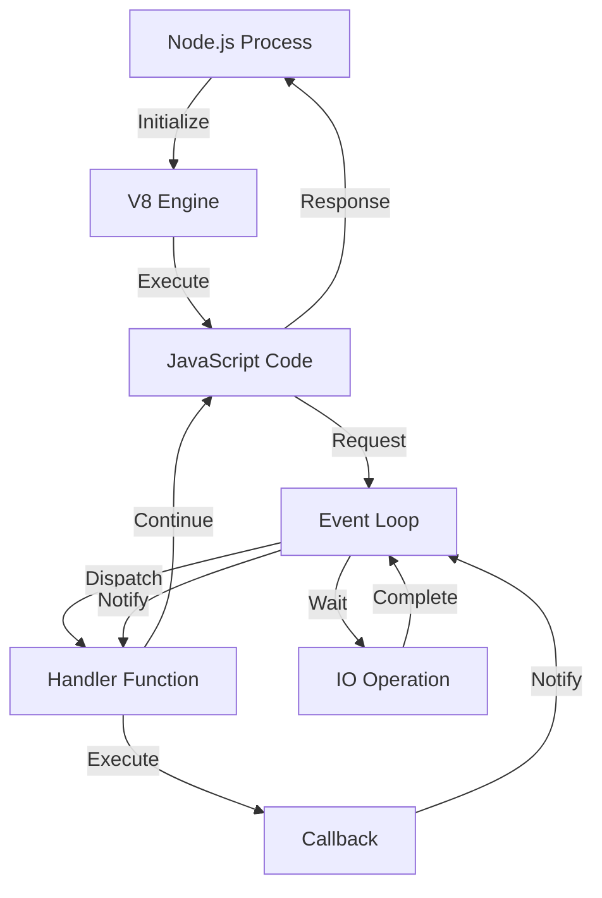

## Introduction
Node.js is a popular JavaScript runtime environment that allows developers to create scalable and high-performance backend applications. When it comes to building Node.js backends where correctness matters, it's essential to understand the importance of writing robust, maintainable, and efficient code. In this overview, we'll explore the core concepts, internal mechanics, and best practices for building reliable Node.js backends. 
> **Note:** Correctness is critical in backend development, as it directly impacts the reliability, security, and performance of the application.

Real-world relevance is evident in the numerous production systems that rely on Node.js, such as Netflix, LinkedIn, and eBay. These companies require high-performance, scalable, and maintainable backend applications to handle massive traffic and data processing. 
> **Warning:** Neglecting correctness in Node.js backend development can lead to security vulnerabilities, performance issues, and maintenance nightmares.

Every engineer needs to know how to write robust Node.js code to ensure the reliability and security of their applications. This overview will provide a comprehensive guide to building correct Node.js backends, covering core concepts, internal mechanics, code examples, and best practices.

## Core Concepts
To build correct Node.js backends, it's essential to understand the core concepts of Node.js, including:
* **Event-driven programming**: Node.js is built around an event-driven, non-blocking I/O model, which allows it to handle multiple requests concurrently.
* **Asynchronous programming**: Node.js uses asynchronous programming to handle I/O operations, such as database queries and network requests.
* **Modules**: Node.js has a vast ecosystem of modules that provide various functionalities, from database drivers to authentication libraries.
* **Error handling**: Node.js provides a robust error handling mechanism, including try-catch blocks, error callbacks, and event listeners.

Mental models and analogies can help developers understand these concepts. For example, event-driven programming can be thought of as a restaurant, where the waiter (Node.js) takes orders (requests) and notifies the kitchen (I/O operations) to prepare the food (data). 
> **Tip:** When working with asynchronous programming, use async/await syntax to simplify code readability and maintainability.

Key terminology includes:
* **Callback**: A function passed as an argument to another function, which is executed when a specific operation is complete.
* **Promise**: A representation of a value that may not be available yet, but will be resolved at some point in the future.
* **Async/await**: A syntax sugar on top of promises, which allows writing asynchronous code that looks and feels synchronous.

## How It Works Internally
Node.js works internally using a combination of the V8 JavaScript engine, the libuv library, and the Node.js core. The V8 engine executes JavaScript code, while libuv provides a cross-platform interface for I/O operations. The Node.js core provides the event-driven, non-blocking I/O model and the module system.

Here's a step-by-step breakdown of how Node.js works internally:
1. The Node.js process starts, and the V8 engine initializes.
2. The Node.js core sets up the event loop, which is responsible for handling I/O operations and executing callbacks.
3. When a request is received, the event loop dispatches it to the corresponding handler function.
4. The handler function executes, and if it performs an I/O operation, it will notify the event loop to wait for the operation to complete.
5. The event loop continues to execute other requests and callbacks while waiting for the I/O operation to complete.
6. When the I/O operation is complete, the event loop will notify the handler function to continue execution.

> **Interview:** Can you explain the difference between synchronous and asynchronous programming in Node.js? How do you handle errors in asynchronous code?

## Code Examples
### Example 1: Basic HTTP Server
```javascript
const http = require('http');

http.createServer((req, res) => {
  // Handle request
  console.log(`Request received: ${req.method} ${req.url}`);

  // Send response
  res.writeHead(200, { 'Content-Type': 'text/plain' });
  res.end('Hello, World!\n');
}).listen(3000, () => {
  console.log('Server listening on port 3000');
});
```
This example demonstrates a basic HTTP server using the built-in `http` module. The server listens for incoming requests and responds with a simple "Hello, World!" message.

### Example 2: Asynchronous Database Query
```javascript
const mysql = require('mysql');

const db = mysql.createConnection({
  host: 'localhost',
  user: 'username',
  password: 'password',
  database: 'database'
});

db.connect((err) => {
  if (err) {
    console.error('Error connecting to database:', err);
    return;
  }

  console.log('Connected to database');

  db.query('SELECT * FROM table', (err, results) => {
    if (err) {
      console.error('Error executing query:', err);
      return;
    }

    console.log('Query results:', results);
  });
});

db.end();
```
This example demonstrates an asynchronous database query using the `mysql` module. The code connects to a database, executes a query, and logs the results.

### Example 3: Error Handling with Try-Catch
```javascript
try {
  // Code that may throw an error
  const data = JSON.parse('Invalid JSON');
  console.log(data);
} catch (err) {
  // Handle error
  console.error('Error:', err);
}

// Alternative error handling using async/await
async function fetchData() {
  try {
    const response = await fetch('https://example.com/data');
    const data = await response.json();
    console.log(data);
  } catch (err) {
    console.error('Error:', err);
  }
}

fetchData();
```
This example demonstrates error handling using try-catch blocks and async/await syntax.

## Visual Diagram

This diagram illustrates the internal mechanics of Node.js, including the event loop, handler functions, and I/O operations.

## Comparison
| Approach | Time Complexity | Space Complexity | Pros | Cons | Best For |
| --- | --- | --- | --- | --- | --- |
| Synchronous Programming | O(1) | O(1) | Simple, predictable | Blocking, inefficient | Small-scale applications |
| Asynchronous Programming | O(n) | O(n) | Scalable, efficient | Complex, error-prone | Large-scale applications |
| Callbacks | O(n) | O(n) | Flexible, reusable | Nested, hard to read | I/O-bound operations |
| Promises | O(n) | O(n) | Simplified, readable | Limited control, slower | CPU-bound operations |
| Async/Await | O(n) | O(n) | Readable, maintainable | Limited control, slower | I/O-bound operations |

## Real-world Use Cases
1. **Netflix**: Uses Node.js to power its web application, handling millions of requests per day.
2. **LinkedIn**: Utilizes Node.js for its mobile application, providing a fast and scalable experience for users.
3. **eBay**: Employs Node.js for its web application, ensuring high performance and reliability.

## Common Pitfalls
1. **Callback Hell**: Nested callbacks can lead to unreadable and unmaintainable code.
```javascript
// Wrong
fs.readFile('file1.txt', (err, data) => {
  fs.readFile('file2.txt', (err, data) => {
    // ...
  });
});

// Right
fs.readFile('file1.txt', (err, data) => {
  if (err) {
    console.error(err);
  } else {
    fs.readFile('file2.txt', (err, data) => {
      if (err) {
        console.error(err);
      } else {
        // ...
      }
    });
  }
});
```
2. **Unhandled Errors**: Failing to handle errors can lead to application crashes and security vulnerabilities.
```javascript
// Wrong
fs.readFile('file.txt', (err, data) => {
  console.log(data);
});

// Right
fs.readFile('file.txt', (err, data) => {
  if (err) {
    console.error(err);
  } else {
    console.log(data);
  }
});
```
3. **Memory Leaks**: Failing to release resources can lead to memory leaks and performance issues.
```javascript
// Wrong
const interval = setInterval(() => {
  console.log('Interval');
}, 1000);

// Right
const interval = setInterval(() => {
  console.log('Interval');
}, 1000);

// Release resource
clearInterval(interval);
```
4. **Insecure Dependencies**: Using insecure dependencies can lead to security vulnerabilities and data breaches.
```javascript
// Wrong
const express = require('express@4.17.1');

// Right
const express = require('express@latest');
```
> **Warning:** Always keep dependencies up-to-date and use secure versions to prevent security vulnerabilities.

## Interview Tips
1. **What is the difference between synchronous and asynchronous programming in Node.js?**
	* Weak answer: "Synchronous programming is when the code executes in a linear fashion, while asynchronous programming is when the code executes in a non-linear fashion."
	* Strong answer: "Synchronous programming in Node.js refers to the execution of code in a blocking manner, where the next line of code is executed only after the previous line has completed. Asynchronous programming, on the other hand, refers to the execution of code in a non-blocking manner, where the next line of code is executed immediately, without waiting for the previous line to complete. Asynchronous programming is achieved using callbacks, promises, or async/await syntax."
2. **How do you handle errors in asynchronous code?**
	* Weak answer: "I use try-catch blocks to catch errors."
	* Strong answer: "I use a combination of try-catch blocks, error callbacks, and promise rejection handlers to handle errors in asynchronous code. I also make sure to log errors and provide meaningful error messages to facilitate debugging."
3. **What is the purpose of the event loop in Node.js?**
	* Weak answer: "The event loop is used to handle I/O operations."
	* Strong answer: "The event loop is the core mechanism in Node.js that allows it to handle multiple requests concurrently. It is responsible for executing callbacks, handling I/O operations, and managing the execution of code. The event loop is what enables Node.js to achieve high scalability and performance."

## Key Takeaways
* Node.js is a JavaScript runtime environment that allows developers to create scalable and high-performance backend applications.
* Correctness is critical in Node.js backend development, as it directly impacts the reliability, security, and performance of the application.
* Node.js uses an event-driven, non-blocking I/O model to handle multiple requests concurrently.
* Asynchronous programming is essential in Node.js, and it can be achieved using callbacks, promises, or async/await syntax.
* Error handling is crucial in Node.js, and it can be achieved using try-catch blocks, error callbacks, and promise rejection handlers.
* The event loop is the core mechanism in Node.js that allows it to handle multiple requests concurrently.
* Node.js has a vast ecosystem of modules that provide various functionalities, from database drivers to authentication libraries.
* Security is a top concern in Node.js development, and it can be achieved by using secure dependencies, handling errors properly, and following best practices.
* Performance is critical in Node.js development, and it can be achieved by using efficient algorithms, minimizing memory usage, and optimizing database queries.
* Node.js is widely used in production environments, including Netflix, LinkedIn, and eBay, to build scalable and high-performance backend applications.