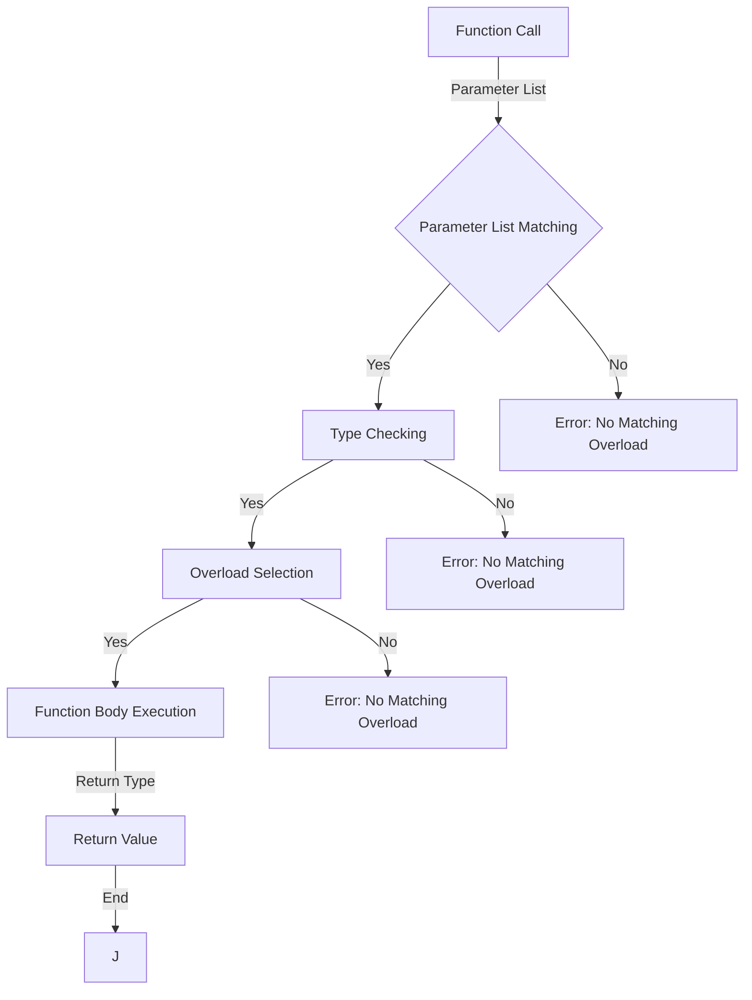

## Introduction
**Function overloads** are a fundamental concept in programming, particularly in statically-typed languages like TypeScript. They allow multiple functions with the same name to be defined, as long as they have different parameter lists. This feature is essential for creating flexible and reusable code, as it enables functions to handle different types of input data. In this section, we will delve into the world of function overloads, exploring their definition, importance, and real-world applications.

Function overloads are crucial in software development, as they provide a way to write more generic and adaptable code. By defining multiple functions with the same name, developers can create a single interface that can handle various types of input data, making their code more modular and maintainable. This feature is particularly useful when working with different data types, such as numbers, strings, or objects, where a single function can be designed to handle all these types.

> **Note:** Function overloads are not to be confused with function overriding, which is a different concept in object-oriented programming. While function overriding involves redefining a function in a subclass, function overloads involve defining multiple functions with the same name but different parameter lists.

## Core Concepts
To understand function overloads, it's essential to grasp the core concepts involved. A **function signature** is the combination of a function's name, return type, and parameter list. In TypeScript, function overloads are defined using multiple function signatures with the same name but different parameter lists. The **function body** is the implementation of the function, which is executed when the function is called.

When defining function overloads, it's crucial to ensure that each overload has a unique parameter list. This is known as **function signature uniqueness**. If two or more overloads have the same parameter list, the compiler will throw an error.

> **Warning:** When defining function overloads, be careful not to create ambiguous function calls. If the compiler is unable to determine which overload to use, it will throw an error.

## How It Works Internally
When a function is called, the compiler checks the function signature to determine which overload to use. This process is known as **function overload resolution**. The compiler uses the following steps to resolve function overloads:

1. **Parameter list matching**: The compiler checks the parameter list of the function call against the parameter lists of the defined overloads.
2. **Type checking**: The compiler checks the types of the parameters passed to the function against the types of the parameters in the overload signatures.
3. **Overload selection**: The compiler selects the overload that best matches the function call.

The time complexity of function overload resolution is O(n), where n is the number of overloads defined. The space complexity is O(1), as the compiler only needs to store the function signatures and parameter lists.

## Code Examples
### Example 1: Basic Function Overload
```typescript
function add(x: number, y: number): number;
function add(x: string, y: string): string;
function add(x: any, y: any): any {
  if (typeof x === 'number' && typeof y === 'number') {
    return x + y;
  } else if (typeof x === 'string' && typeof y === 'string') {
    return x + y;
  } else {
    throw new Error('Unsupported types');
  }
}

console.log(add(2, 3)); // Output: 5
console.log(add('hello', 'world')); // Output: 'helloworld'
```
### Example 2: Real-World Function Overload
```typescript
interface Point {
  x: number;
  y: number;
}

function distance(p1: Point, p2: Point): number;
function distance(x1: number, y1: number, x2: number, y2: number): number;
function distance(...args: any[]): number {
  if (args.length === 2 && typeof args[0] === 'object' && typeof args[1] === 'object') {
    const p1 = args[0] as Point;
    const p2 = args[1] as Point;
    return Math.sqrt((p1.x - p2.x) ** 2 + (p1.y - p2.y) ** 2);
  } else if (args.length === 4 && typeof args[0] === 'number' && typeof args[1] === 'number' && typeof args[2] === 'number' && typeof args[3] === 'number') {
    const x1 = args[0];
    const y1 = args[1];
    const x2 = args[2];
    const y2 = args[3];
    return Math.sqrt((x1 - x2) ** 2 + (y1 - y2) ** 2);
  } else {
    throw new Error('Unsupported arguments');
  }
}

console.log(distance({ x: 1, y: 2 }, { x: 4, y: 6 })); // Output: 5
console.log(distance(1, 2, 4, 6)); // Output: 5
```
### Example 3: Advanced Function Overload
```typescript
class Vector {
  private x: number;
  private y: number;

  constructor(x: number, y: number) {
    this.x = x;
    this.y = y;
  }

  add(other: Vector): Vector;
  add(x: number, y: number): Vector;
  add(...args: any[]): Vector {
    if (args.length === 1 && args[0] instanceof Vector) {
      const other = args[0] as Vector;
      return new Vector(this.x + other.x, this.y + other.y);
    } else if (args.length === 2 && typeof args[0] === 'number' && typeof args[1] === 'number') {
      const x = args[0];
      const y = args[1];
      return new Vector(this.x + x, this.y + y);
    } else {
      throw new Error('Unsupported arguments');
    }
  }
}

const v1 = new Vector(1, 2);
const v2 = new Vector(3, 4);
console.log(v1.add(v2)); // Output: Vector { x: 4, y: 6 }
console.log(v1.add(2, 3)); // Output: Vector { x: 3, y: 5 }
```
## Visual Diagram

The diagram illustrates the process of function overload resolution, from parameter list matching to function body execution.

## Comparison
| Approach | Time Complexity | Space Complexity | Pros | Cons | Best For |
| --- | --- | --- | --- | --- | --- |
| Function Overloads | O(n) | O(1) | Flexible, reusable code | Can lead to ambiguity | General-purpose programming |
| Function Templates | O(1) | O(n) | Compile-time evaluation, type safety | Limited flexibility | Template metaprogramming |
| Dynamic Dispatch | O(1) | O(1) | Runtime evaluation, flexibility | Performance overhead | Dynamic programming |
| Static Dispatch | O(1) | O(1) | Compile-time evaluation, performance | Limited flexibility | Static programming |

## Real-world Use Cases
1. **Google Maps**: The Google Maps API uses function overloads to provide a flexible interface for calculating distances and routes. Developers can use the same function to calculate distances between two points, regardless of whether the points are represented as latitude and longitude coordinates or as addresses.
2. **Facebook React**: The React library uses function overloads to provide a flexible interface for rendering components. Developers can use the same function to render components with different props and state.
3. **Microsoft Azure**: The Azure API uses function overloads to provide a flexible interface for managing cloud resources. Developers can use the same function to manage different types of resources, such as virtual machines and storage accounts.

## Common Pitfalls
1. **Ambiguous Function Calls**: When defining function overloads, be careful not to create ambiguous function calls. If the compiler is unable to determine which overload to use, it will throw an error.
```typescript
function foo(x: number): number;
function foo(x: string): string;
function foo(x: any): any {
  // ...
}

foo(1); // Error: Ambiguous function call
```
2. **Incorrect Parameter Lists**: When defining function overloads, ensure that each overload has a unique parameter list. If two or more overloads have the same parameter list, the compiler will throw an error.
```typescript
function foo(x: number): number;
function foo(x: number): string; // Error: Duplicate function signature
```
3. **Insufficient Type Checking**: When defining function overloads, ensure that each overload performs sufficient type checking. If a function overload does not perform sufficient type checking, it may lead to runtime errors.
```typescript
function foo(x: any): any {
  // ...
}

foo('hello'); // Runtime error: Unexpected string value
```
4. **Inconsistent Return Types**: When defining function overloads, ensure that each overload returns a consistent type. If a function overload returns an inconsistent type, it may lead to runtime errors.
```typescript
function foo(x: number): number;
function foo(x: string): string;
function foo(x: any): any {
  // ...
}

foo(1); // Runtime error: Unexpected return type
```
## Interview Tips
1. **What is function overloading?**: Be prepared to define function overloading and explain its importance in programming.
2. **How does function overloading work?**: Be prepared to explain the process of function overload resolution, including parameter list matching, type checking, and overload selection.
3. **What are the benefits and drawbacks of function overloading?**: Be prepared to discuss the benefits and drawbacks of function overloading, including flexibility, reusability, and potential ambiguity.

> **Interview:** Can you explain the difference between function overloading and function overriding?

## Key Takeaways
* Function overloads allow multiple functions with the same name to be defined, as long as they have different parameter lists.
* Function overloads are defined using multiple function signatures with the same name but different parameter lists.
* The compiler uses parameter list matching, type checking, and overload selection to resolve function overloads.
* Function overloads can lead to ambiguity if not defined carefully.
* Function overloads are useful for creating flexible and reusable code.
* The time complexity of function overload resolution is O(n), where n is the number of overloads defined.
* The space complexity of function overload resolution is O(1), as the compiler only needs to store the function signatures and parameter lists.