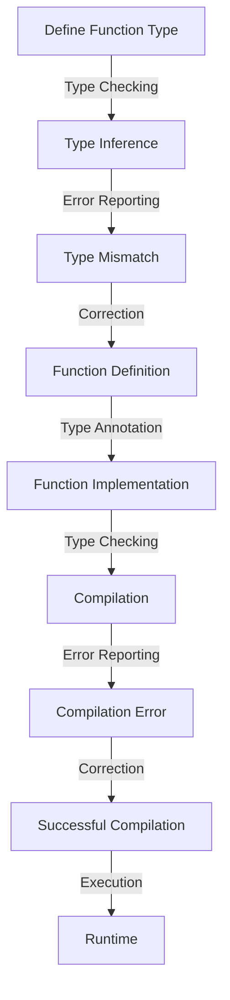

## Introduction
**Function types** in TypeScript are a fundamental concept that allows developers to define the shape of functions, including the types of their parameters and return values. This concept is crucial in maintaining the quality and reliability of code, especially in large-scale applications. In real-world scenarios, function types are used extensively in frameworks like React, Angular, and Vue.js, where they help ensure that components receive the correct props and return the expected values. Every engineer should have a deep understanding of function types to write robust, maintainable, and efficient code.

## Core Concepts
To understand function types, it's essential to grasp the following key concepts:
- **Function signature**: The combination of a function's name, parameters, and return type.
- **Parameter type**: The type of data that a function expects as input.
- **Return type**: The type of data that a function returns as output.
- **Type inference**: The process by which TypeScript automatically determines the types of variables, parameters, and return values based on their usage.

> **Note:** Function types are not limited to simple functions; they can also be used to define the types of higher-order functions, which are functions that take other functions as parameters or return functions as output.

## How It Works Internally
When you define a function type in TypeScript, the compiler checks the types of the function's parameters and return value to ensure they match the defined type. Here's a step-by-step breakdown of the process:
1. **Type checking**: The TypeScript compiler checks the types of the function's parameters and return value against the defined function type.
2. **Type inference**: If the types are not explicitly defined, TypeScript uses type inference to determine the types of the parameters and return value based on their usage.
3. **Error reporting**: If there are any type mismatches, the compiler reports an error, indicating the specific type mismatch and suggesting possible corrections.

## Code Examples
### Example 1: Basic Function Type
```typescript
// Define a function type that takes a string and returns a number
type StringToNumber = (str: string) => number;

// Create a function that matches the defined type
const stringToNumber: StringToNumber = (str: string) => {
  // Use parseInt to convert the string to a number
  return parseInt(str, 10);
};

console.log(stringToNumber('123')); // Output: 123
```
### Example 2: Real-World Pattern
```typescript
// Define a function type that takes an object with a name property and returns a greeting message
type Greet = (person: { name: string }) => string;

// Create a function that matches the defined type
const greet: Greet = (person: { name: string }) => {
  // Use template literals to create a greeting message
  return `Hello, ${person.name}!`;
};

console.log(greet({ name: 'John Doe' })); // Output: Hello, John Doe!
```
### Example 3: Advanced Function Type
```typescript
// Define a function type that takes a callback function as a parameter
type AsyncCallback = (callback: (error: Error | null, result: string) => void) => void;

// Create a function that matches the defined type
const asyncCallback: AsyncCallback = (callback: (error: Error | null, result: string) => void) => {
  // Simulate an asynchronous operation
  setTimeout(() => {
    // Call the callback function with a result
    callback(null, 'Operation completed successfully');
  }, 2000);
};

asyncCallback((error, result) => {
  if (error) {
    console.error(error);
  } else {
    console.log(result); // Output: Operation completed successfully
  }
});
```
> **Tip:** When working with function types, it's essential to use type inference to simplify your code and reduce the amount of explicit type annotations.

## Visual Diagram

The diagram illustrates the process of defining a function type, including type checking, type inference, error reporting, and compilation.

## Comparison
| Approach | Time Complexity | Space Complexity | Pros | Cons | Best For |
| --- | --- | --- | --- | --- | --- |
| Explicit Type Annotation | O(1) | O(1) | Improved code readability, better error messages | Increased code verbosity | Small to medium-sized projects |
| Type Inference | O(n) | O(n) | Reduced code verbosity, improved development speed | Potential for type errors | Large-scale projects, complex systems |
| Hybrid Approach | O(n) | O(n) | Balances code readability and development speed | Requires careful type annotation | Most projects, especially those with complex logic |
| Dynamic Typing | O(1) | O(1) | Rapid development, flexible code | Potential for runtime errors, decreased code maintainability | Prototyping, proof-of-concept projects |

## Real-world Use Cases
1. **React**: React uses function types extensively to define the props and state of components, ensuring that components receive the correct data and behave as expected.
2. **Angular**: Angular uses function types to define the types of services, components, and pipes, making it easier to develop and maintain large-scale applications.
3. **Vue.js**: Vue.js uses function types to define the types of components, mixins, and plugins, providing a robust and maintainable framework for building complex web applications.

> **Warning:** Failing to use function types correctly can lead to type errors, runtime errors, and decreased code maintainability.

## Common Pitfalls
1. **Insufficient Type Annotation**: Failing to annotate function types can lead to type errors and decreased code maintainability.
```typescript
// Incorrect
const add = (a, b) => a + b;

// Correct
const add: (a: number, b: number) => number = (a, b) => a + b;
```
2. **Inconsistent Type Usage**: Using inconsistent types for function parameters and return values can lead to type errors and confusion.
```typescript
// Incorrect
const greet: (name: string) => number = (name) => `Hello, ${name}!`;

// Correct
const greet: (name: string) => string = (name) => `Hello, ${name}!`;
```
3. **Ignoring Type Inference**: Ignoring type inference can lead to unnecessary type annotations and decreased code readability.
```typescript
// Incorrect
const add: (a: number, b: number) => number = (a: number, b: number) => a + b;

// Correct
const add = (a: number, b: number) => a + b;
```
4. **Not Using Type Guards**: Failing to use type guards can lead to type errors and decreased code maintainability.
```typescript
// Incorrect
const isString = (value: any) => typeof value === 'string';

// Correct
const isString = (value: any): value is string => typeof value === 'string';
```
> **Tip:** Use type guards to narrow the type of a value within a specific scope, improving code maintainability and reducing type errors.

## Interview Tips
1. **What is the difference between a function type and an interface?**
	* Weak answer: "A function type is used for functions, and an interface is used for objects."
	* Strong answer: "A function type defines the shape of a function, including its parameters and return type, while an interface defines the shape of an object, including its properties and methods."
2. **How do you use type inference in TypeScript?**
	* Weak answer: "You use type inference by not annotating types."
	* Strong answer: "You use type inference by allowing TypeScript to automatically determine the types of variables, parameters, and return values based on their usage, while still providing explicit type annotations where necessary."
3. **What is the purpose of type guards in TypeScript?**
	* Weak answer: "Type guards are used to check the type of a value."
	* Strong answer: "Type guards are used to narrow the type of a value within a specific scope, allowing for more precise type checking and reducing type errors."

## Key Takeaways
* **Function types** define the shape of functions, including their parameters and return types.
* **Type inference** automatically determines the types of variables, parameters, and return values based on their usage.
* **Type guards** narrow the type of a value within a specific scope, improving code maintainability and reducing type errors.
* **Explicit type annotation** improves code readability and maintainability, but can increase code verbosity.
* **Type inference** reduces code verbosity, but requires careful type annotation to avoid type errors.
* **Hybrid approach** balances code readability and development speed, but requires careful type annotation and type inference.
* **Dynamic typing** allows for rapid development, but can lead to runtime errors and decreased code maintainability.
* **Type annotation** is essential for maintaining code readability and reducing type errors.
* **Type inference** is essential for reducing code verbosity and improving development speed.