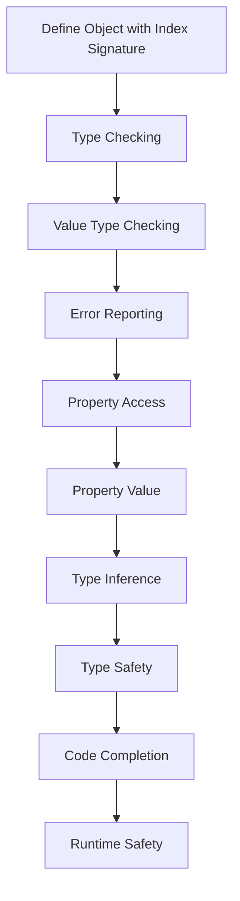

## Introduction
Index signatures in TypeScript are a powerful feature that allows you to define the type of an object's properties using a syntax like `{ [key: string]: unknown }`. This syntax tells TypeScript that the object can have any number of properties, and each property's key is a string, while the value can be of any type. Index signatures are essential in TypeScript because they enable you to work with dynamic objects, such as JSON data, in a type-safe manner. In real-world applications, you often encounter data that has a dynamic structure, and index signatures help you to define the type of such data accurately. For instance, when working with REST APIs, the response data may have varying properties depending on the request. Index signatures allow you to define a type that can accommodate this variability.

## Core Concepts
To understand index signatures, you need to grasp the following core concepts:
- **Index Signature Syntax**: The syntax for defining an index signature is `{ [key: string]: type }`, where `key` is the type of the property key, and `type` is the type of the property value.
- **Property Keys**: In TypeScript, property keys can be of type `string`, `number`, or `symbol`. However, when using index signatures, the type of the property key is usually `string`.
- **Type Inference**: When you define an object with an index signature, TypeScript can infer the type of the object's properties based on the index signature.

> **Note:** Index signatures are particularly useful when working with libraries or frameworks that return data with dynamic properties.

## How It Works Internally
When you define an index signature, TypeScript uses it to check the type of the object's properties at compile-time. Here's a step-by-step breakdown of how it works:
1. **Definition**: You define an object with an index signature, e.g., `{ [key: string]: unknown }`.
2. **Type Checking**: When you access a property of the object, TypeScript checks if the property key is of the correct type (in this case, `string`).
3. **Value Type Checking**: If the property key is of the correct type, TypeScript checks if the value of the property is of the type specified in the index signature (in this case, `unknown`).
4. **Error Reporting**: If the type of the property key or value does not match the index signature, TypeScript reports an error.

## Code Examples
### Example 1: Basic Usage
```typescript
// Define an object with an index signature
const data: { [key: string]: unknown } = {
  name: 'John Doe',
  age: 30,
  occupation: 'Software Engineer',
};

// Accessing properties
console.log(data.name); // string
console.log(data.age); // number
console.log(data.occupation); // string

// Adding a new property
data.country = 'USA';
console.log(data.country); // string
```

### Example 2: Real-World Pattern
```typescript
// Define a function that returns data with an index signature
function fetchData(): { [key: string]: unknown } {
  return {
    id: 1,
    name: 'John Doe',
    email: 'john.doe@example.com',
  };
}

// Using the function
const userData = fetchData();
console.log(userData.id); // number
console.log(userData.name); // string
console.log(userData.email); // string
```

### Example 3: Advanced Usage
```typescript
// Define a class with a method that returns data with an index signature
class DataService {
  async getData(): Promise<{ [key: string]: unknown }> {
    // Simulate a REST API call
    return {
      id: 1,
      name: 'John Doe',
      email: 'john.doe@example.com',
    };
  }
}

// Using the class
const dataService = new DataService();
dataService.getData().then((data) => {
  console.log(data.id); // number
  console.log(data.name); // string
  console.log(data.email); // string
});
```

## Visual Diagram

The diagram illustrates the process of defining an object with an index signature, type checking, value type checking, error reporting, and finally, achieving type safety and runtime safety.

## Comparison
| Approach | Time Complexity | Space Complexity | Pros | Cons | Best For |
| --- | --- | --- | --- | --- | --- |
| Index Signatures | O(1) | O(1) | Flexible, dynamic | Error-prone if not used correctly | Working with dynamic data, REST APIs |
| Type Guards | O(1) | O(1) | Safe, explicit | Verbose, less flexible | Working with complex, static data |
| Interfaces | O(1) | O(1) | Explicit, safe | Less flexible, more verbose | Working with complex, static data |
| Type Aliases | O(1) | O(1) | Flexible, concise | Less explicit, less safe | Working with simple, dynamic data |

## Real-world Use Cases
1. **REST APIs**: When working with REST APIs, the response data often has a dynamic structure. Index signatures can be used to define the type of the response data.
2. **JSON Data**: When working with JSON data, index signatures can be used to define the type of the data.
3. **NoSQL Databases**: When working with NoSQL databases, the data often has a dynamic structure. Index signatures can be used to define the type of the data.

> **Tip:** When working with dynamic data, it's essential to use index signatures to ensure type safety and runtime safety.

## Common Pitfalls
1. **Incorrect Key Type**: Using an incorrect key type in the index signature can lead to errors.
```typescript
// Incorrect key type
const data: { [key: number]: unknown } = {
  'name': 'John Doe', // Error: Type 'string' is not assignable to type 'number'.
};
```
2. **Incorrect Value Type**: Using an incorrect value type in the index signature can lead to errors.
```typescript
// Incorrect value type
const data: { [key: string]: number } = {
  name: 'John Doe', // Error: Type 'string' is not assignable to type 'number'.
};
```
3. **Missing Index Signature**: Failing to define an index signature can lead to errors.
```typescript
// Missing index signature
const data = {
  name: 'John Doe',
};
console.log(data.name); // Error: Property 'name' does not exist on type '{}'.
```
4. **Incorrect Index Signature**: Using an incorrect index signature can lead to errors.
```typescript
// Incorrect index signature
const data: { [key: string]: unknown } = {
  1: 'John Doe', // Error: Type 'number' is not assignable to type 'string'.
};
```

## Interview Tips
1. **What is an index signature?**: An index signature is a syntax in TypeScript that allows you to define the type of an object's properties using a syntax like `{ [key: string]: unknown }`.
2. **How do you use index signatures?**: You can use index signatures to define the type of an object's properties when working with dynamic data.
3. **What are the benefits of using index signatures?**: The benefits of using index signatures include flexibility, dynamic typing, and type safety.

> **Interview:** When asked about index signatures, be sure to explain the syntax, usage, and benefits.

## Key Takeaways
* Index signatures are a powerful feature in TypeScript that allows you to define the type of an object's properties using a syntax like `{ [key: string]: unknown }`.
* Index signatures are essential when working with dynamic data, such as REST APIs, JSON data, and NoSQL databases.
* The benefits of using index signatures include flexibility, dynamic typing, and type safety.
* When using index signatures, it's essential to define the correct key type and value type to avoid errors.
* Index signatures can be used in conjunction with other TypeScript features, such as type guards and interfaces, to achieve type safety and runtime safety.
* The time complexity of using index signatures is O(1), and the space complexity is O(1).
* Index signatures are a fundamental concept in TypeScript, and understanding them is crucial for building robust and maintainable applications.