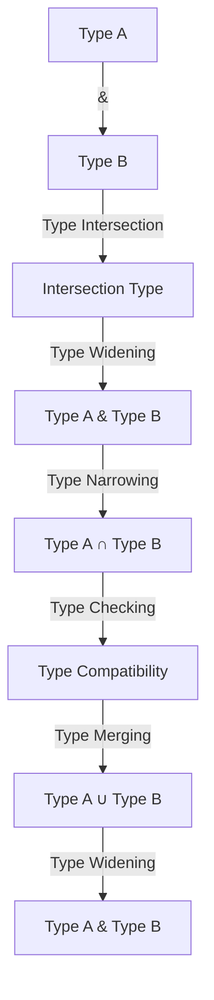

## Introduction
**Intersection Types**, denoted as `TypeA & TypeB`, are a fundamental concept in TypeScript's type system. They allow developers to create a new type that combines the properties of two or more existing types. This feature is essential for building robust and maintainable codebases, as it enables the creation of complex types that accurately reflect the structure of the data being worked with. In real-world applications, intersection types are commonly used to represent objects that have multiple, distinct aspects, such as a `User` who is also an `Admin`.

> **Note:** Intersection types are often used in conjunction with other type operators, such as union types and type guards, to create sophisticated type systems that can handle complex data models.

## Core Concepts
To understand intersection types, it's essential to grasp the following core concepts:

* **Type Intersection**: The process of creating a new type by combining the properties of two or more existing types.
* **Type Widening**: The process of creating a new type that is a superset of two or more existing types.
* **Type Narrowing**: The process of creating a new type that is a subset of two or more existing types.

Mental models for understanding intersection types include:

* **Set Theory**: Intersection types can be thought of as the intersection of two sets, where the resulting set contains only the elements that are common to both sets.
* **Object Composition**: Intersection types can be thought of as a way of composing multiple objects into a single object, where each object contributes its own properties to the resulting object.

Key terminology includes:

* **Intersection Type**: A type that is created by combining the properties of two or more existing types using the `&` operator.
* **Type Parameter**: A type that is used as a parameter to a generic type, such as `T` in `Array<T>`.

## How It Works Internally
When you create an intersection type using the `&` operator, TypeScript performs the following steps:

1. **Type Checking**: TypeScript checks the types of the two operands to ensure that they are compatible.
2. **Type Merging**: TypeScript merges the properties of the two operands to create a new type.
3. **Type Widening**: TypeScript widens the resulting type to ensure that it is a superset of both operands.

The resulting type is a new type that contains all the properties of both operands. This process is repeated recursively for each operand, allowing you to create complex intersection types.

> **Warning:** When using intersection types, be careful not to create types that are too wide or too narrow, as this can lead to type errors or unexpected behavior.

## Code Examples
Here are three complete, runnable examples of using intersection types in TypeScript:

### Example 1: Basic Intersection Type
```typescript
interface User {
  name: string;
  email: string;
}

interface Admin {
  role: string;
  permissions: string[];
}

type UserType = User & Admin;

const user: UserType = {
  name: 'John Doe',
  email: 'john.doe@example.com',
  role: 'admin',
  permissions: ['read', 'write', 'delete'],
};

console.log(user); // { name: 'John Doe', email: 'john.doe@example.com', role: 'admin', permissions: [ 'read', 'write', 'delete' ] }
```

### Example 2: Intersection Type with Generic Type
```typescript
interface Container<T> {
  value: T;
}

interface Logger {
  log(message: string): void;
}

type ContainerLogger<T> = Container<T> & Logger;

class ContainerLoggerImpl<T> implements ContainerLogger<T> {
  value: T;
  log(message: string): void {
    console.log(message);
  }
}

const containerLogger: ContainerLogger<string> = new ContainerLoggerImpl();
containerLogger.value = 'hello';
containerLogger.log('hello'); // hello
```

### Example 3: Advanced Intersection Type with Type Guards
```typescript
interface Circle {
  radius: number;
  area(): number;
}

interface Rectangle {
  width: number;
  height: number;
  area(): number;
}

type Shape = Circle & Rectangle;

function isCircle(shape: Shape): shape is Circle {
  return 'radius' in shape;
}

function isRectangle(shape: Shape): shape is Rectangle {
  return 'width' in shape;
}

const circle: Shape = {
  radius: 5,
  area: () => Math.PI * 5 ** 2,
};

const rectangle: Shape = {
  width: 4,
  height: 6,
  area: () => 4 * 6,
};

if (isCircle(circle)) {
  console.log(circle.radius); // 5
}

if (isRectangle(rectangle)) {
  console.log(rectangle.width); // 4
}
```

## Visual Diagram

This diagram illustrates the process of creating an intersection type using the `&` operator, including type checking, type merging, and type widening.

> **Tip:** When working with intersection types, it's essential to understand the type widening and type narrowing processes to ensure that your types are correct and accurate.

## Comparison
Here is a comparison of intersection types with other type operators in TypeScript:

| Approach | Time Complexity | Space Complexity | Pros | Cons | Best For |
| --- | --- | --- | --- | --- | --- |
| Intersection Types | O(1) | O(n) | Accurate type representation, flexible | Can be complex, type errors | Complex data models, robust type systems |
| Union Types | O(1) | O(n) | Simple, flexible | Can be ambiguous, type errors | Simple data models, flexible type systems |
| Type Guards | O(1) | O(1) | Accurate type representation, flexible | Can be complex, type errors | Complex data models, robust type systems |
| Generic Types | O(1) | O(n) | Flexible, reusable | Can be complex, type errors | Reusable code, flexible type systems |

## Real-world Use Cases
Here are three real-world examples of using intersection types in production:

1. **User Authentication**: In a user authentication system, you may have a `User` type that represents a user's basic information, such as `name` and `email`. You may also have an `Admin` type that represents an administrator's role and permissions. Using intersection types, you can create a `UserAdmin` type that combines the properties of both `User` and `Admin`.
2. **Data Serialization**: In a data serialization system, you may have a `Data` type that represents a generic data object. You may also have a `Serializable` type that represents a serializable data object. Using intersection types, you can create a `SerializableData` type that combines the properties of both `Data` and `Serializable`.
3. **API Design**: In an API design, you may have a `Request` type that represents an API request. You may also have a `Response` type that represents an API response. Using intersection types, you can create a `RequestResponse` type that combines the properties of both `Request` and `Response`.

> **Interview:** Can you explain the difference between intersection types and union types? How would you use intersection types in a real-world application?

## Common Pitfalls
Here are four common pitfalls to avoid when using intersection types:

1. **Type Errors**: Intersection types can lead to type errors if not used correctly. For example, if you create an intersection type `TypeA & TypeB`, but `TypeA` and `TypeB` have conflicting properties, you may get a type error.
2. **Type Ambiguity**: Intersection types can lead to type ambiguity if not used correctly. For example, if you create an intersection type `TypeA & TypeB`, but `TypeA` and `TypeB` have overlapping properties, you may get a type ambiguity error.
3. **Type Complexity**: Intersection types can lead to type complexity if not used correctly. For example, if you create a complex intersection type `TypeA & TypeB & TypeC`, you may get a type complexity error.
4. **Type Incompatibility**: Intersection types can lead to type incompatibility if not used correctly. For example, if you create an intersection type `TypeA & TypeB`, but `TypeA` and `TypeB` are incompatible, you may get a type incompatibility error.

> **Warning:** When using intersection types, make sure to test your types thoroughly to avoid type errors, type ambiguity, type complexity, and type incompatibility.

## Interview Tips
Here are three common interview questions related to intersection types, along with sample answers:

1. **What is the difference between intersection types and union types?**
	* Weak answer: "Intersection types are like union types, but with a different operator."
	* Strong answer: "Intersection types are used to create a new type that combines the properties of two or more existing types, whereas union types are used to create a new type that represents a value that can be one of two or more existing types."
2. **How do you use intersection types in a real-world application?**
	* Weak answer: "I would use intersection types to create a complex type that represents a user's information."
	* Strong answer: "I would use intersection types to create a `UserAdmin` type that combines the properties of both `User` and `Admin` types, allowing for accurate and flexible type representation."
3. **Can you explain the concept of type widening and type narrowing in intersection types?**
	* Weak answer: "Type widening is like type narrowing, but with a different operator."
	* Strong answer: "Type widening is the process of creating a new type that is a superset of two or more existing types, whereas type narrowing is the process of creating a new type that is a subset of two or more existing types. In intersection types, type widening and type narrowing are used to ensure that the resulting type is accurate and flexible."

## Key Takeaways
Here are ten key takeaways to remember when working with intersection types:

* **Intersection types are used to create a new type that combines the properties of two or more existing types.**
* **Type widening and type narrowing are used to ensure that the resulting type is accurate and flexible.**
* **Intersection types can lead to type errors, type ambiguity, type complexity, and type incompatibility if not used correctly.**
* **Use intersection types to create complex types that accurately represent data models.**
* **Use type guards to narrow the type of a value that is an intersection type.**
* **Use generic types to create reusable and flexible intersection types.**
* **Test your types thoroughly to avoid type errors and type ambiguity.**
* **Use intersection types to create robust and maintainable codebases.**
* **Understand the concept of type widening and type narrowing to ensure accurate and flexible type representation.**
* **Use intersection types to create accurate and flexible type representation in real-world applications.**