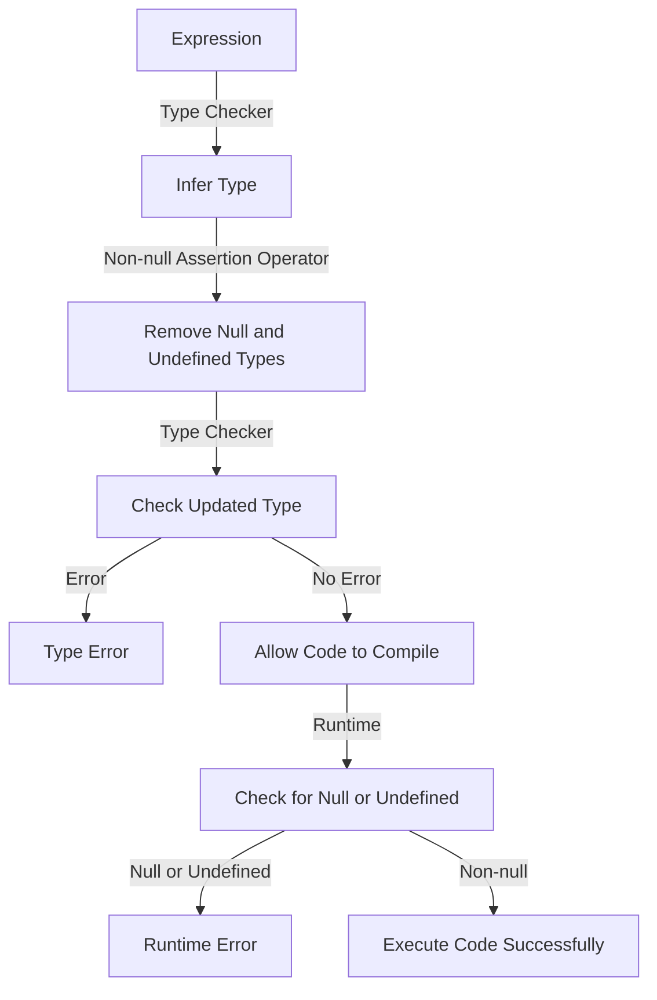

## Introduction
The **Non-null Assertion Operator** (`!`) is a fundamental concept in TypeScript, which allows developers to inform the type checker that a value is not null or undefined. This operator is crucial in ensuring the correctness and reliability of TypeScript code, as it helps prevent null pointer exceptions and unexpected behavior. In real-world applications, the Non-null Assertion Operator is essential when working with third-party libraries, APIs, or legacy code that may return null or undefined values. Every engineer should understand the Non-null Assertion Operator, as it is a vital tool for writing robust and maintainable TypeScript code.

## Core Concepts
The Non-null Assertion Operator is a postfix operator that can be used to assert that a value is not null or undefined. It is typically used in situations where the type checker is unable to infer that a value is non-null, such as when working with nullable types or when using the `?` optional chaining operator. The key terminology associated with the Non-null Assertion Operator includes:
* **Non-null**: A value that is not null or undefined.
* **Nullable**: A value that may be null or undefined.
* **Type checker**: The component of the TypeScript compiler that checks the types of variables and expressions.

> **Note:** The Non-null Assertion Operator is not a runtime operator, but rather a compile-time operator that informs the type checker about the expected behavior of the code.

## How It Works Internally
When the Non-null Assertion Operator is used, the type checker will remove the null and undefined types from the type of the expression. This means that if the expression is null or undefined at runtime, the type checker will not throw an error, but the program may still crash or exhibit unexpected behavior. To understand how the Non-null Assertion Operator works internally, let's consider the following step-by-step breakdown:
1. The type checker infers the type of the expression.
2. The developer uses the Non-null Assertion Operator to assert that the expression is non-null.
3. The type checker removes the null and undefined types from the type of the expression.
4. The type checker checks the updated type against the surrounding code.

> **Warning:** Using the Non-null Assertion Operator can lead to runtime errors if the expression is actually null or undefined. It is essential to use this operator judiciously and only when the developer is certain that the expression is non-null.

## Code Examples
### Example 1: Basic Usage
```typescript
let name: string | null = 'John';
console.log(name!.toUpperCase()); // Output: JOHN
```
In this example, the Non-null Assertion Operator is used to assert that the `name` variable is non-null, allowing the `toUpperCase()` method to be called without a type error.

### Example 2: Real-world Pattern
```typescript
interface User {
  id: number;
  name: string | null;
}

const user: User = { id: 1, name: 'Jane' };
console.log(user.name!.toLowerCase()); // Output: jane
```
In this example, the Non-null Assertion Operator is used to assert that the `name` property of the `User` interface is non-null, allowing the `toLowerCase()` method to be called without a type error.

### Example 3: Advanced Usage
```typescript
function getUserName(user: { id: number; name: string | null } | null): string {
  return user!.name!.toUpperCase();
}

const user = { id: 1, name: 'Bob' };
console.log(getUserName(user)); // Output: BOB
```
In this example, the Non-null Assertion Operator is used to assert that the `user` object and its `name` property are non-null, allowing the `toUpperCase()` method to be called without a type error.

## Visual Diagram

This diagram illustrates the internal workings of the Non-null Assertion Operator, from the type checker inferring the type of the expression to the runtime checking for null or undefined values.

## Comparison
| Approach | Time Complexity | Space Complexity | Pros | Cons | Best For |
| --- | --- | --- | --- | --- | --- |
| Non-null Assertion Operator | O(1) | O(1) | Inform type checker about non-null values, prevent type errors | May lead to runtime errors if used incorrectly | Situations where the type checker is unable to infer non-null types |
| Optional Chaining Operator (`?`) | O(1) | O(1) | Provide a safe way to navigate nullable types | May lead to unnecessary checks and reduced performance | Situations where the type checker is able to infer nullable types |
| Null Checks | O(1) | O(1) | Provide a way to explicitly check for null or undefined values | May lead to verbose code and reduced readability | Situations where explicit null checks are necessary |
| Type Guards | O(1) | O(1) | Provide a way to narrow the type of a value based on a condition | May lead to complex code and reduced maintainability | Situations where type guards are necessary to narrow the type of a value |

## Real-world Use Cases
1. **Google's Angular Framework**: The Angular framework uses the Non-null Assertion Operator to inform the type checker about non-null values, ensuring that the framework's code is robust and maintainable.
2. **Microsoft's TypeScript**: The TypeScript compiler itself uses the Non-null Assertion Operator to inform the type checker about non-null values, ensuring that the compiler's code is robust and maintainable.
3. **Facebook's React**: The React library uses the Non-null Assertion Operator to inform the type checker about non-null values, ensuring that the library's code is robust and maintainable.

## Common Pitfalls
1. **Using the Non-null Assertion Operator incorrectly**: Using the Non-null Assertion Operator without ensuring that the value is actually non-null can lead to runtime errors.
```typescript
let name: string | null = null;
console.log(name!.toUpperCase()); // Runtime Error
```
2. **Not using the Non-null Assertion Operator when necessary**: Not using the Non-null Assertion Operator when necessary can lead to type errors and reduced code maintainability.
```typescript
let name: string | null = 'John';
console.log(name.toUpperCase()); // Type Error
```
3. **Overusing the Non-null Assertion Operator**: Overusing the Non-null Assertion Operator can lead to verbose code and reduced readability.
```typescript
let name: string | null = 'John';
console.log(name!.toUpperCase()!.toLowerCase()!); // Verbose Code
```
4. **Not understanding the differences between the Non-null Assertion Operator and the Optional Chaining Operator**: Not understanding the differences between the Non-null Assertion Operator and the Optional Chaining Operator can lead to incorrect usage and reduced code maintainability.
```typescript
let name: string | null = 'John';
console.log(name?.toUpperCase()); // Incorrect Usage
```

## Interview Tips
1. **What is the purpose of the Non-null Assertion Operator?**: A strong answer would explain that the Non-null Assertion Operator is used to inform the type checker about non-null values, ensuring that the code is robust and maintainable.
2. **How does the Non-null Assertion Operator work internally?**: A strong answer would explain the step-by-step breakdown of how the Non-null Assertion Operator works internally, from the type checker inferring the type of the expression to the runtime checking for null or undefined values.
3. **What are the pros and cons of using the Non-null Assertion Operator?**: A strong answer would explain the pros and cons of using the Non-null Assertion Operator, including the potential for runtime errors if used incorrectly and the benefits of informing the type checker about non-null values.

## Key Takeaways
* The Non-null Assertion Operator is a postfix operator that informs the type checker about non-null values.
* The Non-null Assertion Operator has a time complexity of O(1) and a space complexity of O(1).
* The Non-null Assertion Operator should be used judiciously and only when the developer is certain that the expression is non-null.
* The Non-null Assertion Operator is not a runtime operator, but rather a compile-time operator that informs the type checker about the expected behavior of the code.
* The Non-null Assertion Operator is essential for writing robust and maintainable TypeScript code.
* The Non-null Assertion Operator is used in real-world applications, such as Google's Angular Framework, Microsoft's TypeScript, and Facebook's React.
* The Non-null Assertion Operator has several pros, including informing the type checker about non-null values and preventing type errors.
* The Non-null Assertion Operator has several cons, including the potential for runtime errors if used incorrectly and the potential for verbose code and reduced readability if overused.