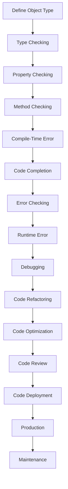

## Introduction
**Object Types** are a fundamental concept in TypeScript, allowing developers to define the structure of objects. In this section, we will explore the three types of object types in TypeScript: **Inline**, **Type Alias**, and **Interface**. Understanding these concepts is crucial for any TypeScript developer, as they enable you to create robust, maintainable, and scalable code. Real-world relevance can be seen in various projects, such as Angular, React, and Vue.js, where object types play a vital role in defining the structure of components, services, and models.

## Core Concepts
To grasp object types, it's essential to understand the following key concepts:

* **Inline Object Type**: An inline object type is defined directly where it's used. It's useful for simple, one-time use cases.
* **Type Alias**: A type alias is a way to give a new name to an existing type. It's helpful when working with complex types or when you want to make your code more readable.
* **Interface**: An interface is a way to define a blueprint for an object. It's the most powerful way to define object types in TypeScript, as it allows you to define properties, methods, and their types.

> **Tip:** When working with object types, it's essential to understand the differences between type aliases and interfaces. Type aliases are more flexible, while interfaces are more restrictive, but they provide better code completion and error checking.

## How It Works Internally
When you define an object type, TypeScript creates a type definition that can be used to check the structure of objects at compile-time. Here's a step-by-step breakdown of how it works:

1. **Type Checking**: When you assign an object to a variable or pass it as an argument to a function, TypeScript checks the type of the object against the defined object type.
2. **Property Checking**: TypeScript checks if the object has all the properties defined in the object type, and if their types match.
3. **Method Checking**: If the object type defines methods, TypeScript checks if the object has those methods and if their return types match.

> **Warning:** If you're using type aliases or interfaces with methods, make sure to implement those methods in your objects, or you'll get a compile-time error.

## Code Examples
Here are three complete, runnable examples that demonstrate the usage of inline object types, type aliases, and interfaces:

### Example 1: Inline Object Type
```typescript
const person: { name: string; age: number } = {
  name: 'John Doe',
  age: 30,
};

console.log(person.name); // John Doe
console.log(person.age); // 30
```
### Example 2: Type Alias
```typescript
type PersonType = {
  name: string;
  age: number;
};

const person: PersonType = {
  name: 'Jane Doe',
  age: 25,
};

console.log(person.name); // Jane Doe
console.log(person.age); // 25
```
### Example 3: Interface
```typescript
interface PersonInterface {
  name: string;
  age: number;
  sayHello(): void;
}

class Person implements PersonInterface {
  constructor(public name: string, public age: number) {}

  sayHello(): void {
    console.log(`Hello, my name is ${this.name} and I'm ${this.age} years old.`);
  }
}

const person = new Person('Bob Smith', 40);
person.sayHello(); // Hello, my name is Bob Smith and I'm 40 years old.
```
> **Interview:** Can you explain the differences between type aliases and interfaces in TypeScript? How would you choose between them in a real-world project?

## Visual Diagram

This diagram illustrates the workflow of defining object types, type checking, property checking, method checking, and the consequences of errors or successful compilation.

## Comparison
Here's a comparison table of the three object types:

| Object Type | Definition | Use Case | Pros | Cons |
| --- | --- | --- | --- | --- |
| Inline | Defined directly where used | Simple, one-time use cases | Easy to use, no extra syntax | Limited flexibility, no code completion |
| Type Alias | Gives a new name to an existing type | Complex types, readability | Flexible, reusable | Can lead to type ambiguity, no method checking |
| Interface | Defines a blueprint for an object | Robust, maintainable code | Provides code completion, method checking | More restrictive, can be verbose |

> **Note:** When choosing between object types, consider the trade-offs between flexibility, readability, and maintainability.

## Real-world Use Cases
Here are three real-world examples of using object types in production:

1. **Angular**: In Angular, interfaces are used to define the structure of components, services, and models. For example, the `@Injectable` decorator uses an interface to define the structure of a service.
2. **React**: In React, type aliases are used to define the props of a component. For example, the `React.Component` class uses a type alias to define the props of a component.
3. **Vue.js**: In Vue.js, interfaces are used to define the structure of components and models. For example, the `Vue.Component` class uses an interface to define the structure of a component.

## Common Pitfalls
Here are four common mistakes to avoid when working with object types:

1. **Forgetting to implement methods**: When using interfaces or type aliases with methods, make sure to implement those methods in your objects.
2. **Using type aliases with methods**: Type aliases with methods can lead to type ambiguity and errors. Instead, use interfaces to define methods.
3. **Not using code completion**: Code completion is a powerful feature that can help you catch errors and improve productivity. Make sure to use it when working with object types.
4. **Not testing for type errors**: Type errors can be difficult to catch, especially when working with complex types. Make sure to test your code for type errors to ensure it's robust and maintainable.

> **Warning:** When working with object types, it's essential to test your code thoroughly to catch type errors and ensure maintainability.

## Interview Tips
Here are three common interview questions related to object types, along with weak and strong answers:

1. **What's the difference between type aliases and interfaces?**
	* Weak answer: "Type aliases are for simple types, and interfaces are for complex types."
	* Strong answer: "Type aliases give a new name to an existing type, while interfaces define a blueprint for an object. Interfaces provide better code completion and error checking, but they're more restrictive."
2. **How do you choose between inline object types, type aliases, and interfaces?**
	* Weak answer: "I use inline object types for simple cases, type aliases for complex cases, and interfaces for robust code."
	* Strong answer: "I choose between object types based on the trade-offs between flexibility, readability, and maintainability. Inline object types are easy to use, but limited in flexibility. Type aliases are flexible, but can lead to type ambiguity. Interfaces provide robust code completion and error checking, but can be verbose."
3. **What's the benefit of using object types in TypeScript?**
	* Weak answer: "Object types help with code completion and error checking."
	* Strong answer: "Object types provide a way to define the structure of objects, which helps with code completion, error checking, and maintainability. They also enable better code reuse and scalability, making it easier to write robust and maintainable code."

## Key Takeaways
Here are ten key takeaways to remember when working with object types in TypeScript:

* **Use inline object types for simple cases**: Inline object types are easy to use, but limited in flexibility.
* **Use type aliases for complex types**: Type aliases are flexible, but can lead to type ambiguity.
* **Use interfaces for robust code**: Interfaces provide better code completion and error checking, but can be verbose.
* **Implement methods when using interfaces or type aliases**: Make sure to implement methods when using interfaces or type aliases with methods.
* **Test for type errors**: Test your code for type errors to ensure it's robust and maintainable.
* **Use code completion**: Code completion is a powerful feature that can help you catch errors and improve productivity.
* **Choose between object types based on trade-offs**: Choose between object types based on the trade-offs between flexibility, readability, and maintainability.
* **Use object types for code reuse and scalability**: Object types enable better code reuse and scalability, making it easier to write robust and maintainable code.
* **Understand the differences between type aliases and interfaces**: Type aliases give a new name to an existing type, while interfaces define a blueprint for an object.
* **Practice using object types**: Practice using object types to improve your skills and understanding of TypeScript.