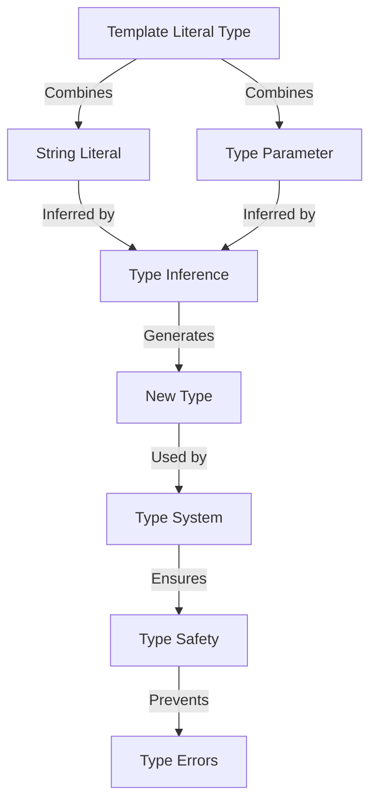

## Introduction
**Template Literal Types** are a powerful feature in TypeScript that allows you to create new types by combining string literals and type parameters. This feature is particularly useful when working with APIs, configuration files, or any scenario where you need to generate types based on strings. In this section, we will delve into the world of Template Literal Types, exploring what they are, why they matter, and their real-world relevance.

> **Note:** Template Literal Types are a part of the TypeScript type system, which is designed to help you catch errors early and improve code maintainability.

## Core Concepts
At its core, a Template Literal Type is a type that is generated by combining string literals and type parameters using the `${}` syntax. This syntax is similar to template literals in JavaScript, but with the added power of type inference. The key terminology to understand when working with Template Literal Types includes:

* **Template Literal Type**: A type that is generated by combining string literals and type parameters.
* **Type Parameter**: A placeholder for a type that can be replaced with a concrete type.
* **String Literal**: A string that is used to generate a type.

> **Tip:** When working with Template Literal Types, it's essential to understand the concept of type inference, which allows TypeScript to automatically infer the types of variables based on their usage.

## How It Works Internally
When you use a Template Literal Type, TypeScript will internally generate a new type by combining the string literals and type parameters. This process involves the following steps:

1. **Tokenization**: TypeScript breaks down the template literal into individual tokens, including string literals and type parameters.
2. **Type Inference**: TypeScript infers the types of the type parameters based on their usage.
3. **Type Combination**: TypeScript combines the string literals and type parameters to generate a new type.

> **Warning:** When working with Template Literal Types, it's essential to ensure that the type parameters are correctly inferred, as incorrect type inference can lead to type errors.

## Code Examples
Here are three complete and runnable examples of using Template Literal Types in TypeScript:

### Example 1: Basic Usage
```typescript
type Color = 'red' | 'green' | 'blue';
type Shape = `circle-${Color}`;

const shape: Shape = 'circle-red'; // Valid
const invalidShape: Shape = 'circle-yellow'; // Error: Type '"circle-yellow"' is not assignable to type '"circle-red" | "circle-green" | "circle-blue"'.
```

### Example 2: Real-world Pattern
```typescript
interface APIResponse {
  id: number;
  name: string;
}

type APIEndpoint = `/${string}-${number}`;

const apiEndpoint: APIEndpoint = '/users-123'; // Valid
const invalidEndpoint: APIEndpoint = '/users'; // Error: Type '"users"' is not assignable to type '"users-123"'.

async function fetchAPI(endpoint: APIEndpoint): Promise<APIResponse> {
  // Implement API call logic here
  return { id: 123, name: 'John Doe' };
}

const response = await fetchAPI('/users-123'); // Valid
```

### Example 3: Advanced Usage
```typescript
type LogLevel = 'debug' | 'info' | 'warn' | 'error';
type LogMessage = `log-${LogLevel}-${string}`;

const logMessage: LogMessage = 'log-debug-Hello World'; // Valid
const invalidLogMessage: LogMessage = 'log-debug'; // Error: Type '"log-debug"' is not assignable to type '"log-debug-Hello World"'.

function log(level: LogLevel, message: string): LogMessage {
  return `log-${level}-${message}`;
}

const logMessage2 = log('debug', 'Hello World'); // Valid
```

## Visual Diagram


The diagram illustrates the process of generating a new type using Template Literal Types. It shows how the template literal type combines string literals and type parameters, which are then inferred by the type inference system. The resulting new type is used by the type system to ensure type safety and prevent type errors.

## Comparison
Here is a comparison table of different approaches to generating types in TypeScript:

| Approach | Time Complexity | Space Complexity | Pros | Cons | Best For |
| --- | --- | --- | --- | --- | --- |
| Template Literal Types | O(1) | O(1) | Flexible, expressive | Can be complex | Generating types based on strings |
| Enum Types | O(1) | O(1) | Simple, efficient | Limited flexibility | Defining a fixed set of values |
| Type Aliases | O(1) | O(1) | Simple, reusable | Limited expressiveness | Creating shortcuts for complex types |
| Interfaces | O(1) | O(1) | Flexible, reusable | Can be complex | Defining object types with multiple properties |

## Real-world Use Cases
Here are three real-world use cases of Template Literal Types in TypeScript:

1. **API Endpoint Generation**: Template Literal Types can be used to generate API endpoint types based on string literals and type parameters. For example, `/${string}-${number}` can be used to generate types for API endpoints such as `/users-123`.
2. **Logging**: Template Literal Types can be used to generate log message types based on string literals and type parameters. For example, `log-${LogLevel}-${string}` can be used to generate types for log messages such as `log-debug-Hello World`.
3. **Configuration Files**: Template Literal Types can be used to generate configuration file types based on string literals and type parameters. For example, `config-${string}-${number}` can be used to generate types for configuration files such as `config-users-123`.

## Common Pitfalls
Here are four common pitfalls to watch out for when using Template Literal Types:

1. **Incorrect Type Inference**: Incorrect type inference can lead to type errors. For example, `type Color = 'red' | 'green' | 'blue'; type Shape = `circle-${Color}`; const shape: Shape = 'circle-yellow'; // Error: Type '"circle-yellow"' is not assignable to type '"circle-red" | "circle-green" | "circle-blue"'.`
2. **Type Complexity**: Template Literal Types can lead to complex types, which can be difficult to understand and maintain. For example, `type APIEndpoint = `/${string}-${number}-${string}`; const apiEndpoint: APIEndpoint = '/users-123-abc'; // Valid`
3. **Type Overloading**: Template Literal Types can lead to type overloading, which can make it difficult to determine the correct type. For example, `type LogLevel = 'debug' | 'info' | 'warn' | 'error'; type LogMessage = `log-${LogLevel}-${string}`; const logMessage: LogMessage = 'log-debug-Hello World'; // Valid`
4. **Type Errors**: Template Literal Types can lead to type errors if not used correctly. For example, `type Color = 'red' | 'green' | 'blue'; type Shape = `circle-${Color}`; const shape: Shape = 'circle-yellow'; // Error: Type '"circle-yellow"' is not assignable to type '"circle-red" | "circle-green" | "circle-blue"'.`

## Interview Tips
Here are three common interview questions related to Template Literal Types, along with weak and strong answers:

1. **What is a Template Literal Type?**
	* Weak answer: "A Template Literal Type is a type that is generated by combining string literals and type parameters."
	* Strong answer: "A Template Literal Type is a type that is generated by combining string literals and type parameters using the `${}` syntax. It allows you to create new types based on strings and type parameters, which can be useful for generating API endpoint types, log message types, and configuration file types."
2. **How do you use Template Literal Types in TypeScript?**
	* Weak answer: "You can use Template Literal Types by combining string literals and type parameters using the `${}` syntax."
	* Strong answer: "You can use Template Literal Types by defining a type parameter, combining it with a string literal using the `${}` syntax, and then using the resulting type. For example, `type Color = 'red' | 'green' | 'blue'; type Shape = `circle-${Color}`; const shape: Shape = 'circle-red'; // Valid`"
3. **What are the benefits of using Template Literal Types?**
	* Weak answer: "The benefits of using Template Literal Types include generating new types based on strings and type parameters."
	* Strong answer: "The benefits of using Template Literal Types include generating new types based on strings and type parameters, improving code maintainability, and preventing type errors. Additionally, Template Literal Types can be used to create flexible and expressive types, which can be useful for a wide range of applications, including API endpoint generation, logging, and configuration files."

## Key Takeaways
Here are ten key takeaways to remember when working with Template Literal Types:

* Template Literal Types are a powerful feature in TypeScript that allows you to create new types by combining string literals and type parameters.
* Template Literal Types are useful for generating API endpoint types, log message types, and configuration file types.
* Template Literal Types can lead to complex types, which can be difficult to understand and maintain.
* Template Literal Types can lead to type overloading, which can make it difficult to determine the correct type.
* Template Literal Types can lead to type errors if not used correctly.
* The `${}` syntax is used to combine string literals and type parameters.
* Type inference is used to infer the types of type parameters.
* Template Literal Types can be used to improve code maintainability and prevent type errors.
* Template Literal Types are a part of the TypeScript type system, which is designed to help you catch errors early and improve code maintainability.
* Template Literal Types are a flexible and expressive way to generate new types, which can be useful for a wide range of applications.