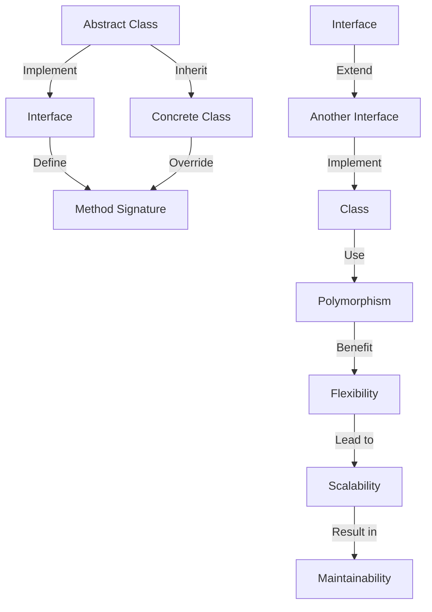

## Introduction
**Abstract classes** and **interfaces** are two fundamental concepts in object-oriented programming (OOP) that help developers define blueprints for objects and establish relationships between them. In TypeScript, these concepts are crucial for building robust, maintainable, and scalable applications. In this section, we will delve into the world of abstract classes and interfaces, exploring their definitions, use cases, and best practices. 
> **Note:** Understanding the differences between abstract classes and interfaces is essential for any software engineer, as it directly impacts the design and implementation of their code.

## Core Concepts
- An **abstract class** is a class that cannot be instantiated on its own and is designed to be inherited by other classes. It can contain both abstract and concrete methods.
- An **interface**, on the other hand, is a contract that specifies a set of methods that must be implemented by any class that implements it. Interfaces can only contain method signatures and constants.
- **Inheritance** is the mechanism by which one class can inherit the properties and behavior of another class.
- **Polymorphism** is the ability of an object to take on multiple forms, depending on the context in which it is used.
> **Tip:** When deciding between an abstract class and an interface, ask yourself: "Do I need to provide a basic implementation, or am I simply defining a contract?"

## How It Works Internally
When you define an abstract class or an interface in TypeScript, the compiler generates a corresponding JavaScript class or object that reflects the same structure. 
1. **Abstract Class**: The JavaScript class generated from an abstract TypeScript class will have a constructor that throws an error if attempted to be instantiated directly.
2. **Interface**: Since JavaScript does not have a direct equivalent of interfaces, the TypeScript interface is essentially a design-time construct that helps with code completion, type checking, and compile-time errors. At runtime, the interface does not exist as a separate entity.

## Code Examples
### Example 1: Basic Abstract Class
```typescript
// Define an abstract class
abstract class Animal {
    abstract sound(): void;
    eat(): void {
        console.log("Eating...");
    }
}

// Extend the abstract class
class Dog extends Animal {
    sound(): void {
        console.log("Barking...");
    }
}

const dog = new Dog();
dog.sound(); // Output: Barking...
dog.eat(); // Output: Eating...
```
### Example 2: Implementing an Interface
```typescript
// Define an interface
interface Printable {
    print(): void;
}

// Implement the interface
class Document implements Printable {
    private content: string;

    constructor(content: string) {
        this.content = content;
    }

    print(): void {
        console.log(this.content);
    }
}

const document = new Document("Hello, World!");
document.print(); // Output: Hello, World!
```
### Example 3: Combining Abstract Classes and Interfaces
```typescript
// Define an abstract class and an interface
abstract class Shape {
    abstract area(): number;
}

interface Colorable {
    color: string;
}

// Extend the abstract class and implement the interface
class Circle extends Shape implements Colorable {
    radius: number;
    color: string;

    constructor(radius: number, color: string) {
        super();
        this.radius = radius;
        this.color = color;
    }

    area(): number {
        return Math.PI * this.radius ** 2;
    }
}

const circle = new Circle(5, "red");
console.log(circle.area()); // Output: 78.53981633974483
console.log(circle.color); // Output: red
```
> **Warning:** Be cautious when using abstract classes and interfaces together, as it can lead to tight coupling between classes.

## Visual Diagram

This diagram illustrates the relationships between abstract classes, interfaces, and concrete classes, as well as the benefits of using these concepts in software design.

## Comparison
| Approach | Time Complexity | Space Complexity | Pros | Cons | Best For |
|----------|----------------|-----------------|------|------|----------|
| Abstract Class | O(1) | O(1) | Provides a basic implementation, can be inherited | Limited to single inheritance | Complex, hierarchical relationships |
| Interface | O(1) | O(1) | Defines a contract, can be implemented by multiple classes | Cannot provide implementation | Decoupling, polymorphism |
| Composition | O(1) | O(n) | Allows for flexible, dynamic relationships | Can lead to tight coupling | Complex, dynamic systems |
| Inheritance | O(1) | O(1) | Simple, intuitive way to establish relationships | Limited to single inheritance, can lead to tight coupling | Simple, hierarchical relationships |

## Real-world Use Cases
1. **Android Apps**: Android uses abstract classes and interfaces extensively in its SDK. For example, the `Activity` class is an abstract class that provides a basic implementation for app activities, while the `OnClickListener` interface defines a contract for handling click events.
2. **Angular Framework**: Angular uses interfaces to define contracts for components, services, and other entities. This helps ensure that these entities conform to a specific structure and behavior.
3. **Java Spring Framework**: Spring uses abstract classes and interfaces to provide a robust, flexible framework for building enterprise-level applications. For example, the `AbstractController` class provides a basic implementation for controllers, while the `Service` interface defines a contract for services.

## Common Pitfalls
1. **Tight Coupling**: Using abstract classes and interfaces can lead to tight coupling between classes, making it difficult to modify or replace individual components.
2. **Over-Engineering**: Overusing abstract classes and interfaces can result in complex, hard-to-maintain code.
3. **Incorrect Inheritance**: Incorrectly inheriting from an abstract class or implementing an interface can lead to unexpected behavior or errors.
4. **Insufficient Documentation**: Failing to document abstract classes and interfaces can make it difficult for other developers to understand their purpose and usage.

> **Tip:** Use abstract classes and interfaces judiciously, and always document their purpose and usage clearly.

## Interview Tips
1. **What is the difference between an abstract class and an interface?**: A strong answer should explain that an abstract class provides a basic implementation, while an interface defines a contract. 
2. **How do you decide between using an abstract class and an interface?**: A weak answer might say "it depends," while a strong answer should provide a clear, thoughtful explanation of the trade-offs.
3. **Can you give an example of when you would use an abstract class versus an interface?**: A strong answer should provide a concrete example, such as using an abstract class for a complex, hierarchical relationship, and an interface for decoupling and polymorphism.

## Key Takeaways
* Abstract classes provide a basic implementation and can be inherited.
* Interfaces define a contract and can be implemented by multiple classes.
* Use abstract classes for complex, hierarchical relationships.
* Use interfaces for decoupling and polymorphism.
* Avoid tight coupling and over-engineering when using abstract classes and interfaces.
* Document abstract classes and interfaces clearly to ensure maintainability.
* Consider the trade-offs between abstract classes and interfaces when designing software.
* Use composition and inheritance judiciously to establish relationships between classes.
* Always follow the principles of SOLID (Single responsibility, Open/closed, Liskov substitution, Interface segregation, and Dependency inversion) when designing software.