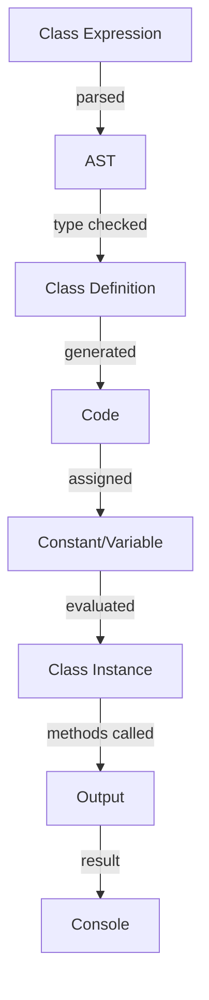

## Introduction
**Class Expressions** are a fundamental concept in TypeScript, allowing developers to define classes in a more concise and flexible way. They are particularly useful when working with complex logic, inheritance, and polymorphism. In this section, we will delve into the world of class expressions, exploring their syntax, benefits, and real-world applications.

> **Note:** Class expressions are often overlooked in favor of traditional class definitions, but they offer a unique set of advantages, especially when working with dynamic or computed properties.

In real-world scenarios, class expressions are commonly used in frameworks such as React, Angular, and Vue.js, where they help to create reusable and modular components. For instance, a web application might use class expressions to define a set of UI components, each with its own set of properties and methods.

## Core Concepts
A **class expression** is a way to define a class using an expression, rather than a declaration. This allows for more flexibility in terms of syntax and usage. The basic syntax of a class expression is as follows:
```typescript
const MyClass = class {
  // class body
};
```
In this example, `MyClass` is a constant that holds a reference to the class. The class body can contain properties, methods, and other members, just like a traditional class definition.

> **Tip:** Class expressions can be used to create anonymous classes, which can be useful when working with callbacks or higher-order functions.

Key terminology includes:

* **Class expression**: a way to define a class using an expression
* **Anonymous class**: a class defined without a name
* **Computed property**: a property whose value is computed at runtime

## How It Works Internally
When a class expression is evaluated, the TypeScript compiler creates a new class definition in memory. This class definition is then assigned to the constant or variable that holds the class expression.

The internal mechanics of class expressions involve the following steps:

1. **Parsing**: the TypeScript compiler parses the class expression syntax and creates an abstract syntax tree (AST) representation of the class.
2. **Type checking**: the compiler checks the type annotations and constraints of the class, ensuring that they are valid and consistent.
3. **Code generation**: the compiler generates the necessary code to create the class definition in memory.
4. **Assignment**: the class definition is assigned to the constant or variable that holds the class expression.

> **Warning:** Class expressions can lead to performance issues if not used judiciously, since they create a new class definition in memory each time they are evaluated.

## Code Examples
### Example 1: Basic Class Expression
```typescript
const Person = class {
  private name: string;
  private age: number;

  constructor(name: string, age: number) {
    this.name = name;
    this.age = age;
  }

  public greet() {
    console.log(`Hello, my name is ${this.name} and I am ${this.age} years old.`);
  }
};

const person = new Person('John Doe', 30);
person.greet(); // Output: Hello, my name is John Doe and I am 30 years old.
```
### Example 2: Computed Property
```typescript
const calculator = class {
  private operations: { [key: string]: (a: number, b: number) => number };

  constructor() {
    this.operations = {
      add: (a, b) => a + b,
      subtract: (a, b) => a - b,
      multiply: (a, b) => a * b,
      divide: (a, b) => a / b,
    };
  }

  public calculate(operation: string, a: number, b: number) {
    return this.operations[operation](a, b);
  }
};

const calc = new calculator();
console.log(calc.calculate('add', 2, 3)); // Output: 5
```
### Example 3: Inheritance
```typescript
const Animal = class {
  protected name: string;

  constructor(name: string) {
    this.name = name;
  }

  public sound() {
    console.log('The animal makes a sound.');
  }
};

const Dog = class extends Animal {
  constructor(name: string) {
    super(name);
  }

  public sound() {
    console.log('The dog barks.');
  }
};

const dog = new Dog('Fido');
dog.sound(); // Output: The dog barks.
```
## Visual Diagram

The diagram illustrates the internal mechanics of class expressions, from parsing and type checking to code generation and assignment.

## Comparison
| Approach | Time Complexity | Space Complexity | Pros | Cons | Best For |
| --- | --- | --- | --- | --- | --- |
| Class Expression | O(1) | O(1) | Flexible, concise, reusable | Performance issues, complex syntax | Dynamic or computed properties, inheritance, polymorphism |
| Traditional Class Definition | O(1) | O(1) | Simple, straightforward, easy to understand | Limited flexibility, verbose syntax | Simple classes, static properties, no inheritance |
| Functional Programming | O(n) | O(n) | Declarative, composable, easier to reason about | Steeper learning curve, less efficient | Data processing, algorithmic computations, reactive programming |
| Object-Oriented Programming | O(n) | O(n) | Encapsulates data and behavior, promotes modularity | More complex, harder to optimize | Complex systems, simulation, game development |

## Real-world Use Cases
1. **React**: uses class expressions to define reusable UI components, such as buttons, input fields, and dropdown menus.
2. **Angular**: employs class expressions to create components, services, and directives, which are the building blocks of Angular applications.
3. **Vue.js**: utilizes class expressions to define Vue components, which are used to create reusable and modular UI components.

## Common Pitfalls
1. **Overusing class expressions**: can lead to performance issues and make the code harder to understand.
2. **Incorrectly using `this`**: can cause issues with scope and context, leading to unexpected behavior.
3. **Not handling errors**: can lead to runtime errors and make the code more prone to bugs.
4. **Not following best practices**: can result in code that is hard to maintain, optimize, and scale.

> **Interview:** What are some common pitfalls when using class expressions, and how can you avoid them?

## Interview Tips
1. **Be prepared to explain the benefits and drawbacks of class expressions**: be able to discuss the advantages and disadvantages of using class expressions, including performance issues and complexity.
2. **Know how to use class expressions to create reusable and modular code**: be able to demonstrate how to use class expressions to create reusable and modular code, such as UI components or services.
3. **Be able to explain how to handle errors and exceptions in class expressions**: be able to discuss how to handle errors and exceptions in class expressions, including try-catch blocks and error handling mechanisms.

## Key Takeaways
* Class expressions are a powerful tool for creating reusable and modular code.
* They offer a unique set of advantages, including flexibility and conciseness.
* However, they can lead to performance issues if not used judiciously.
* It is essential to follow best practices and avoid common pitfalls when using class expressions.
* Class expressions are commonly used in real-world applications, such as React, Angular, and Vue.js.
* They can be used to create complex systems, simulate real-world scenarios, and optimize code for performance.
* Understanding class expressions is crucial for any developer working with TypeScript or JavaScript.