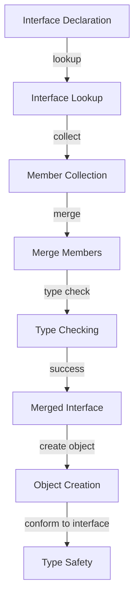

## Introduction
**Declaration Merging** is a fundamental concept in TypeScript that allows developers to extend the functionality of existing interfaces. It enables the combination of multiple interface declarations into a single interface, providing a powerful way to build complex data structures and APIs. This feature is particularly useful when working with third-party libraries or legacy codebases, where modifying the original interface definitions might not be feasible. In this study guide, we will delve into the world of declaration merging, exploring its core concepts, internal mechanics, and practical applications.

> **Note:** Declaration merging is a key feature that sets TypeScript apart from other statically-typed languages, allowing for greater flexibility and expressiveness in interface design.

## Core Concepts
At its core, declaration merging is a process that combines multiple interface declarations with the same name into a single, unified interface. This is achieved through the use of the `interface` keyword, which can be used to extend an existing interface with new properties, methods, or other members. The resulting merged interface contains all the members from the original declarations, providing a single, cohesive interface for working with the data.

* **Interface**: A TypeScript interface is a blueprint for an object that defines its shape, including the properties, methods, and their types.
* **Declaration Merging**: The process of combining multiple interface declarations with the same name into a single, unified interface.
* **Merged Interface**: The resulting interface that contains all the members from the original declarations.

## How It Works Internally
When the TypeScript compiler encounters multiple interface declarations with the same name, it uses a process called declaration merging to combine them into a single interface. This process involves the following steps:

1. **Interface Lookup**: The compiler looks up the interface declaration with the given name and checks if it has already been merged.
2. **Member Collection**: The compiler collects all the members (properties, methods, etc.) from the current interface declaration.
3. **Merge**: The compiler merges the collected members with the existing members of the interface, using the following rules:
	* If a member with the same name already exists, the types are merged using the **intersection type** algorithm.
	* If a member with the same name does not exist, it is added to the interface.
4. **Type Checking**: The compiler performs type checking on the merged interface to ensure that all members are valid and consistent.

> **Warning:** Declaration merging can lead to unexpected behavior if not used carefully, as it can result in interfaces with conflicting or ambiguous members.

## Code Examples
### Example 1: Basic Declaration Merging
```typescript
// Declare an interface
interface Person {
  name: string;
}

// Merge the interface with new members
interface Person {
  age: number;
}

// Create an object that conforms to the merged interface
const person: Person = {
  name: 'John Doe',
  age: 30,
};

console.log(person.name); // Output: John Doe
console.log(person.age); // Output: 30
```
### Example 2: Real-World Declaration Merging
```typescript
// Declare an interface for a user
interface User {
  id: number;
  username: string;
}

// Merge the interface with new members for an admin user
interface User {
  isAdmin: boolean;
  permissions: string[];
}

// Create an object that conforms to the merged interface
const adminUser: User = {
  id: 1,
  username: 'admin',
  isAdmin: true,
  permissions: ['create', 'read', 'update', 'delete'],
};

console.log(adminUser.username); // Output: admin
console.log(adminUser.isAdmin); // Output: true
```
### Example 3: Advanced Declaration Merging with Generics
```typescript
// Declare a generic interface for a container
interface Container<T> {
  value: T;
}

// Merge the interface with new members for a container with a specific type
interface Container<string> {
  length: number;
}

// Create an object that conforms to the merged interface
const stringContainer: Container<string> = {
  value: 'hello',
  length: 5,
};

console.log(stringContainer.value); // Output: hello
console.log(stringContainer.length); // Output: 5
```
## Visual Diagram

The diagram illustrates the declaration merging process, from interface lookup to type checking, and finally to object creation and type safety.

## Comparison
| Approach | Time Complexity | Space Complexity | Pros | Cons | Best For |
| --- | --- | --- | --- | --- | --- |
| Declaration Merging | O(1) | O(n) | Flexible, expressive | Can lead to ambiguous members | Complex interface design |
| Interface Extension | O(1) | O(1) | Simple, straightforward | Limited flexibility | Simple interface design |
| Type Aliases | O(1) | O(1) | Concise, readable | Limited expressiveness | Simple type definitions |
| Classes | O(1) | O(n) | Object-oriented, inheritance | Verbose, complex | Complex object-oriented design |

## Real-world Use Cases
1. **Angular Framework**: Angular uses declaration merging to extend the `Component` interface with new members for specific component types, such as `Directive` and `Pipe`.
2. **React Library**: React uses declaration merging to extend the `Component` interface with new members for specific component types, such as `FunctionComponent` and `ClassComponent`.
3. **TypeScript SDKs**: Many TypeScript SDKs use declaration merging to provide a unified interface for working with different APIs and data structures.

> **Tip:** Declaration merging is a powerful tool for building complex data structures and APIs, but it requires careful consideration of the potential pitfalls and limitations.

## Common Pitfalls
1. **Ambiguous Members**: Declaration merging can lead to ambiguous members if multiple interfaces declare members with the same name but different types.
2. **Type Conflicts**: Declaration merging can result in type conflicts if multiple interfaces declare members with the same name but different types.
3. **Inconsistent Members**: Declaration merging can lead to inconsistent members if multiple interfaces declare members with different names but similar types.
4. **Overly Complex Interfaces**: Declaration merging can result in overly complex interfaces if not used carefully, making it difficult to understand and work with the data.

> **Warning:** Declaration merging can lead to unexpected behavior if not used carefully, as it can result in interfaces with conflicting or ambiguous members.

## Interview Tips
1. **What is declaration merging?**: A good answer should explain the concept of declaration merging, its purpose, and its benefits.
2. **How does declaration merging work?**: A good answer should describe the internal mechanics of declaration merging, including the lookup, collection, merge, and type checking steps.
3. **What are the benefits and limitations of declaration merging?**: A good answer should discuss the pros and cons of declaration merging, including its flexibility, expressiveness, and potential pitfalls.

> **Interview:** Can you explain how declaration merging works in TypeScript, and provide an example of how it can be used to build a complex data structure?

## Key Takeaways
* **Declaration merging** is a powerful tool for building complex data structures and APIs.
* **Interface lookup** and **member collection** are key steps in the declaration merging process.
* **Type checking** is essential to ensure the correctness and consistency of the merged interface.
* **Ambiguous members** and **type conflicts** are potential pitfalls of declaration merging.
* **Overly complex interfaces** can result from careless use of declaration merging.
* **TypeScript SDKs** and **frameworks** often use declaration merging to provide a unified interface for working with different APIs and data structures.
* **Careful consideration** of the potential pitfalls and limitations is necessary when using declaration merging.