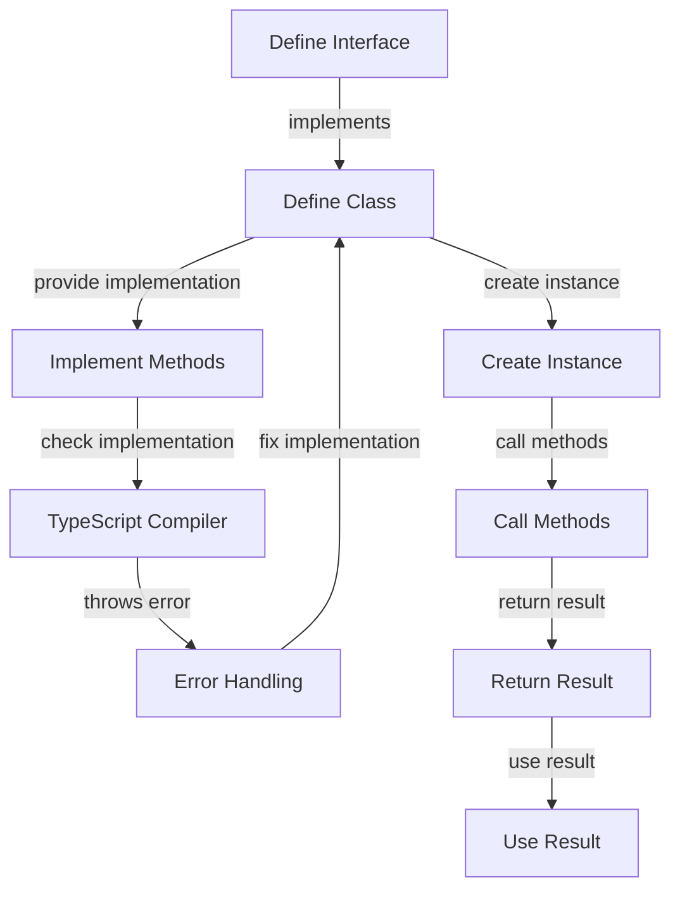

## Introduction
**Implementing interfaces in classes** is a fundamental concept in object-oriented programming (OOP) that allows developers to define a blueprint of methods and properties that a class must implement. In TypeScript, interfaces are used to define the shape of an object, ensuring that it has the required properties and methods. This concept is crucial in maintaining code quality, reusability, and scalability. Every engineer should understand how to implement interfaces in classes, as it is a common practice in software development.

> **Note:** Interfaces are abstract, meaning they cannot be instantiated on their own and must be implemented by a class.

In real-world scenarios, implementing interfaces in classes is essential when working with third-party libraries, frameworks, or APIs that require specific methods and properties to be implemented. For instance, when building a web application using Angular, you might need to implement an interface provided by the framework to handle HTTP requests.

## Core Concepts
- **Interface:** A abstract concept that defines a set of methods and properties that a class must implement.
- **Class:** A concrete implementation of an interface, providing the actual code for the methods and properties defined in the interface.
- **Implementation:** The process of creating a class that satisfies the requirements of an interface.
- **Inheritance:** The mechanism by which one class can inherit the properties and methods of another class.

> **Tip:** When defining an interface, use the `interface` keyword followed by the name of the interface.

Mental models and analogies can help developers understand the concept of implementing interfaces in classes. Consider a restaurant where the menu (interface) defines the dishes (methods) that the chef (class) must prepare. The chef can choose to implement the menu in various ways, but the dishes must be prepared according to the menu's specifications.

## How It Works Internally
When a class implements an interface, the TypeScript compiler checks if the class provides an implementation for all the methods and properties defined in the interface. If the class does not provide an implementation for any of the interface's members, the compiler will throw an error.

Here's a step-by-step breakdown of how it works:

1. The interface is defined using the `interface` keyword.
2. The class is defined using the `class` keyword.
3. The class implements the interface using the `implements` keyword.
4. The TypeScript compiler checks if the class provides an implementation for all the interface's members.
5. If the class does not provide an implementation for any of the interface's members, the compiler throws an error.

> **Warning:** Failing to implement all the interface's members can lead to runtime errors.

## Code Examples
### Example 1: Basic Implementation
```typescript
// Define the interface
interface Printable {
  print(): void;
}

// Define the class that implements the interface
class Document implements Printable {
  private content: string;

  constructor(content: string) {
    this.content = content;
  }

  // Implement the print method
  print(): void {
    console.log(this.content);
  }
}

// Create an instance of the class and call the print method
const doc = new Document('Hello, World!');
doc.print();
```

### Example 2: Real-World Pattern
```typescript
// Define the interface
interface Payable {
  calculatePay(): number;
}

// Define the class that implements the interface
class Employee implements Payable {
  private hourlyRate: number;
  private hoursWorked: number;

  constructor(hourlyRate: number, hoursWorked: number) {
    this.hourlyRate = hourlyRate;
    this.hoursWorked = hoursWorked;
  }

  // Implement the calculatePay method
  calculatePay(): number {
    return this.hourlyRate * this.hoursWorked;
  }
}

// Create an instance of the class and call the calculatePay method
const emp = new Employee(25, 40);
console.log(emp.calculatePay());
```

### Example 3: Advanced Implementation
```typescript
// Define the interface
interface Shape {
  area(): number;
  perimeter(): number;
}

// Define the class that implements the interface
class Circle implements Shape {
  private radius: number;

  constructor(radius: number) {
    this.radius = radius;
  }

  // Implement the area method
  area(): number {
    return Math.PI * this.radius ** 2;
  }

  // Implement the perimeter method
  perimeter(): number {
    return 2 * Math.PI * this.radius;
  }
}

// Create an instance of the class and call the area and perimeter methods
const circle = new Circle(5);
console.log(circle.area());
console.log(circle.perimeter());
```

## Visual Diagram

This diagram illustrates the process of implementing an interface in a class, from defining the interface to creating an instance of the class and calling its methods.

## Comparison
| Approach | Time Complexity | Space Complexity | Pros | Cons | Best For |
| --- | --- | --- | --- | --- | --- |
| Interface Implementation | O(1) | O(1) | Ensures code quality and reusability | Can be verbose | Large-scale applications |
| Abstract Class | O(1) | O(1) | Provides a basic implementation | Can be inflexible | Small-scale applications |
| Duck Typing | O(1) | O(1) | Flexible and easy to use | Can lead to runtime errors | Prototyping and testing |
| Functional Programming | O(1) | O(1) | Composable and predictable | Can be difficult to learn | Data processing and analysis |

## Real-world Use Cases
1. **Angular Framework:** Angular provides various interfaces that developers must implement to handle HTTP requests, form validation, and other features.
2. **React Library:** React provides interfaces for components, props, and state, which developers must implement to build reusable and maintainable UI components.
3. **Node.js:** Node.js provides interfaces for working with streams, file systems, and network sockets, which developers must implement to build scalable and efficient server-side applications.

## Common Pitfalls
1. **Failing to Implement All Interface Members:** This can lead to runtime errors and make it difficult to debug the code.
```typescript
// Wrong way
interface Printable {
  print(): void;
}

class Document implements Printable {
  // Missing implementation for print method
}

// Right way
class Document implements Printable {
  print(): void {
    console.log('Printing...');
  }
}
```
2. **Using Interfaces as a Replacement for Classes:** Interfaces should be used to define a contract, not to provide a basic implementation.
```typescript
// Wrong way
interface Shape {
  area(): number;
  perimeter(): number;
}

class Circle implements Shape {
  area(): number {
    return 0; // Wrong implementation
  }

  perimeter(): number {
    return 0; // Wrong implementation
  }
}

// Right way
class Circle implements Shape {
  private radius: number;

  constructor(radius: number) {
    this.radius = radius;
  }

  area(): number {
    return Math.PI * this.radius ** 2;
  }

  perimeter(): number {
    return 2 * Math.PI * this.radius;
  }
}
```
3. **Not Using Interfaces to Define Dependencies:** This can make the code tightly coupled and difficult to test.
```typescript
// Wrong way
class Document {
  private printer: Printer;

  constructor(printer: Printer) {
    this.printer = printer;
  }

  print(): void {
    this.printer.print();
  }
}

// Right way
interface Printer {
  print(): void;
}

class Document {
  private printer: Printer;

  constructor(printer: Printer) {
    this.printer = printer;
  }

  print(): void {
    this.printer.print();
  }
}
```
4. **Not Using Interfaces to Define Return Types:** This can make the code difficult to understand and maintain.
```typescript
// Wrong way
function calculateArea(shape: any): any {
  // ...
}

// Right way
interface Shape {
  area(): number;
}

function calculateArea(shape: Shape): number {
  return shape.area();
}
```

## Interview Tips
1. **What is the purpose of an interface in TypeScript?**
	* Weak answer: "An interface is used to define a class."
	* Strong answer: "An interface is used to define a contract that a class must implement, ensuring code quality and reusability."
2. **How do you implement an interface in a class?**
	* Weak answer: "You use the `interface` keyword and define the methods and properties."
	* Strong answer: "You use the `implements` keyword to specify the interface that the class implements, and then provide an implementation for all the interface's members."
3. **What is the difference between an interface and an abstract class?**
	* Weak answer: "An interface is abstract, while an abstract class is concrete."
	* Strong answer: "An interface defines a contract, while an abstract class provides a basic implementation that can be inherited by other classes."

> **Interview:** Be prepared to explain the concept of interfaces and how they are used in TypeScript, as well as to provide examples of how you have implemented interfaces in your own code.

## Key Takeaways
* **Interfaces are abstract contracts** that define a set of methods and properties that a class must implement.
* **Classes implement interfaces** using the `implements` keyword and providing an implementation for all the interface's members.
* **Interfaces ensure code quality and reusability** by defining a contract that must be implemented by any class that implements the interface.
* **Abstract classes provide a basic implementation** that can be inherited by other classes, while interfaces define a contract.
* **Duck typing is a flexible approach** to implementing interfaces, but can lead to runtime errors if not used carefully.
* **Functional programming is a composable approach** to implementing interfaces, but can be difficult to learn and use.
* **Interfaces can be used to define dependencies** and return types, making the code more maintainable and efficient.
* **Implementing interfaces correctly** requires attention to detail and a deep understanding of the concept.