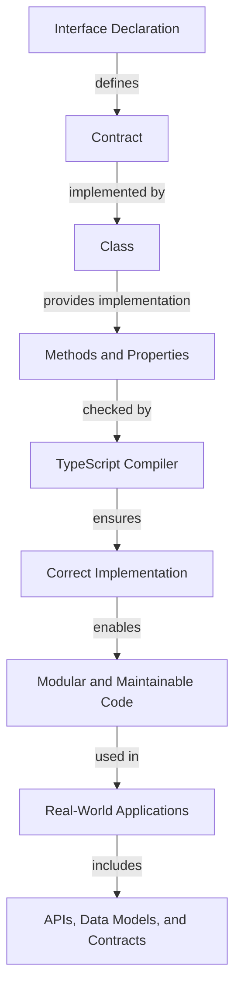

## Introduction
**Interface Declaration and Usage** is a fundamental concept in TypeScript, allowing developers to define contracts that must be implemented by classes. This concept is essential in object-oriented programming, as it enables the creation of modular, reusable, and maintainable code. In real-world scenarios, interfaces are used to define APIs, data models, and contracts between different components of a system. Every engineer should understand interface declaration and usage, as it is a crucial aspect of software development.

> **Note:** Interfaces are abstract and cannot be instantiated on their own. They are used to define a blueprint for classes that implement them.

## Core Concepts
- **Interface**: A contract that specifies a set of properties, methods, and events that must be implemented by a class.
- **Implementation**: The process of creating a class that fulfills the requirements of an interface.
- **Extends**: A keyword used to indicate that a class implements an interface.
- **Implements**: A keyword used to indicate that a class implements an interface.

> **Warning:** Failing to implement all members of an interface can result in compilation errors.

## How It Works Internally
When a class implements an interface, it must provide an implementation for all members of the interface. The TypeScript compiler checks that the class implements all members of the interface at compile-time. If a class does not implement all members of an interface, the compiler will throw an error.

Here is a step-by-step breakdown of how it works:
1. The interface is declared, defining the contract that must be implemented.
2. A class is created that implements the interface using the `implements` keyword.
3. The class must provide an implementation for all members of the interface.
4. The TypeScript compiler checks that the class implements all members of the interface at compile-time.

> **Tip:** Use interfaces to define contracts that must be implemented by classes, making your code more modular and maintainable.

## Code Examples
### Example 1: Basic Interface Declaration and Usage
```typescript
// Define the interface
interface Printable {
  print(): void;
}

// Create a class that implements the interface
class Document implements Printable {
  print(): void {
    console.log("Printing a document...");
  }
}

// Create an instance of the class and call the print method
const document = new Document();
document.print();
```
### Example 2: Interface with Properties
```typescript
// Define the interface
interface Person {
  name: string;
  age: number;
}

// Create a class that implements the interface
class Employee implements Person {
  name: string;
  age: number;

  constructor(name: string, age: number) {
    this.name = name;
    this.age = age;
  }

  displayInfo(): void {
    console.log(`Name: ${this.name}, Age: ${this.age}`);
  }
}

// Create an instance of the class and call the displayInfo method
const employee = new Employee("John Doe", 30);
employee.displayInfo();
```
### Example 3: Advanced Interface with Methods and Index Signatures
```typescript
// Define the interface
interface Dictionary<T> {
  [key: string]: T;
  add(key: string, value: T): void;
  remove(key: string): void;
}

// Create a class that implements the interface
class StringDictionary implements Dictionary<string> {
  private data: { [key: string]: string };

  constructor() {
    this.data = {};
  }

  add(key: string, value: string): void {
    this.data[key] = value;
  }

  remove(key: string): void {
    delete this.data[key];
  }

  displayInfo(): void {
    console.log(this.data);
  }
}

// Create an instance of the class and call the add, remove, and displayInfo methods
const dictionary = new StringDictionary();
dictionary.add("key1", "value1");
dictionary.add("key2", "value2");
dictionary.remove("key1");
dictionary.displayInfo();
```
## Visual Diagram

The diagram illustrates the relationship between interface declaration, contract definition, class implementation, and the role of the TypeScript compiler in ensuring correct implementation.

## Comparison
| Approach | Time Complexity | Space Complexity | Pros | Cons | Best For |
| --- | --- | --- | --- | --- | --- |
| Interface | O(1) | O(1) | Defines a contract, enables modular code | Can be verbose, requires implementation | Large-scale applications, APIs |
| Abstract Class | O(1) | O(1) | Provides a basic implementation, can be extended | Can be inflexible, requires inheritance | Small-scale applications, utility classes |
| Concrete Class | O(1) | O(1) | Provides a complete implementation, easy to use | Can be rigid, limited reusability | Small-scale applications, simple data models |
| Mixin | O(1) | O(1) | Provides a reusable implementation, flexible | Can be complex, requires careful composition | Large-scale applications, complex data models |

## Real-world Use Cases
1. **API Design**: Interfaces are used to define the contract for API endpoints, ensuring that the API is modular and maintainable.
2. **Data Models**: Interfaces are used to define the structure of data models, making it easier to work with data in a type-safe manner.
3. **Contracts**: Interfaces are used to define contracts between different components of a system, ensuring that the components work together seamlessly.

> **Interview:** Can you explain the difference between an interface and an abstract class? How would you choose between the two in a real-world scenario?

## Common Pitfalls
1. **Incomplete Implementation**: Failing to implement all members of an interface can result in compilation errors.
2. **Incorrect Implementation**: Providing an incorrect implementation for a member of an interface can result in runtime errors.
3. **Overusing Interfaces**: Using interfaces for every class can result in a complex and rigid system.
4. **Underusing Interfaces**: Failing to use interfaces where necessary can result in a system that is difficult to maintain and extend.

> **Warning:** Be careful when using interfaces, as they can be complex and require careful consideration.

## Interview Tips
1. **Define Interface**: Can you define an interface for a given problem? How would you ensure that the interface is correct and complete?
2. **Implement Interface**: Can you implement an interface for a given class? How would you ensure that the implementation is correct and complete?
3. **Choose Between Interface and Abstract Class**: Can you explain the difference between an interface and an abstract class? How would you choose between the two in a real-world scenario?

> **Tip:** When answering interview questions, be sure to provide a clear and concise definition of the interface and its implementation.

## Key Takeaways
* Interfaces define a contract that must be implemented by classes.
* Interfaces are abstract and cannot be instantiated on their own.
* The `implements` keyword is used to indicate that a class implements an interface.
* The TypeScript compiler checks that a class implements all members of an interface at compile-time.
* Interfaces can be used to define APIs, data models, and contracts between different components of a system.
* Interfaces can be used to enable modular and maintainable code.
* Interfaces can be complex and require careful consideration.
* Abstract classes can be used to provide a basic implementation that can be extended by subclasses.
* Concrete classes can be used to provide a complete implementation that is easy to use.
* Mixins can be used to provide a reusable implementation that is flexible and composable.