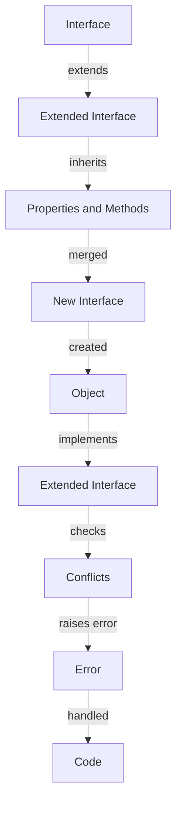

## Introduction
**Interface extension** is a fundamental concept in TypeScript, allowing developers to create a new interface that inherits properties and methods from an existing interface. This feature is crucial in object-oriented programming (OOP) as it enables code reuse, facilitates the creation of complex data structures, and promotes modularity. In real-world scenarios, interface extension is commonly used in large-scale applications, such as those built with Angular or React, where a robust and maintainable architecture is essential. Every engineer should understand interface extension to write efficient, scalable, and readable code.

## Core Concepts
- **Interface**: A blueprint of an object that defines its properties, methods, and their types.
- **Extension**: The process of creating a new interface that inherits properties and methods from an existing interface.
- **Inheritance**: A mechanism of creating a new interface based on an existing one, allowing for code reuse and modularity.
- **Polymorphism**: The ability of an object to take on multiple forms, which is achieved through interface extension.

> **Tip:** When designing interfaces, consider using extension to create a hierarchy of interfaces, promoting code reuse and reducing duplication.

## How It Works Internally
When an interface extends another, TypeScript performs the following steps:
1. **Merge properties and methods**: The new interface inherits all properties and methods from the extended interface.
2. **Check for conflicts**: If there are any conflicts between the properties and methods of the two interfaces, TypeScript will raise an error.
3. **Create a new interface**: The new interface is created with the merged properties and methods.

```typescript
// Define an interface
interface Person {
  name: string;
  age: number;
}

// Extend the interface
interface Employee extends Person {
  employeeId: number;
}

// Create an object that implements the extended interface
const employee: Employee = {
  name: 'John Doe',
  age: 30,
  employeeId: 123,
};
```

## Code Examples
### Example 1: Basic Interface Extension
```typescript
// Define an interface
interface Shape {
  area: number;
}

// Extend the interface
interface Rectangle extends Shape {
  width: number;
  height: number;
}

// Create an object that implements the extended interface
const rectangle: Rectangle = {
  area: 100,
  width: 10,
  height: 10,
};

console.log(rectangle);
```

### Example 2: Real-world Interface Extension
```typescript
// Define an interface for a user
interface User {
  id: number;
  name: string;
  email: string;
}

// Extend the interface for an admin user
interface AdminUser extends User {
  role: string;
  permissions: string[];
}

// Create an object that implements the extended interface
const adminUser: AdminUser = {
  id: 1,
  name: 'Admin',
  email: 'admin@example.com',
  role: 'admin',
  permissions: ['create', 'read', 'update', 'delete'],
};

console.log(adminUser);
```

### Example 3: Advanced Interface Extension with Generics
```typescript
// Define an interface for a generic container
interface Container<T> {
  value: T;
}

// Extend the interface for a specific type
interface StringContainer extends Container<string> {
  trim(): string;
}

// Create an object that implements the extended interface
class StringContainerImpl implements StringContainer {
  value: string;

  constructor(value: string) {
    this.value = value;
  }

  trim(): string {
    return this.value.trim();
  }
}

const stringContainer = new StringContainerImpl('   Hello, World!   ');
console.log(stringContainer.trim());
```

## Visual Diagram

The diagram illustrates the process of interface extension, from defining an interface to creating an object that implements the extended interface.

## Comparison
| Approach | Time Complexity | Space Complexity | Pros | Cons | Best For |
| --- | --- | --- | --- | --- | --- |
| Interface Extension | O(1) | O(1) | Promotes code reuse, modularity, and polymorphism | Can lead to complex interface hierarchies | Large-scale applications with complex data structures |
| Interface Composition | O(1) | O(1) | Allows for flexible and dynamic composition of interfaces | Can result in tighter coupling between interfaces | Applications with rapidly changing requirements |
| Class Inheritance | O(1) | O(1) | Provides a straightforward way to inherit behavior | Can lead to tight coupling and fragility | Small-scale applications with simple class hierarchies |
| Mixins | O(1) | O(1) | Enables composition of behavior from multiple sources | Can result in complex and hard-to-debug code | Applications with complex and dynamic behavior |

## Real-world Use Cases
1. **Angular**: Uses interface extension to define a hierarchy of interfaces for components, services, and directives.
2. **React**: Employs interface extension to create a set of interfaces for React components, props, and state.
3. **TypeORM**: Utilizes interface extension to define a set of interfaces for database entities, repositories, and services.

> **Note:** Interface extension is a powerful tool for creating complex and maintainable architectures in large-scale applications.

## Common Pitfalls
1. **Overly complex interface hierarchies**: Can lead to tight coupling and fragility in the codebase.
```typescript
// Wrong way
interface A extends B extends C {}
```
```typescript
// Right way
interface A extends B {}
interface B extends C {}
```
2. **Conflicting properties and methods**: Can result in errors and unexpected behavior.
```typescript
// Wrong way
interface A {
  foo: string;
}
interface B extends A {
  foo: number;
}
```
```typescript
// Right way
interface A {
  foo: string;
}
interface B extends A {
  bar: number;
}
```
3. **Lack of documentation**: Can make it difficult for other developers to understand the interface hierarchy and its purpose.
```typescript
// Wrong way
interface A {}
```
```typescript
// Right way
/**
 * Interface A
 */
interface A {}
```
4. **Insufficient testing**: Can lead to errors and bugs in the codebase.
```typescript
// Wrong way
interface A {}
```
```typescript
// Right way
describe('Interface A', () => {
  it('should have the correct properties', () => {
    // Test code
  });
});
```

## Interview Tips
1. **What is interface extension, and how does it work?**
	* Weak answer: "It's a way to inherit properties and methods from another interface."
	* Strong answer: "Interface extension is a mechanism that allows you to create a new interface that inherits properties and methods from an existing interface. It promotes code reuse, modularity, and polymorphism."
2. **Can you give an example of interface extension?**
	* Weak answer: "Uh, I think it's like... interface A extends interface B..."
	* Strong answer: "Yes, for example, you can define an interface `User` and extend it to create an interface `AdminUser` with additional properties and methods."
3. **What are the benefits and drawbacks of interface extension?**
	* Weak answer: "It's good for code reuse, but it can be complex."
	* Strong answer: "Interface extension promotes code reuse, modularity, and polymorphism, but it can lead to tight coupling and fragility if not used carefully. It's essential to balance the benefits and drawbacks when designing an interface hierarchy."

## Key Takeaways
* Interface extension is a powerful tool for creating complex and maintainable architectures.
* It promotes code reuse, modularity, and polymorphism.
* Interface extension can lead to tight coupling and fragility if not used carefully.
* It's essential to balance the benefits and drawbacks when designing an interface hierarchy.
* Documentation and testing are crucial when working with interface extension.
* Interface extension is commonly used in large-scale applications with complex data structures.
* It's a fundamental concept in TypeScript and OOP.