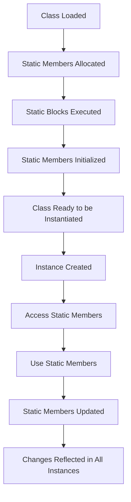

## Introduction
**Static members** and **static blocks** are essential concepts in object-oriented programming (OOP) that allow developers to share data and behavior among instances of a class. In TypeScript, static members are used to define properties and methods that belong to a class rather than an instance of the class. Static blocks, on the other hand, are used to initialize static members or perform other setup tasks when a class is loaded. Understanding static members and static blocks is crucial for building robust, efficient, and scalable software systems. In this section, we will delve into the world of static members and static blocks, exploring their definitions, uses, and best practices.

## Core Concepts
A **static member** is a property or method that is shared by all instances of a class. Static members are defined using the `static` keyword and are accessed using the class name rather than an instance of the class. **Static blocks**, also known as static initializers, are used to initialize static members or perform other setup tasks when a class is loaded. Static blocks are defined using the `static` keyword and are executed only once when the class is loaded. Key terminology includes:
* **Static variable**: a variable that is shared by all instances of a class
* **Static method**: a method that is shared by all instances of a class
* **Static block**: a block of code that is executed when a class is loaded

> **Note:** Static members and static blocks are used to implement the **Singleton pattern**, which ensures that only one instance of a class is created.

## How It Works Internally
When a class is loaded, the following steps occur:
1. The class is initialized, and static members are allocated memory.
2. Static blocks are executed, and static members are initialized.
3. The class is ready to be instantiated, and instances can access static members.
The under-the-hood mechanics of static members and static blocks involve the following:
* **Memory allocation**: static members are allocated memory when the class is loaded.
* **Initialization**: static members are initialized when the class is loaded.
* **Access**: static members are accessed using the class name rather than an instance of the class.

> **Warning:** Static members and static blocks can lead to **tight coupling** between classes, making it difficult to modify or extend the code.

## Code Examples
### Example 1: Basic Static Member
```typescript
class MyClass {
  static myStaticVariable: string = 'Hello, World!';
  static myStaticMethod(): string {
    return 'This is a static method';
  }
}

console.log(MyClass.myStaticVariable); // Output: Hello, World!
console.log(MyClass.myStaticMethod()); // Output: This is a static method
```
### Example 2: Real-World Pattern
```typescript
class Logger {
  private static instance: Logger;
  private logs: string[] = [];

  private constructor() {}

  public static getInstance(): Logger {
    if (!Logger.instance) {
      Logger.instance = new Logger();
    }
    return Logger.instance;
  }

  public log(message: string): void {
    this.logs.push(message);
  }

  public getLogs(): string[] {
    return this.logs;
  }
}

const logger1 = Logger.getInstance();
const logger2 = Logger.getInstance();

logger1.log('Log message 1');
logger2.log('Log message 2');

console.log(logger1.getLogs()); // Output: ['Log message 1', 'Log message 2']
console.log(logger2.getLogs()); // Output: ['Log message 1', 'Log message 2']
```
### Example 3: Advanced Static Block
```typescript
class MyClass {
  static myStaticVariable: string;

  static {
    console.log('Static block executed');
    MyClass.myStaticVariable = 'Initialized in static block';
  }
}

console.log(MyClass.myStaticVariable); // Output: Initialized in static block
```
> **Tip:** Use static blocks to initialize static members or perform other setup tasks when a class is loaded.

## Visual Diagram

The diagram illustrates the lifecycle of a class, from loading to instantiation, and how static members and static blocks are involved in the process.

## Comparison
| Approach | Time Complexity | Space Complexity | Pros | Cons | Best For |
| --- | --- | --- | --- | --- | --- |
| Static Members | O(1) | O(1) | Shared data and behavior among instances | Tight coupling between classes | Implementing Singleton pattern |
| Static Blocks | O(1) | O(1) | Initialize static members or perform setup tasks | Executed only once when class is loaded | Initializing static members or performing setup tasks |
| Instance Members | O(1) | O(n) | Unique data and behavior for each instance | More memory-intensive than static members | Implementing stateful classes |
| Instance Blocks | O(1) | O(n) | Initialize instance members or perform setup tasks | Executed for each instance created | Initializing instance members or performing setup tasks |

> **Interview:** What is the difference between a static member and an instance member? How do you decide when to use each?

## Real-world Use Cases
1. **Singleton pattern**: Implementing a Singleton pattern using static members and static blocks to ensure that only one instance of a class is created.
2. **Logger class**: Creating a Logger class that uses static members and static blocks to log messages and provide a centralized logging mechanism.
3. **Configuration class**: Implementing a Configuration class that uses static members and static blocks to store and retrieve configuration settings.

## Common Pitfalls
1. **Tight coupling**: Using static members and static blocks can lead to tight coupling between classes, making it difficult to modify or extend the code.
2. **Memory leaks**: Static members can cause memory leaks if not properly cleaned up.
3. **Thread safety**: Static members and static blocks can be thread-unsafe if not properly synchronized.
4. **Overuse**: Overusing static members and static blocks can lead to rigid and inflexible code.

> **Warning:** Be cautious when using static members and static blocks, as they can lead to tight coupling and memory leaks.

## Interview Tips
1. **Define static members and static blocks**: Be able to define and explain the purpose of static members and static blocks.
2. **Explain the Singleton pattern**: Understand the Singleton pattern and how to implement it using static members and static blocks.
3. **Discuss thread safety**: Be able to discuss thread safety concerns when using static members and static blocks.

> **Tip:** Practice explaining complex concepts, such as static members and static blocks, in simple terms to improve your communication skills.

## Key Takeaways
* Static members are shared by all instances of a class.
* Static blocks are used to initialize static members or perform setup tasks when a class is loaded.
* The Singleton pattern can be implemented using static members and static blocks.
* Static members and static blocks can lead to tight coupling and memory leaks if not used properly.
* Thread safety is a concern when using static members and static blocks.
* The time complexity of accessing static members is O(1).
* The space complexity of static members is O(1).
* Static members and static blocks are useful for implementing centralized logging and configuration mechanisms.