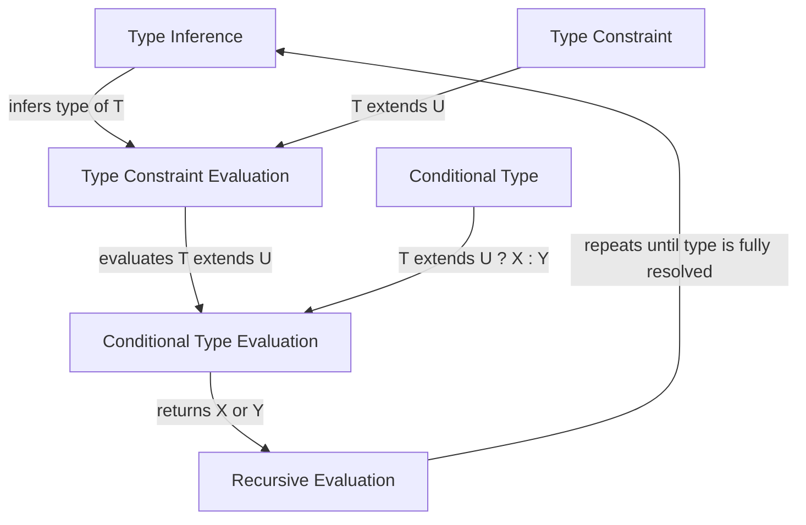

## Introduction
Conditional types in TypeScript are a powerful feature that allows you to make decisions based on types at compile-time. The syntax `T extends U ? X : Y` is used to express a conditional type, where `T` is the type being checked, `U` is the type to check against, and `X` and `Y` are the types to return depending on the result of the check. This feature is essential for building robust and reusable type-safe APIs. > **Note:** Conditional types are a key part of TypeScript's type system, and understanding how to use them effectively is crucial for any TypeScript developer.

In real-world applications, conditional types are used extensively in libraries and frameworks to provide a more expressive and flexible type system. For example, the popular `lodash` library uses conditional types to provide type-safe utility functions. > **Tip:** When working with conditional types, it's essential to understand the concept of type inference, which allows TypeScript to automatically infer the types of variables and expressions.

## Core Concepts
To work with conditional types, you need to understand the following core concepts:

* **Type inference**: The process of automatically determining the type of a variable or expression based on its usage.
* **Type constraints**: The use of the `extends` keyword to constrain a type parameter to a specific type or set of types.
* **Conditional type syntax**: The syntax `T extends U ? X : Y` used to express a conditional type.

A key mental model for understanding conditional types is to think of them as a way of making decisions based on types at compile-time. This allows you to write more expressive and flexible code that is also type-safe. > **Warning:** One common pitfall when working with conditional types is to forget that the type checker is not a runtime evaluator, so you cannot use conditional types to make decisions based on runtime values.

## How It Works Internally
When the TypeScript compiler encounters a conditional type, it evaluates the type constraint `T extends U` and returns either `X` or `Y` depending on the result. This process is repeated recursively until the type is fully resolved. > **Interview:** A common interview question is to ask how conditional types work internally, and the answer should include a discussion of type inference, type constraints, and the recursive evaluation of the type constraint.

Here is a step-by-step breakdown of how the compiler evaluates a conditional type:

1. **Type inference**: The compiler infers the type of the type parameter `T`.
2. **Type constraint evaluation**: The compiler evaluates the type constraint `T extends U`.
3. **Conditional type evaluation**: The compiler returns either `X` or `Y` depending on the result of the type constraint evaluation.
4. **Recursive evaluation**: The compiler repeats steps 1-3 until the type is fully resolved.

## Code Examples
Here are three complete and runnable examples of using conditional types:

### Example 1: Basic Usage
```typescript
type IsString<T> = T extends string ? true : false;

const str: IsString<'hello'> = true; // okay
const num: IsString<42> = false; // okay
```
In this example, we define a conditional type `IsString` that checks if a type `T` is a string. We then use this type to create two variables, `str` and `num`, and assign them values based on the result of the type check.

### Example 2: Real-World Pattern
```typescript
interface User {
  name: string;
  age: number;
}

type GetUser<T extends 'name' | 'age'> = T extends 'name' ? string : number;

const userName: GetUser<'name'> = 'John'; // okay
const userAge: GetUser<'age'> = 30; // okay
```
In this example, we define an interface `User` with two properties, `name` and `age`. We then define a conditional type `GetUser` that checks if a type `T` is either `'name'` or `'age'`, and returns the corresponding type. We then use this type to create two variables, `userName` and `userAge`, and assign them values based on the result of the type check.

### Example 3: Advanced Usage
```typescript
type UnionToIntersection<T> = (T extends infer U ? (k: U) => void : never) extends (k: infer I) => void ? I : never;

type Result = UnionToIntersection<string | number>; // string & number
```
In this example, we define a conditional type `UnionToIntersection` that takes a union type `T` and returns the intersection of all the types in the union. We then use this type to create a type `Result` that is the intersection of `string` and `number`.

## Visual Diagram

This diagram illustrates the internal workings of the TypeScript compiler when evaluating a conditional type. The flowchart shows the recursive evaluation of the type constraint and the conditional type, and how the compiler returns either `X` or `Y` depending on the result of the type constraint evaluation.

## Comparison
| Approach | Time Complexity | Space Complexity | Pros | Cons | Best For |
| --- | --- | --- | --- | --- | --- |
| Conditional Types | O(1) | O(1) | Flexible and expressive type system | Can be complex to understand and use | Advanced type-safe APIs |
| Type Guards | O(1) | O(1) | Simple and easy to use | Limited expressiveness | Simple type checks |
| Type Assertions | O(1) | O(1) | Simple and easy to use | Can bypass type checking | Legacy code or compatibility issues |

## Real-world Use Cases
Here are three real-world examples of using conditional types:

* **Facebook's React**: React uses conditional types to provide a type-safe API for building user interfaces.
* **Microsoft's TypeScript**: TypeScript itself uses conditional types to provide a flexible and expressive type system.
* **Google's Angular**: Angular uses conditional types to provide a type-safe API for building web applications.

## Common Pitfalls
Here are four common mistakes to watch out for when working with conditional types:

* **Forgetting to use the `extends` keyword**: > **Warning:** This can lead to unexpected type errors.
```typescript
// wrong
type IsString<T> = T ? true : false;

// right
type IsString<T> = T extends string ? true : false;
```
* **Using conditional types with runtime values**: > **Warning:** This can lead to unexpected type errors.
```typescript
// wrong
const value = 'hello';
type IsString<T> = T extends value ? true : false;

// right
type IsString<T> = T extends string ? true : false;
```
* **Not understanding type inference**: > **Tip:** This can lead to unexpected type errors.
```typescript
// wrong
type IsString<T> = T extends string ? true : false;
const str: IsString<'hello'> = true; // okay
const num: IsString<42> = true; // error

// right
type IsString<T> = T extends string ? true : false;
const str: IsString<'hello'> = true; // okay
const num: IsString<42> = false; // okay
```
* **Not using recursive evaluation**: > **Warning:** This can lead to unexpected type errors.
```typescript
// wrong
type UnionToIntersection<T> = T extends infer U ? (k: U) => void : never;

// right
type UnionToIntersection<T> = (T extends infer U ? (k: U) => void : never) extends (k: infer I) => void ? I : never;
```

## Interview Tips
Here are three common interview questions related to conditional types, along with weak and strong answers:

* **What are conditional types?**
	+ Weak answer: "Conditional types are a way of making decisions based on types at compile-time."
	+ Strong answer: "Conditional types are a feature of the TypeScript type system that allows you to make decisions based on types at compile-time using the syntax `T extends U ? X : Y`. This feature is essential for building robust and reusable type-safe APIs."
* **How do conditional types work internally?**
	+ Weak answer: "The compiler evaluates the type constraint and returns either `X` or `Y`."
	+ Strong answer: "The compiler evaluates the type constraint `T extends U` and returns either `X` or `Y` depending on the result. This process is repeated recursively until the type is fully resolved. The compiler uses type inference to infer the type of `T` and then evaluates the type constraint using the `extends` keyword."
* **Can you give an example of using conditional types?**
	+ Weak answer: "You can use conditional types to check if a type is a string or a number."
	+ Strong answer: "Yes, here is an example of using conditional types to check if a type is a string or a number:
```typescript
type IsString<T> = T extends string ? true : false;
const str: IsString<'hello'> = true; // okay
const num: IsString<42> = false; // okay
```
This example demonstrates how to use conditional types to make decisions based on types at compile-time, and how to use type inference to infer the type of a variable."

## Key Takeaways
Here are ten key takeaways to remember when working with conditional types:

* Conditional types are a feature of the TypeScript type system that allows you to make decisions based on types at compile-time.
* The syntax `T extends U ? X : Y` is used to express a conditional type.
* Type inference is used to infer the type of `T`.
* The `extends` keyword is used to evaluate the type constraint `T extends U`.
* The compiler repeats the evaluation process recursively until the type is fully resolved.
* Conditional types are essential for building robust and reusable type-safe APIs.
* Type guards and type assertions can be used as alternatives to conditional types, but they have limited expressiveness.
* Recursive evaluation is necessary to fully resolve the type.
* Conditional types can be used to check if a type is a string, a number, or any other type.
* The `infer` keyword is used to infer the type of a variable or expression.