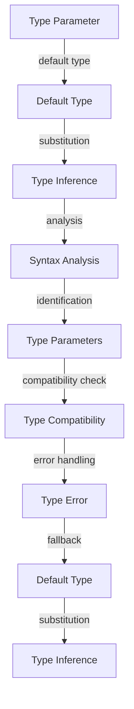

## Introduction
**Default type parameters** are a feature in TypeScript that allows developers to specify a default type for a type parameter. This feature is particularly useful when working with generics, as it enables developers to provide a fallback type in case the type is not explicitly specified. In this section, we will explore the concept of default type parameters, their importance, and their real-world relevance.

Default type parameters are essential in TypeScript because they provide a way to make generics more flexible and reusable. By specifying a default type, developers can ensure that their generic functions and classes work correctly even when the type is not explicitly provided. This feature is also useful when working with third-party libraries, as it allows developers to use generic functions and classes without having to specify the type every time.

> **Note:** Default type parameters are a powerful feature in TypeScript that can help improve the flexibility and reusability of generic code. However, they can also lead to type-related issues if not used carefully.

## Core Concepts
In this section, we will delve into the core concepts related to default type parameters. We will explore the syntax, terminology, and mental models that are essential for understanding this feature.

* **Default type parameter**: A default type parameter is a type parameter that has a default type specified. This default type is used when the type parameter is not explicitly specified.
* **Type parameter**: A type parameter is a placeholder for a type that is specified when a generic function or class is instantiated.
* **Generic**: A generic is a function or class that can work with multiple types.

> **Tip:** When working with default type parameters, it's essential to understand the concept of type inference. Type inference is the process by which the TypeScript compiler infers the type of a variable or expression based on its usage.

## How It Works Internally
In this section, we will explore how default type parameters work internally. We will examine the syntax, the compilation process, and the runtime behavior of default type parameters.

When a default type parameter is specified, the TypeScript compiler uses it to infer the type of the type parameter. If the type parameter is not explicitly specified, the default type is used. The compilation process involves the following steps:

1. **Syntax analysis**: The TypeScript compiler analyzes the syntax of the generic function or class and identifies the type parameters.
2. **Type inference**: The TypeScript compiler infers the type of the type parameters based on their usage.
3. **Default type substitution**: If a type parameter has a default type specified, the TypeScript compiler substitutes the default type for the type parameter.

> **Warning:** When working with default type parameters, it's essential to be aware of the potential for type-related issues. If the default type is not compatible with the expected type, it can lead to type errors.

## Code Examples
In this section, we will explore three complete and runnable code examples that demonstrate the usage of default type parameters.

### Example 1: Basic Usage
```typescript
function identity<T = string>(value: T): T {
  return value;
}

console.log(identity('hello')); // Output: "hello"
console.log(identity(123)); // Output: 123
```
In this example, we define a generic function `identity` that takes a type parameter `T` with a default type of `string`. The function returns the input value unchanged.

### Example 2: Real-World Pattern
```typescript
class Container<T = string> {
  private value: T;

  constructor(value: T) {
    this.value = value;
  }

  getValue(): T {
    return this.value;
  }
}

const stringContainer = new Container('hello');
console.log(stringContainer.getValue()); // Output: "hello"

const numberContainer = new Container(123);
console.log(numberContainer.getValue()); // Output: 123
```
In this example, we define a generic class `Container` that takes a type parameter `T` with a default type of `string`. The class has a private property `value` of type `T` and a method `getValue` that returns the value.

### Example 3: Advanced Usage
```typescript
function merge<T = string, U = string>(a: T, b: U): T & U {
  return { ...a, ...b };
}

console.log(merge({ a: 1 }, { b: 2 })); // Output: { a: 1, b: 2 }
console.log(merge('hello', 'world')); // Output: { 0: "h", 1: "e", 2: "l", 3: "l", 4: "o", 5: "w", 6: "o", 7: "r", 8: "l", 9: "d" }
```
In this example, we define a generic function `merge` that takes two type parameters `T` and `U` with default types of `string`. The function returns an object that combines the properties of the input objects.

## Visual Diagram

This diagram illustrates the process of default type parameter substitution and type inference.

> **Interview:** Can you explain the difference between a type parameter and a default type parameter?

## Comparison
| Approach | Time Complexity | Space Complexity | Pros | Cons | Best For |
| --- | --- | --- | --- | --- | --- |
| Explicit Type Parameters | O(1) | O(1) | Explicit type specification, no ambiguity | Verbose, requires explicit type specification | Simple use cases |
| Default Type Parameters | O(1) | O(1) | Flexible, reusable, and concise | Potential for type-related issues, requires careful usage | Complex use cases, third-party libraries |
| Type Inference | O(1) | O(1) | Automatic type inference, no explicit type specification | Potential for type-related issues, requires careful usage | Simple use cases, implicit type specification |
| Hybrid Approach | O(1) | O(1) | Combines explicit type parameters and default type parameters | Verbose, requires explicit type specification and careful usage | Complex use cases, third-party libraries |

## Real-world Use Cases
1. **React**: React uses default type parameters to make its generic components more flexible and reusable.
2. **Angular**: Angular uses default type parameters to provide a flexible and reusable way to work with forms and validation.
3. **TypeORM**: TypeORM uses default type parameters to provide a flexible and reusable way to work with database entities.

> **Tip:** When working with default type parameters, it's essential to consider the trade-offs between flexibility, reusability, and type safety.

## Common Pitfalls
1. **Type-related issues**: Default type parameters can lead to type-related issues if not used carefully.
2. **Implicit type specification**: Implicit type specification can lead to type-related issues if not used carefully.
3. **Verbose code**: Explicit type specification can lead to verbose code.
4. **Compatibility issues**: Default type parameters can lead to compatibility issues if not used carefully.

> **Warning:** When working with default type parameters, it's essential to be aware of the potential for type-related issues and compatibility issues.

## Interview Tips
1. **What is the difference between a type parameter and a default type parameter?**: A type parameter is a placeholder for a type that is specified when a generic function or class is instantiated. A default type parameter is a type parameter that has a default type specified.
2. **How do you use default type parameters in TypeScript?**: Default type parameters are used to specify a default type for a type parameter. This default type is used when the type parameter is not explicitly specified.
3. **What are the benefits and drawbacks of using default type parameters?**: The benefits of using default type parameters include flexibility, reusability, and conciseness. The drawbacks include potential type-related issues and compatibility issues.

> **Interview:** Can you explain the benefits and drawbacks of using default type parameters in TypeScript?

## Key Takeaways
* **Default type parameters are a powerful feature in TypeScript**: They provide a flexible and reusable way to work with generics.
* **Default type parameters can lead to type-related issues**: If not used carefully, default type parameters can lead to type-related issues.
* **Default type parameters can lead to compatibility issues**: If not used carefully, default type parameters can lead to compatibility issues.
* **Explicit type specification is verbose**: Explicit type specification can lead to verbose code.
* **Type inference is automatic**: Type inference is the process by which the TypeScript compiler infers the type of a variable or expression based on its usage.
* **Default type parameters are useful in complex use cases**: Default type parameters are useful in complex use cases where flexibility and reusability are essential.
* **Default type parameters are useful in third-party libraries**: Default type parameters are useful in third-party libraries where flexibility and reusability are essential.
* **Default type parameters require careful usage**: Default type parameters require careful usage to avoid type-related issues and compatibility issues.
* **Default type parameters require a deep understanding of TypeScript**: Default type parameters require a deep understanding of TypeScript and its type system.