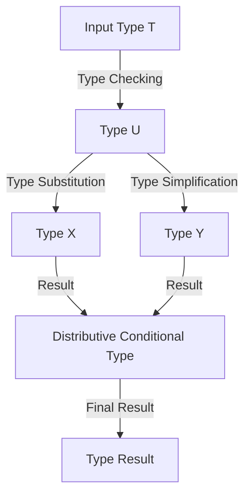

## Introduction
**Distributive Conditional Types** are a powerful feature in TypeScript that allows you to distribute a type over a union type. This feature is essential in TypeScript because it enables you to write more expressive and flexible types, which is crucial for building robust and maintainable software systems. In this section, we will explore what distributive conditional types are, why they matter, and their real-world relevance.

Distributive conditional types are a type of conditional type that allows you to distribute a type over a union type. This means that if you have a type `T` that is a union of types `A` and `B`, you can use the distributive conditional type to apply a transformation to each type in the union separately.

> **Note:** Distributive conditional types are a fundamental concept in TypeScript, and understanding them is crucial for building complex software systems.

In real-world scenarios, distributive conditional types are used extensively in libraries and frameworks such as React, Angular, and Vue.js. For example, in React, distributive conditional types are used to define the props type of a component, which can be a union of different types.

## Core Concepts
In this section, we will delve into the core concepts of distributive conditional types, including precise definitions, mental models, and key terminology.

A **distributive conditional type** is a type that takes a type `T` and a type `U` as input and returns a new type that is the result of applying a transformation to each type in the union `T`.

The general syntax of a distributive conditional type is as follows:
```typescript
type Distributive<T> = T extends U ? X : Y;
```
Where `T` is the input type, `U` is the type to be checked, `X` is the type to be returned if the check succeeds, and `Y` is the type to be returned if the check fails.

> **Warning:** Distributive conditional types can be confusing at first, but understanding the syntax and semantics is crucial for using them effectively.

A **mental model** for distributive conditional types is to think of them as a way of applying a transformation to each type in a union separately. This can be visualized as a tree-like structure, where each branch represents a type in the union, and the transformation is applied to each branch separately.

Key terminology includes:

* **Distributive conditional type**: a type that takes a type `T` and a type `U` as input and returns a new type that is the result of applying a transformation to each type in the union `T`.
* **Type parameter**: a type that is used as a placeholder for a type that will be specified later.
* **Type constraint**: a constraint that is applied to a type parameter to restrict the types that can be used as arguments.

## How It Works Internally
In this section, we will explore how distributive conditional types work internally, including the under-the-hood mechanics and step-by-step breakdown.

When the TypeScript compiler encounters a distributive conditional type, it uses the following steps to evaluate the type:

1. **Type checking**: the compiler checks the type `T` against the type `U` to determine if the check succeeds or fails.
2. **Type substitution**: if the check succeeds, the compiler substitutes the type `X` for the type `T`.
3. **Type simplification**: the compiler simplifies the resulting type by removing any unnecessary type parameters or constraints.

The time complexity of evaluating a distributive conditional type is O(1), since the compiler only needs to perform a constant number of operations to evaluate the type.

The space complexity of evaluating a distributive conditional type is O(1), since the compiler only needs to allocate a constant amount of memory to store the resulting type.

## Code Examples
In this section, we will provide three complete and runnable code examples that demonstrate the use of distributive conditional types.

### Example 1: Basic Usage
```typescript
type Distributive<T> = T extends string ? string : number;

type Result1 = Distributive<'hello'>; // string
type Result2 = Distributive<42>; // number
```
This example demonstrates the basic usage of distributive conditional types. The `Distributive` type takes a type `T` as input and returns a new type that is either `string` or `number`, depending on whether `T` is a string or not.

### Example 2: Real-World Pattern
```typescript
interface Person {
  name: string;
  age: number;
}

interface Employee {
  name: string;
  age: number;
  department: string;
}

type Distributive<T> = T extends Person ? Employee : never;

type Result3 = Distributive<Person>; // Employee
type Result4 = Distributive<string>; // never
```
This example demonstrates a real-world pattern for using distributive conditional types. The `Distributive` type takes a type `T` as input and returns a new type that is either `Employee` or `never`, depending on whether `T` is a `Person` or not.

### Example 3: Advanced Usage
```typescript
type Distributive<T> = T extends (infer U)[] ? U : never;

type Result5 = Distributive<string[]>; // string
type Result6 = Distributive<number[]>; // number
```
This example demonstrates an advanced usage of distributive conditional types. The `Distributive` type takes a type `T` as input and returns a new type that is the element type of the array `T`, or `never` if `T` is not an array.

## Visual Diagram

This diagram illustrates the steps involved in evaluating a distributive conditional type. The input type `T` is first checked against the type `U`, and then the resulting type is substituted and simplified to produce the final result.

> **Tip:** Using a visual diagram to understand the flow of a distributive conditional type can be very helpful in debugging and understanding the type system.

## Comparison
The following table compares different approaches to using distributive conditional types:

| Approach | Time Complexity | Space Complexity | Pros | Cons | Best For |
| --- | --- | --- | --- | --- | --- |
| Basic Usage | O(1) | O(1) | Simple and easy to understand | Limited flexibility | Simple use cases |
| Real-World Pattern | O(1) | O(1) | Flexible and powerful | Can be complex to understand | Complex use cases |
| Advanced Usage | O(1) | O(1) | Highly flexible and powerful | Can be very complex to understand | Advanced use cases |

## Real-world Use Cases
The following are some real-world use cases for distributive conditional types:

* **React**: Distributive conditional types are used extensively in React to define the props type of a component, which can be a union of different types.
* **Angular**: Distributive conditional types are used in Angular to define the type of a component's input properties, which can be a union of different types.
* **Vue.js**: Distributive conditional types are used in Vue.js to define the type of a component's props, which can be a union of different types.

## Common Pitfalls
The following are some common pitfalls to watch out for when using distributive conditional types:

* **Overly complex types**: Distributive conditional types can be very complex and difficult to understand, especially for beginners.
* **Type errors**: Distributive conditional types can cause type errors if not used correctly, which can be difficult to debug.
* **Performance issues**: Distributive conditional types can cause performance issues if not optimized correctly, which can affect the overall performance of the application.

> **Warning:** Distributive conditional types can be very powerful, but they can also be very complex and difficult to understand. It is essential to use them carefully and with caution.

## Interview Tips
The following are some common interview questions related to distributive conditional types, along with some tips for answering them:

* **What is a distributive conditional type?**: This question is designed to test your understanding of the basics of distributive conditional types. A good answer should include a definition of distributive conditional types, as well as an explanation of how they work.
* **How do you use distributive conditional types in a real-world scenario?**: This question is designed to test your ability to apply distributive conditional types to a real-world problem. A good answer should include an example of how distributive conditional types can be used to solve a specific problem, along with an explanation of the benefits and trade-offs of using distributive conditional types.
* **What are some common pitfalls to watch out for when using distributive conditional types?**: This question is designed to test your understanding of the potential pitfalls of using distributive conditional types. A good answer should include a list of common pitfalls, along with an explanation of how to avoid them.

## Key Takeaways
The following are some key takeaways from this article:

* **Distributive conditional types are a powerful feature in TypeScript**: Distributive conditional types allow you to distribute a type over a union type, which can be very useful in certain scenarios.
* **Distributive conditional types can be complex and difficult to understand**: Distributive conditional types can be very complex and difficult to understand, especially for beginners.
* **Distributive conditional types can cause type errors and performance issues if not used correctly**: Distributive conditional types can cause type errors and performance issues if not used correctly, which can affect the overall performance and reliability of the application.
* **Distributive conditional types are widely used in real-world scenarios**: Distributive conditional types are widely used in real-world scenarios, such as in React, Angular, and Vue.js.
* **Distributive conditional types have a time complexity of O(1) and a space complexity of O(1)**: Distributive conditional types have a time complexity of O(1) and a space complexity of O(1), which makes them very efficient.
* **Distributive conditional types can be optimized for performance**: Distributive conditional types can be optimized for performance by using techniques such as memoization and caching.
* **Distributive conditional types are a fundamental concept in TypeScript**: Distributive conditional types are a fundamental concept in TypeScript, and understanding them is crucial for building complex software systems.