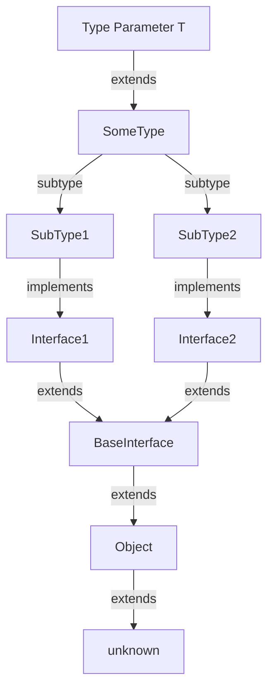

## Introduction
**Generic Constraints** are a fundamental concept in TypeScript, allowing developers to create reusable and type-safe functions, classes, and interfaces. The `T extends SomeType` syntax is a specific type of generic constraint that enables developers to restrict the type of a generic parameter to a specific type or its subtypes. In this section, we will explore why generic constraints matter, their real-world relevance, and why every engineer needs to know this concept.

Generic constraints are essential in ensuring type safety and preventing errors at runtime. By constraining the type of a generic parameter, developers can guarantee that the code will work correctly and prevent potential type-related issues. For instance, in a real-world scenario, a developer might create a generic function that operates on a collection of objects. By using a generic constraint, the developer can ensure that the function only accepts collections of a specific type, preventing potential errors when working with incompatible types.

> **Note:** Generic constraints are particularly useful when working with complex data structures or algorithms, where type safety is crucial to prevent errors and ensure correct behavior.

## Core Concepts
To understand generic constraints, it's essential to grasp the following core concepts:

* **Type Parameters**: A type parameter is a symbol that represents a type in a generic function, class, or interface. Type parameters are typically represented by a single letter, such as `T`.
* **Type Constraints**: A type constraint is a restriction placed on a type parameter, limiting it to a specific type or its subtypes. Type constraints are used to ensure type safety and prevent errors at runtime.
* **Subtyping**: Subtyping refers to the relationship between two types, where one type is a subtype of another. In TypeScript, subtyping is based on the concept of structural typing, where a type is considered a subtype of another if it has all the properties and methods of the supertype.

> **Warning:** Failure to understand type constraints and subtyping can lead to type-related errors and bugs in your code.

## How It Works Internally
When a generic constraint is applied to a type parameter, the TypeScript compiler checks the type of the generic parameter against the constraint at compile-time. If the type of the generic parameter satisfies the constraint, the code is considered type-safe, and the compiler generates the corresponding JavaScript code. If the type of the generic parameter does not satisfy the constraint, the compiler raises a type error.

Here's a step-by-step breakdown of how generic constraints work internally:

1. **Type Parameter Declaration**: The developer declares a type parameter, such as `T`, in a generic function, class, or interface.
2. **Type Constraint Declaration**: The developer declares a type constraint, such as `T extends SomeType`, to restrict the type of the type parameter.
3. **Type Checking**: The TypeScript compiler checks the type of the generic parameter against the type constraint at compile-time.
4. **Type Safety Guarantee**: If the type of the generic parameter satisfies the constraint, the code is considered type-safe, and the compiler generates the corresponding JavaScript code.

## Code Examples
Here are three complete and runnable examples of generic constraints in TypeScript:

### Example 1: Basic Generic Constraint
```typescript
function identity<T extends string | number>(arg: T): T {
  return arg;
}

console.log(identity("hello")); // Output: "hello"
console.log(identity(42)); // Output: 42
```
In this example, the `identity` function has a generic parameter `T` that is constrained to be either a `string` or a `number`. The function returns the input argument unchanged.

### Example 2: Generic Constraint with Interface
```typescript
interface Person {
  name: string;
  age: number;
}

function getPersonName<T extends Person>(person: T): string {
  return person.name;
}

const person: Person = { name: "John", age: 30 };
console.log(getPersonName(person)); // Output: "John"
```
In this example, the `getPersonName` function has a generic parameter `T` that is constrained to be a subtype of the `Person` interface. The function returns the `name` property of the input `person` object.

### Example 3: Advanced Generic Constraint with Type Inference
```typescript
function createArray<T extends string | number>(length: number, value: T): T[] {
  return new Array(length).fill(value);
}

const stringArray = createArray(3, "hello");
console.log(stringArray); // Output: ["hello", "hello", "hello"]

const numberArray = createArray(3, 42);
console.log(numberArray); // Output: [42, 42, 42]
```
In this example, the `createArray` function has a generic parameter `T` that is constrained to be either a `string` or a `number`. The function returns an array of the specified length filled with the input `value`. The type of the array is inferred based on the type of the `value` parameter.

> **Tip:** Use the `extends` keyword to constrain a type parameter to a specific type or its subtypes.

## Visual Diagram

This diagram illustrates the relationship between a type parameter `T`, its constraint `SomeType`, and its subtypes `SubType1` and `SubType2`. The subtypes implement interfaces `Interface1` and `Interface2`, which extend a base interface `BaseInterface`. The base interface extends the `Object` type, which extends the `unknown` type.

## Comparison
| Approach | Time Complexity | Space Complexity | Pros | Cons | Best For |
| --- | --- | --- | --- | --- | --- |
| Generic Constraints | O(1) | O(1) | Ensures type safety, prevents errors | Can be verbose, requires understanding of type theory | Complex data structures, algorithms |
| Type Assertions | O(1) | O(1) | Allows for more flexibility, can be used with existing code | Can lead to type-related errors, requires careful use | Legacy code, third-party libraries |
| Type Guards | O(1) | O(1) | Provides a way to narrow the type of a value, can be used with type assertions | Can be complex to implement, requires understanding of type theory | Complex data structures, algorithms |
| Casting | O(1) | O(1) | Allows for more flexibility, can be used with existing code | Can lead to type-related errors, requires careful use | Legacy code, third-party libraries |

> **Interview:** What is the main difference between a generic constraint and a type assertion? How would you use each in a real-world scenario?

## Real-world Use Cases
Here are three real-world use cases for generic constraints:

* **React**: React uses generic constraints to ensure type safety when working with components and props. For example, the `React.Component` class has a generic parameter `P` that is constrained to be a subtype of the `React.Props` interface.
* **Angular**: Angular uses generic constraints to ensure type safety when working with components and services. For example, the `@Injectable` decorator has a generic parameter `T` that is constrained to be a subtype of the `Injectable` interface.
* **TypeORM**: TypeORM uses generic constraints to ensure type safety when working with database entities and repositories. For example, the `EntityRepository` class has a generic parameter `T` that is constrained to be a subtype of the `Entity` interface.

## Common Pitfalls
Here are four common pitfalls to avoid when using generic constraints:

* **Incorrect type constraint**: Using an incorrect type constraint can lead to type-related errors and bugs in your code.
* **Insufficient type information**: Failing to provide sufficient type information can lead to type-related errors and bugs in your code.
* **Overly restrictive type constraint**: Using an overly restrictive type constraint can limit the flexibility of your code and make it more difficult to use.
* **Underly restrictive type constraint**: Using an underly restrictive type constraint can lead to type-related errors and bugs in your code.

> **Warning:** Failure to understand type constraints and subtyping can lead to type-related errors and bugs in your code.

## Interview Tips
Here are three common interview questions related to generic constraints:

* **What is the main difference between a generic constraint and a type assertion?**: A generic constraint is used to restrict the type of a generic parameter, while a type assertion is used to assert the type of a value.
* **How would you use a generic constraint to ensure type safety in a complex data structure?**: You would use a generic constraint to restrict the type of a generic parameter to a specific type or its subtypes, ensuring that the data structure is type-safe and preventing potential type-related errors.
* **What are some common pitfalls to avoid when using generic constraints?**: Some common pitfalls to avoid when using generic constraints include using an incorrect type constraint, failing to provide sufficient type information, using an overly restrictive type constraint, and using an underly restrictive type constraint.

## Key Takeaways
Here are ten key takeaways to remember when working with generic constraints:

* **Generic constraints are used to restrict the type of a generic parameter**: Generic constraints are used to ensure type safety and prevent potential type-related errors.
* **Type constraints are used to restrict the type of a type parameter**: Type constraints are used to ensure type safety and prevent potential type-related errors.
* **Subtyping is based on structural typing**: Subtyping is based on the concept of structural typing, where a type is considered a subtype of another if it has all the properties and methods of the supertype.
* **Generic constraints can be used with interfaces and classes**: Generic constraints can be used with interfaces and classes to ensure type safety and prevent potential type-related errors.
* **Type assertions can be used with generic constraints**: Type assertions can be used with generic constraints to assert the type of a value.
* **Generic constraints can be used with type guards**: Generic constraints can be used with type guards to narrow the type of a value.
* **Casting can be used with generic constraints**: Casting can be used with generic constraints to cast a value to a specific type.
* **Generic constraints are essential for type safety**: Generic constraints are essential for ensuring type safety and preventing potential type-related errors.
* **Generic constraints can be complex to understand**: Generic constraints can be complex to understand, requiring a deep understanding of type theory and subtyping.
* **Practice is key to mastering generic constraints**: Practice is key to mastering generic constraints, requiring a combination of theoretical knowledge and practical experience.