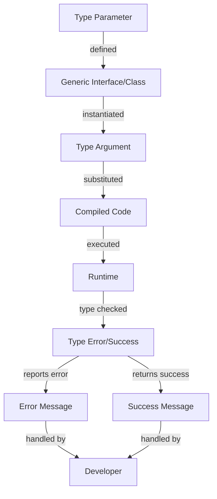

## Introduction
**Generic interfaces and classes** are a fundamental concept in TypeScript, allowing developers to create reusable and type-safe code. They enable us to define a blueprint for a class or interface that can work with multiple types, rather than being restricted to a single type. This feature is essential in building robust and maintainable software systems, as it helps to prevent type-related errors and improves code readability.

In real-world scenarios, generic interfaces and classes are used extensively in various applications, such as data structures, algorithms, and frameworks. For instance, the popular **React** library uses generic interfaces to define reusable components that can work with different types of data. Similarly, **Angular** uses generic classes to create reusable services that can be used across multiple applications.

> **Note:** The concept of generics is not unique to TypeScript and is also available in other programming languages, such as Java and C#.

## Core Concepts
To understand generic interfaces and classes, it's essential to grasp the following core concepts:

* **Type parameters**: These are placeholders for types that will be specified when the generic interface or class is instantiated. Type parameters are defined using the `<` and `>` symbols, and they can be used to represent any type, including primitive types, interfaces, and classes.
* **Type arguments**: These are the actual types that are passed to a generic interface or class when it's instantiated. Type arguments can be any valid type, including primitive types, interfaces, and classes.
* **Constraints**: These are optional restrictions that can be applied to type parameters to limit the types that can be used as type arguments. Constraints can be used to ensure that type parameters are compatible with specific interfaces or classes.

The mental model for understanding generic interfaces and classes is to think of them as templates that can be instantiated with different types. This allows developers to write reusable code that can work with multiple types, without having to write separate implementations for each type.

## How It Works Internally
When a generic interface or class is instantiated, the TypeScript compiler replaces the type parameters with the actual type arguments. This process is called **type substitution**. The resulting code is then compiled to JavaScript, which does not have built-in support for generics.

Here's a step-by-step breakdown of how generic interfaces and classes work internally:

1. **Type parameter definition**: The developer defines a generic interface or class with type parameters.
2. **Type argument specification**: The developer instantiates the generic interface or class with type arguments.
3. **Type substitution**: The TypeScript compiler replaces the type parameters with the actual type arguments.
4. **Type checking**: The TypeScript compiler checks the resulting code for type errors.
5. **Compilation**: The resulting code is compiled to JavaScript.

> **Warning:** When working with generic interfaces and classes, it's essential to ensure that the type arguments are compatible with the type parameters. Otherwise, type errors can occur at runtime.

## Code Examples
Here are three complete and runnable examples of generic interfaces and classes in TypeScript:

### Example 1: Basic Generic Interface
```typescript
// Define a generic interface
interface Container<T> {
  value: T;
}

// Instantiate the interface with a type argument
const stringContainer: Container<string> = {
  value: 'Hello, World!',
};

console.log(stringContainer.value); // Output: "Hello, World!"
```

### Example 2: Generic Class with Constraints
```typescript
// Define a generic class with a constraint
class Box<T extends { name: string }> {
  private value: T;

  constructor(value: T) {
    this.value = value;
  }

  public getValue(): T {
    return this.value;
  }
}

// Instantiate the class with a type argument
const personBox = new Box({ name: 'John Doe' });

console.log(personBox.getValue()); // Output: { name: "John Doe" }
```

### Example 3: Advanced Generic Interface with Multiple Type Parameters
```typescript
// Define a generic interface with multiple type parameters
interface Pair<T, U> {
  first: T;
  second: U;
}

// Instantiate the interface with type arguments
const numberStringPair: Pair<number, string> = {
  first: 42,
  second: 'Hello, World!',
};

console.log(numberStringPair.first); // Output: 42
console.log(numberStringPair.second); // Output: "Hello, World!"
```

## Visual Diagram

The diagram illustrates the process of defining a generic interface or class, instantiating it with type arguments, and compiling the resulting code. The compiled code is then executed at runtime, where type checking occurs. If a type error occurs, an error message is reported; otherwise, a success message is returned.

## Comparison
Here's a comparison of different approaches to using generic interfaces and classes in TypeScript:

| Approach | Time Complexity | Space Complexity | Pros | Cons | Best For |
| --- | --- | --- | --- | --- | --- |
| Generic Interfaces | O(1) | O(1) | Flexible, reusable | Can be complex | Data structures, algorithms |
| Generic Classes | O(1) | O(1) | Encapsulates data and behavior | Can be overused | Complex, stateful objects |
| Type Aliases | O(1) | O(1) | Simple, concise | Limited functionality | Simple type definitions |
| Interfaces | O(1) | O(1) | Clear, explicit | Limited flexibility | Simple, stateless objects |

> **Tip:** When deciding between generic interfaces and classes, consider the complexity of the data structure or algorithm and the level of encapsulation required.

## Real-world Use Cases
Here are three production examples of using generic interfaces and classes in TypeScript:

1. **React**: React uses generic interfaces to define reusable components that can work with different types of data.
2. **Angular**: Angular uses generic classes to create reusable services that can be used across multiple applications.
3. **RxJS**: RxJS uses generic interfaces to define observable sequences that can work with different types of data.

## Common Pitfalls
Here are four common mistakes to avoid when using generic interfaces and classes in TypeScript:

1. **Incorrect type parameter usage**: Using type parameters incorrectly can lead to type errors at runtime.
```typescript
// WRONG
interface Container<T> {
  value: T;
}

const stringContainer: Container<number> = {
  value: 'Hello, World!', // type error
};
```

```typescript
// RIGHT
interface Container<T> {
  value: T;
}

const stringContainer: Container<string> = {
  value: 'Hello, World!',
};
```

2. **Insufficient constraints**: Failing to apply sufficient constraints to type parameters can lead to type errors at runtime.
```typescript
// WRONG
class Box<T> {
  private value: T;

  constructor(value: T) {
    this.value = value;
  }

  public getValue(): T {
    return this.value;
  }
}

const numberBox = new Box({ name: 'John Doe' }); // type error
```

```typescript
// RIGHT
class Box<T extends { name: string }> {
  private value: T;

  constructor(value: T) {
    this.value = value;
  }

  public getValue(): T {
    return this.value;
  }
}

const personBox = new Box({ name: 'John Doe' });
```

3. **Overusing generics**: Overusing generics can lead to complex and hard-to-maintain code.
```typescript
// WRONG
interface Container<T, U, V> {
  value: T;
  otherValue: U;
  anotherValue: V;
}
```

```typescript
// RIGHT
interface Container<T> {
  value: T;
}
```

4. **Failing to handle type errors**: Failing to handle type errors can lead to runtime errors.
```typescript
// WRONG
interface Container<T> {
  value: T;
}

const stringContainer: Container<number> = {
  value: 'Hello, World!', // type error
};
```

```typescript
// RIGHT
interface Container<T> {
  value: T;
}

try {
  const stringContainer: Container<number> = {
    value: 'Hello, World!', // type error
  };
} catch (error) {
  console.error(error);
}
```

## Interview Tips
Here are three common interview questions related to generic interfaces and classes in TypeScript, along with weak and strong answers:

1. **What is the purpose of generic interfaces and classes in TypeScript?**

Weak answer: "They're used to define reusable code."

Strong answer: "Generic interfaces and classes allow developers to define reusable code that can work with multiple types, while maintaining type safety and preventing type-related errors at runtime."

2. **How do you decide between using a generic interface and a generic class in TypeScript?**

Weak answer: "I use a generic interface when I need to define a simple data structure, and a generic class when I need to encapsulate complex behavior."

Strong answer: "I consider the complexity of the data structure or algorithm, the level of encapsulation required, and the trade-offs between flexibility and maintainability. If the data structure or algorithm is simple and doesn't require encapsulation, I use a generic interface. If the data structure or algorithm is complex and requires encapsulation, I use a generic class."

3. **How do you handle type errors when using generic interfaces and classes in TypeScript?**

Weak answer: "I ignore type errors and fix them at runtime."

Strong answer: "I use try-catch blocks to handle type errors at runtime, and I also use type guards and conditional statements to prevent type errors from occurring in the first place. Additionally, I use the TypeScript compiler to catch type errors at compile-time, and I fix them before deploying the code to production."

> **Interview:** When answering interview questions related to generic interfaces and classes in TypeScript, be sure to demonstrate a deep understanding of the concepts, including type parameters, type arguments, and constraints. Also, be prepared to provide examples of how you've used generic interfaces and classes in production code, and how you've handled type errors and other challenges that arise when using these features.

## Key Takeaways
Here are six key takeaways to remember when working with generic interfaces and classes in TypeScript:

* **Use generic interfaces and classes to define reusable code**: Generic interfaces and classes allow developers to define reusable code that can work with multiple types, while maintaining type safety and preventing type-related errors at runtime.
* **Consider the complexity of the data structure or algorithm**: When deciding between using a generic interface and a generic class, consider the complexity of the data structure or algorithm, the level of encapsulation required, and the trade-offs between flexibility and maintainability.
* **Use type parameters and constraints to maintain type safety**: Use type parameters and constraints to maintain type safety and prevent type-related errors at runtime.
* **Handle type errors at runtime**: Use try-catch blocks to handle type errors at runtime, and use type guards and conditional statements to prevent type errors from occurring in the first place.
* **Use the TypeScript compiler to catch type errors at compile-time**: Use the TypeScript compiler to catch type errors at compile-time, and fix them before deploying the code to production.
* **Test your code thoroughly**: Test your code thoroughly to ensure that it works correctly with different types and scenarios, and to catch any type-related errors that may occur at runtime.