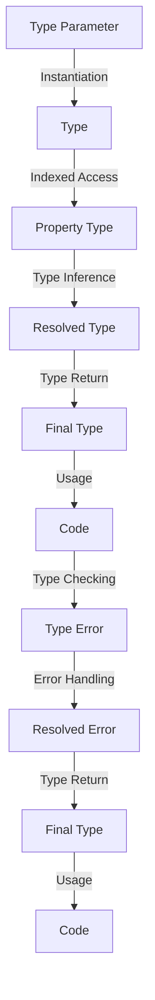

## Introduction
Indexed Access Types, denoted as `T[K]`, are a powerful feature in TypeScript that allows developers to access the type of a property in an object. This feature is particularly useful when working with generic types and objects. In this section, we will explore what Indexed Access Types are, why they matter, and their real-world relevance.

Indexed Access Types are used to access the type of a property in an object. For example, given an object `obj` with a property `prop`, the type of `obj['prop']` can be accessed using the syntax `T['prop']`. This feature is essential when working with generic types, as it allows developers to define types that are flexible and reusable.

> **Note:** Indexed Access Types are a key feature in TypeScript that enables developers to write more expressive and flexible code. They are particularly useful when working with generic types and objects.

In real-world scenarios, Indexed Access Types are used extensively in libraries and frameworks that rely heavily on generics, such as React and Angular. They are also used in data processing and manipulation, where the type of data needs to be accessed and processed dynamically.

## Core Concepts
To understand Indexed Access Types, it is essential to grasp the following core concepts:

* **Type Parameters:** Type parameters are placeholders for types that are defined when a type is instantiated. They are denoted using the syntax `T`.
* **Indexed Access:** Indexed access refers to the process of accessing the type of a property in an object using the syntax `T[K]`.
* **Type Inference:** Type inference is the process of automatically determining the type of a variable or expression based on its usage.

> **Warning:** When using Indexed Access Types, it is essential to ensure that the type parameter `T` is correctly defined and instantiated. Failure to do so can result in type errors and unexpected behavior.

The key terminology associated with Indexed Access Types includes:

* **Type Parameter:** A placeholder for a type that is defined when a type is instantiated.
* **Indexed Access Type:** A type that is accessed using the syntax `T[K]`.
* **Type Inference:** The process of automatically determining the type of a variable or expression based on its usage.

## How It Works Internally
Indexed Access Types work internally by using the type system to resolve the type of a property in an object. When the syntax `T[K]` is used, the type system checks the type of `T` and `K` to determine the type of the property.

Here is a step-by-step breakdown of how Indexed Access Types work internally:

1. **Type Checking:** The type system checks the type of `T` and `K` to determine if they are valid type parameters.
2. **Type Inference:** The type system uses type inference to determine the type of the property based on the type of `T` and `K`.
3. **Type Resolution:** The type system resolves the type of the property by checking the type of `T` and `K`.
4. **Type Return:** The type system returns the resolved type of the property.

> **Tip:** When using Indexed Access Types, it is essential to use the correct type parameters and ensure that they are correctly defined and instantiated.

## Code Examples
Here are three complete and runnable examples that demonstrate the usage of Indexed Access Types:

### Example 1: Basic Usage
```typescript
interface Person {
  name: string;
  age: number;
}

type NameType = Person['name']; // string
type AgeType = Person['age']; // number

const person: Person = {
  name: 'John Doe',
  age: 30,
};

console.log(person.name); // John Doe
console.log(person.age); // 30
```

### Example 2: Generic Type
```typescript
interface GenericType<T> {
  value: T;
}

type StringType = GenericType<string>['value']; // string
type NumberType = GenericType<number>['value']; // number

const genericString: GenericType<string> = {
  value: 'Hello World',
};

const genericNumber: GenericType<number> = {
  value: 42,
};

console.log(genericString.value); // Hello World
console.log(genericNumber.value); // 42
```

### Example 3: Advanced Usage
```typescript
interface ComplexType<T, K> {
  value: T[K];
}

type ComplexStringType = ComplexType<{ foo: string }, 'foo'>['value']; // string
type ComplexNumberType = ComplexType<{ bar: number }, 'bar'>['value']; // number

const complexString: ComplexType<{ foo: string }, 'foo'> = {
  value: 'Hello World',
};

const complexNumber: ComplexType<{ bar: number }, 'bar'> = {
  value: 42,
};

console.log(complexString.value); // Hello World
console.log(complexNumber.value); // 42
```

## Visual Diagram

The diagram illustrates the process of Indexed Access Types, from type parameter instantiation to type return and usage in code.

## Comparison
Here is a comparison table that highlights the differences between Indexed Access Types and other type features in TypeScript:

| Approach | Time Complexity | Space Complexity | Pros | Cons | Best For |
| --- | --- | --- | --- | --- | --- |
| Indexed Access Types | O(1) | O(1) | Flexible and reusable | Can be complex to understand | Generic types and objects |
| Type Guards | O(1) | O(1) | Simple and easy to use | Limited flexibility | Simple type checking |
| Type Assertions | O(1) | O(1) | Simple and easy to use | Can be error-prone | Simple type assertions |
| Type Inference | O(1) | O(1) | Automatic and efficient | Can be limited in complex scenarios | Simple type inference |

## Real-world Use Cases
Here are three real-world use cases that demonstrate the usage of Indexed Access Types:

* **React:** React uses Indexed Access Types to define the type of props and state in functional components.
* **Angular:** Angular uses Indexed Access Types to define the type of dependencies and services in components.
* **GraphQL:** GraphQL uses Indexed Access Types to define the type of fields and resolvers in schemas.

## Common Pitfalls
Here are four common pitfalls that developers may encounter when using Indexed Access Types:

* **Incorrect Type Parameters:** Using incorrect type parameters can result in type errors and unexpected behavior.
* **Insufficient Type Inference:** Insufficient type inference can result in type errors and unexpected behavior.
* **Incorrect Indexed Access:** Incorrect indexed access can result in type errors and unexpected behavior.
* **Overly Complex Types:** Overly complex types can result in type errors and unexpected behavior.

> **Warning:** When using Indexed Access Types, it is essential to ensure that the type parameters are correctly defined and instantiated, and that the indexed access is correct.

## Interview Tips
Here are three common interview questions that may be asked about Indexed Access Types:

* **What is the purpose of Indexed Access Types?**
	+ Weak answer: Indexed Access Types are used to access properties in objects.
	+ Strong answer: Indexed Access Types are used to access the type of a property in an object, allowing for flexible and reusable code.
* **How do Indexed Access Types work internally?**
	+ Weak answer: Indexed Access Types work internally by using the type system to resolve the type of a property.
	+ Strong answer: Indexed Access Types work internally by using the type system to resolve the type of a property, through a process of type checking, type inference, type resolution, and type return.
* **What are some common use cases for Indexed Access Types?**
	+ Weak answer: Indexed Access Types are used in React and Angular.
	+ Strong answer: Indexed Access Types are used in React and Angular, as well as in data processing and manipulation, where the type of data needs to be accessed and processed dynamically.

## Key Takeaways
Here are ten key takeaways about Indexed Access Types:

* **Indexed Access Types are used to access the type of a property in an object.**
* **Type parameters are placeholders for types that are defined when a type is instantiated.**
* **Indexed Access Types work internally by using the type system to resolve the type of a property.**
* **Type inference is used to determine the type of a property based on the type of `T` and `K`.**
* **Type resolution is used to resolve the type of a property based on the type of `T` and `K`.**
* **Type return is used to return the resolved type of a property.**
* **Indexed Access Types are flexible and reusable.**
* **Indexed Access Types can be complex to understand.**
* **Type guards and type assertions are alternative approaches to Indexed Access Types.**
* **Type inference and type resolution are essential components of Indexed Access Types.**