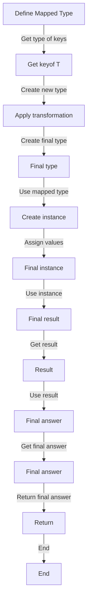

## Introduction
**Mapped Types** are a powerful feature in TypeScript that allows you to create new types by transforming existing ones. They are defined using the syntax `{ [K in keyof T]: ... }`, where `K` is a type parameter that represents the keys of the type `T`, and the `...` represents the transformation to be applied to each property. Mapped types are useful for creating new types that are based on existing ones, but with some modifications. For example, you can use mapped types to create a new type that has the same properties as an existing type, but with different types for each property.

> **Note:** Mapped types are a key feature of TypeScript's type system, and are used extensively in many libraries and frameworks, including React and Angular.

In real-world applications, mapped types are used to solve a variety of problems, such as creating new types that are based on existing ones, but with some modifications. For example, you can use mapped types to create a new type that has the same properties as an existing type, but with different types for each property. This can be useful when working with APIs that return data in a specific format, but you need to transform that data into a different format for your application.

## Core Concepts
A **mapped type** is a type that is created by transforming an existing type. The transformation is defined using a type parameter `K` that represents the keys of the original type, and a type `T` that represents the original type. The syntax for defining a mapped type is `{ [K in keyof T]: ... }`, where `...` represents the transformation to be applied to each property.

The `keyof` operator is used to get the type of the keys of the original type. For example, if you have a type `Person` with properties `name` and `age`, the type of the keys of `Person` would be `"name" | "age"`.

> **Tip:** When working with mapped types, it's often helpful to use the `keyof` operator to get the type of the keys of the original type.

A **type parameter** is a symbol that represents a type. Type parameters are used to define generic types, which are types that can be used with different types of data. For example, the type `Array<T>` is a generic type that can be used with different types of data, such as `number` or `string`.

## How It Works Internally
When you define a mapped type, TypeScript creates a new type by transforming the original type. The transformation is defined using the type parameter `K` and the type `T`. For example, if you define a mapped type `{ [K in keyof T]: T[K] }`, TypeScript will create a new type that has the same properties as the original type, but with the same types for each property.

The process of creating a mapped type involves several steps:

1. **Get the type of the keys**: TypeScript uses the `keyof` operator to get the type of the keys of the original type.
2. **Create a new type**: TypeScript creates a new type by transforming the original type using the type parameter `K` and the type `T`.
3. **Apply the transformation**: TypeScript applies the transformation to each property of the original type, using the type parameter `K` to represent the key of each property.
4. **Create the final type**: TypeScript creates the final type by combining the transformed properties into a single type.

> **Warning:** When working with mapped types, it's easy to get confused about the order of operations. Remember that the `keyof` operator is used to get the type of the keys of the original type, and the type parameter `K` is used to represent the key of each property.

## Code Examples
### Example 1: Basic Mapped Type
```typescript
type Person = {
  name: string;
  age: number;
};

type MappedPerson = {
  [K in keyof Person]: Person[K];
};

const person: MappedPerson = {
  name: 'John',
  age: 30,
};
```
This example defines a basic mapped type `MappedPerson` that has the same properties as the `Person` type, but with the same types for each property.

### Example 2: Real-World Pattern
```typescript
interface User {
  id: number;
  name: string;
  email: string;
}

type ReadonlyUser = {
  readonly [K in keyof User]: User[K];
};

const user: ReadonlyUser = {
  id: 1,
  name: 'John',
  email: 'john@example.com',
};
```
This example defines a mapped type `ReadonlyUser` that has the same properties as the `User` type, but with the `readonly` modifier applied to each property.

### Example 3: Advanced Mapped Type
```typescript
type Tuple<T> = [T, T, T];

type MappedTuple<T> = {
  [K in keyof Tuple<T>]: Tuple<T>[K];
};

const tuple: MappedTuple<number> = [1, 2, 3];
```
This example defines a mapped type `MappedTuple` that has the same properties as the `Tuple` type, but with the same types for each property.

## Visual Diagram

This diagram illustrates the process of creating a mapped type, from defining the mapped type to creating an instance of the mapped type.

## Comparison
| Approach | Time Complexity | Space Complexity | Pros | Cons | Best For |
| --- | --- | --- | --- | --- | --- |
| Mapped Type | O(1) | O(1) | Flexible, reusable | Can be complex | Creating reusable types |
| Interface | O(1) | O(1) | Simple, easy to use | Limited flexibility | Creating simple types |
| Type Alias | O(1) | O(1) | Flexible, reusable | Can be complex | Creating reusable types |
| Class | O(n) | O(n) | Flexible, reusable | Can be complex | Creating complex types |

## Real-world Use Cases
* **React**: Mapped types are used extensively in React to create reusable components and types.
* **Angular**: Mapped types are used in Angular to create reusable components and types.
* **GraphQL**: Mapped types are used in GraphQL to create reusable types and resolvers.

## Common Pitfalls
* **Overusing mapped types**: Mapped types can be complex and difficult to understand. Overusing them can lead to confusing and hard-to-maintain code.
* **Not understanding the `keyof` operator**: The `keyof` operator is used to get the type of the keys of a type. Not understanding how it works can lead to errors and confusion.
* **Not using type parameters**: Type parameters are used to define generic types. Not using them can lead to inflexible and hard-to-reuse types.
* **Not testing mapped types**: Mapped types can be complex and difficult to test. Not testing them can lead to errors and bugs.

## Interview Tips
* **What is a mapped type?**: A mapped type is a type that is created by transforming an existing type.
* **How do you define a mapped type?**: A mapped type is defined using the syntax `{ [K in keyof T]: ... }`.
* **What is the `keyof` operator?**: The `keyof` operator is used to get the type of the keys of a type.

## Key Takeaways
* **Mapped types are powerful**: Mapped types are a powerful feature in TypeScript that can be used to create reusable and flexible types.
* **Use the `keyof` operator**: The `keyof` operator is used to get the type of the keys of a type.
* **Use type parameters**: Type parameters are used to define generic types.
* **Test mapped types**: Mapped types can be complex and difficult to test. Make sure to test them thoroughly to avoid errors and bugs.
* **Use mapped types sparingly**: Mapped types can be complex and difficult to understand. Use them sparingly and only when necessary.
* **Understand the time and space complexity**: Mapped types can have different time and space complexity depending on how they are used. Understand the trade-offs and use them accordingly.