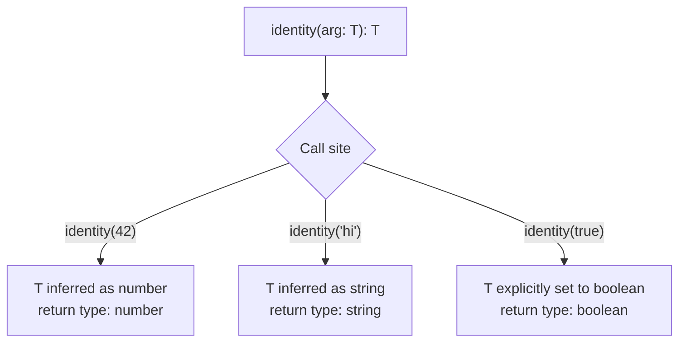

## Introduction

Generics are TypeScript's mechanism for writing reusable, type-safe code that works with multiple types without sacrificing type information. Instead of using `any` (which throws away type safety) or duplicating code for each type, generics let you write a single implementation that preserves the relationship between input and output types.

> **Note:** Generics are a compile-time feature — they are completely erased in the emitted JavaScript. They exist purely to help TypeScript catch type errors before your code runs.

## Core Concepts

### The Problem Generics Solve

```typescript
// ❌ Without generics — loses type information
function identity(arg: any): any {
  return arg
}
const result = identity(42) // result is `any` — TypeScript can't help you

// ✅ With generics — preserves type
function identity<T>(arg: T): T {
  return arg
}
const result = identity(42)        // result is `number`
const str = identity('hello')      // result is `string`
const arr = identity([1, 2, 3])    // result is `number[]`
```

### Type Parameter Conventions

| Letter | Convention |
|--------|------------|
| `T` | Type (general purpose) |
| `K` | Key |
| `V` | Value |
| `E` | Element |
| `R` | Return type |
| `P` | Props (React) |

## Code Examples

### Example 1: Generic Functions

```typescript
// Generic function with constraint
function getProperty<T, K extends keyof T>(obj: T, key: K): T[K] {
  return obj[key]
}

const user = { name: 'Alice', age: 30, role: 'admin' }
const name = getProperty(user, 'name')  // type: string
const age = getProperty(user, 'age')    // type: number
// getProperty(user, 'email')           // ❌ Error: 'email' not in type

// Generic arrow function (note the comma to avoid JSX ambiguity in .tsx)
const first = <T,>(arr: T[]): T | undefined => arr[0]
```

### Example 2: Generic Interfaces and Types

```typescript
// Generic API response wrapper
interface ApiResponse<T> {
  data: T
  status: number
  message: string
  timestamp: Date
}

// Generic Result type (like Rust's Result<T, E>)
type Result<T, E = Error> =
  | { success: true; data: T }
  | { success: false; error: E }

// Usage
async function fetchUser(id: number): Promise<Result<User>> {
  try {
    const user = await api.get<User>(`/users/${id}`)
    return { success: true, data: user }
  } catch (error) {
    return { success: false, error: error as Error }
  }
}

const result = await fetchUser(1)
if (result.success) {
  console.log(result.data.name) // TypeScript knows data is User
} else {
  console.error(result.error.message) // TypeScript knows error is Error
}
```

### Example 3: Generic Classes

```typescript
// Type-safe stack implementation
class Stack<T> {
  private items: T[] = []

  push(item: T): void {
    this.items.push(item)
  }

  pop(): T | undefined {
    return this.items.pop()
  }

  peek(): T | undefined {
    return this.items[this.items.length - 1]
  }

  get size(): number {
    return this.items.length
  }

  isEmpty(): boolean {
    return this.items.length === 0
  }
}

const numStack = new Stack<number>()
numStack.push(1)
numStack.push(2)
// numStack.push('hello') // ❌ Error: Argument of type 'string' is not assignable

const strStack = new Stack<string>()
strStack.push('hello')
```

### Example 4: Advanced — Conditional and Mapped Types

```typescript
// Conditional type
type NonNullable<T> = T extends null | undefined ? never : T

// Mapped type — make all properties optional
type Partial<T> = {
  [K in keyof T]?: T[K]
}

// Mapped type — make all properties readonly
type Readonly<T> = {
  readonly [K in keyof T]: T[K]
}

// Extract only function properties from a type
type FunctionProperties<T> = {
  [K in keyof T as T[K] extends Function ? K : never]: T[K]
}

interface Service {
  name: string
  version: number
  start(): void
  stop(): void
  getStatus(): string
}

type ServiceMethods = FunctionProperties<Service>
// Result: { start(): void; stop(): void; getStatus(): string }
```

## Generic Constraints Cheatsheet

```typescript
// T must have a length property
function longest<T extends { length: number }>(a: T, b: T): T {
  return a.length >= b.length ? a : b
}

// T must be a key of U
function pick<T, K extends keyof T>(obj: T, keys: K[]): Pick<T, K> {
  return keys.reduce((acc, key) => ({ ...acc, [key]: obj[key] }), {} as Pick<T, K>)
}

// Default type parameter (TypeScript 2.3+)
interface Container<T = string> {
  value: T
}
const c1: Container = { value: 'hello' }       // T defaults to string
const c2: Container<number> = { value: 42 }    // T is number
```

## Type Inference Flow



## Real-world Use Cases

- **API client wrappers** — `get<T>(url: string): Promise<T>`
- **React hooks** — `useState<User | null>(null)`
- **Form libraries** — `useForm<FormValues>()`
- **Data fetching** — `useQuery<Data, Error>(key, fetcher)`
- **Repository pattern** — `Repository<T extends Entity>`

## Common Pitfalls & How to Avoid Them

- **Using `any` instead of generics** — `any` disables type checking; generics preserve it
- **Over-constraining** — don't add constraints unless you actually use the constrained properties
- **Forgetting the comma in `.tsx` files** — `<T,>` not `<T>` to avoid JSX parsing ambiguity
- **Inferring too broadly** — `identity([1, 2, 3])` infers `number[]`, not `[1, 2, 3]`. Use `as const` or explicit type parameter if you need the literal type

## Summary / Key Takeaways

- Generics write once, work with any type — without losing type safety
- Use `<T extends SomeType>` to constrain what types are allowed
- `keyof T` and `T[K]` unlock powerful type-safe property access patterns
- Conditional types (`T extends U ? X : Y`) and mapped types enable advanced type transformations
- TypeScript infers type parameters at call sites — explicit annotation is only needed when inference fails

> **Tip:** The built-in utility types (`Partial<T>`, `Required<T>`, `Pick<T, K>`, `Omit<T, K>`, `Record<K, V>`, `ReturnType<F>`) are all implemented using generics. Reading their source in `lib.es5.d.ts` is one of the best ways to level up your generic skills.
