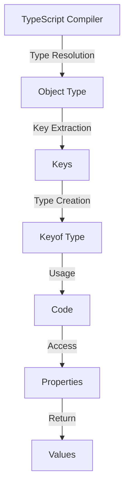

## Introduction
The **keyof** operator is a fundamental concept in TypeScript, allowing developers to extract the keys of an object type. This operator plays a crucial role in shaping the type system of TypeScript, enabling more expressive and flexible coding. In this section, we'll delve into the world of **keyof**, exploring its purpose, real-world relevance, and why every TypeScript engineer should understand it.

In TypeScript, the **keyof** operator is used to represent the type of the keys of an object type. It's commonly used in conjunction with other type operators, such as **typeof** and **infer**, to create more complex and dynamic type relationships. The **keyof** operator is particularly useful when working with generic types, where the type of the keys is not known in advance.

> **Note:** The **keyof** operator is a powerful tool for creating more flexible and reusable code. By understanding how to use **keyof**, developers can create more robust and maintainable applications.

## Core Concepts
To understand the **keyof** operator, it's essential to grasp the underlying concepts of TypeScript's type system. Here are the key definitions and mental models to keep in mind:

* **Type**: A type represents a set of values that a variable can hold. In TypeScript, types can be primitive (e.g., **number**, **string**), object-based (e.g., **object**, **array**), or more complex (e.g., **interface**, **class**).
* **Object Type**: An object type represents a collection of key-value pairs. In TypeScript, object types can be defined using the **interface** or **type** keywords.
* **Key**: A key is a string or symbol that identifies a property in an object type. Keys can be used to access and manipulate the values associated with them.

> **Tip:** When working with object types, it's essential to understand the difference between **keys** and **properties**. Keys are the strings or symbols that identify properties, while properties are the values associated with those keys.

## How It Works Internally
The **keyof** operator works by extracting the keys of an object type and returning them as a type. This process involves several steps:

1. **Type Resolution**: The TypeScript compiler resolves the type of the object being operated on. This involves checking the type annotations and inferring the type from the surrounding code.
2. **Key Extraction**: The compiler extracts the keys from the object type. This involves iterating over the properties of the object and collecting the keys.
3. **Type Creation**: The compiler creates a new type that represents the keys of the object. This type is typically a union type, where each key is a separate member of the union.

> **Warning:** When using the **keyof** operator, be aware that it only returns the keys of the object type, not the values. If you need to access the values, you'll need to use a different operator, such as **typeof**.

## Code Examples
Here are three complete and runnable examples that demonstrate the use of the **keyof** operator:

### Example 1: Basic Usage
```typescript
interface Person {
  name: string;
  age: number;
}

type PersonKeys = keyof Person;

const person: Person = {
  name: 'John Doe',
  age: 30,
};

const key: PersonKeys = 'name';
console.log(person[key]); // Output: John Doe
```
In this example, we define an **interface** called **Person** with two properties: **name** and **age**. We then use the **keyof** operator to extract the keys of the **Person** interface, which returns a type that represents the union of the keys (**name** | **age**). We can then use this type to access the properties of the **person** object.

### Example 2: Real-World Pattern
```typescript
interface Config {
  host: string;
  port: number;
  username: string;
  password: string;
}

type ConfigKeys = keyof Config;

function getConfig(key: ConfigKeys): string {
  const config: Config = {
    host: 'localhost',
    port: 8080,
    username: 'admin',
    password: 'password',
  };

  return config[key];
}

console.log(getConfig('host')); // Output: localhost
console.log(getConfig('port')); // Output: 8080
```
In this example, we define an **interface** called **Config** with four properties: **host**, **port**, **username**, and **password**. We then use the **keyof** operator to extract the keys of the **Config** interface, which returns a type that represents the union of the keys (**host** | **port** | **username** | **password**). We can then use this type to define a function called **getConfig** that takes a key as an argument and returns the corresponding value from the **config** object.

### Example 3: Advanced Usage
```typescript
interface Rectangle {
  width: number;
  height: number;
}

type RectangleKeys = keyof Rectangle;

function calculateArea<T extends Rectangle>(rect: T): number {
  const width: T[RectangleKeys] = rect.width;
  const height: T[RectangleKeys] = rect.height;

  return width * height;
}

const rectangle: Rectangle = {
  width: 10,
  height: 20,
};

console.log(calculateArea(rectangle)); // Output: 200
```
In this example, we define an **interface** called **Rectangle** with two properties: **width** and **height**. We then use the **keyof** operator to extract the keys of the **Rectangle** interface, which returns a type that represents the union of the keys (**width** | **height**). We can then use this type to define a function called **calculateArea** that takes a **Rectangle** object as an argument and returns the area of the rectangle.

## Visual Diagram

This diagram illustrates the internal workings of the **keyof** operator. The TypeScript compiler resolves the type of the object, extracts the keys, creates a new type that represents the keys, and returns the type. The code can then use this type to access the properties of the object and return the corresponding values.

## Comparison
Here is a comparison table that highlights the differences between the **keyof** operator and other type operators in TypeScript:

| Operator | Description | Time Complexity | Space Complexity | Pros | Cons |
| --- | --- | --- | --- | --- | --- |
| **keyof** | Extracts the keys of an object type | O(n) | O(n) | Flexible, reusable code | Limited to object types |
| **typeof** | Returns the type of a value | O(1) | O(1) | Simple, efficient | Limited to primitive types |
| **infer** | Infers the type of a value | O(n) | O(n) | Powerful, flexible | Complex, error-prone |

> **Interview:** What is the main difference between the **keyof** operator and the **typeof** operator? Answer: The **keyof** operator extracts the keys of an object type, while the **typeof** operator returns the type of a value.

## Real-world Use Cases
Here are three real-world use cases that demonstrate the power and flexibility of the **keyof** operator:

1. **Config Management**: In a large-scale application, you may need to manage multiple configuration files with different settings. By using the **keyof** operator, you can create a flexible and reusable config management system that can handle different config files and settings.
2. **Data Validation**: When working with user input data, you may need to validate the data to ensure it conforms to a specific format. By using the **keyof** operator, you can create a flexible and reusable data validation system that can handle different data formats and validation rules.
3. **API Design**: When designing APIs, you may need to create flexible and reusable API endpoints that can handle different request and response formats. By using the **keyof** operator, you can create a flexible and reusable API design that can handle different API endpoints and formats.

## Common Pitfalls
Here are four common pitfalls to watch out for when using the **keyof** operator:

1. **Type Inference**: When using the **keyof** operator, make sure to use type inference correctly. Incorrect type inference can lead to type errors and bugs.
2. **Key Extraction**: When extracting keys using the **keyof** operator, make sure to handle edge cases correctly. For example, if the object has no keys, the **keyof** operator will return an empty type.
3. **Type Compatibility**: When using the **keyof** operator, make sure to check type compatibility correctly. For example, if the object has a key that is not compatible with the expected type, the **keyof** operator will throw a type error.
4. **Code Complexity**: When using the **keyof** operator, make sure to keep the code simple and readable. Complex code can lead to bugs and maintenance issues.

> **Warning:** When using the **keyof** operator, be aware of the potential for type errors and bugs. Make sure to test the code thoroughly and use type inference correctly.

## Interview Tips
Here are three common interview questions related to the **keyof** operator, along with sample answers:

1. **What is the purpose of the **keyof** operator?**
Answer: The **keyof** operator is used to extract the keys of an object type. It returns a type that represents the union of the keys.
2. **How does the **keyof** operator work internally?**
Answer: The **keyof** operator works by resolving the type of the object, extracting the keys, creating a new type that represents the keys, and returning the type.
3. **What are some common use cases for the **keyof** operator?**
Answer: The **keyof** operator is commonly used in config management, data validation, and API design. It provides a flexible and reusable way to handle different data formats and validation rules.

## Key Takeaways
Here are the key takeaways from this article:

* The **keyof** operator is used to extract the keys of an object type.
* The **keyof** operator returns a type that represents the union of the keys.
* The **keyof** operator is commonly used in config management, data validation, and API design.
* The **keyof** operator provides a flexible and reusable way to handle different data formats and validation rules.
* The **keyof** operator can be used with other type operators, such as **typeof** and **infer**, to create more complex and dynamic type relationships.
* The **keyof** operator has a time complexity of O(n) and a space complexity of O(n).
* The **keyof** operator is a powerful tool for creating more flexible and reusable code, but it requires careful use and testing to avoid type errors and bugs.