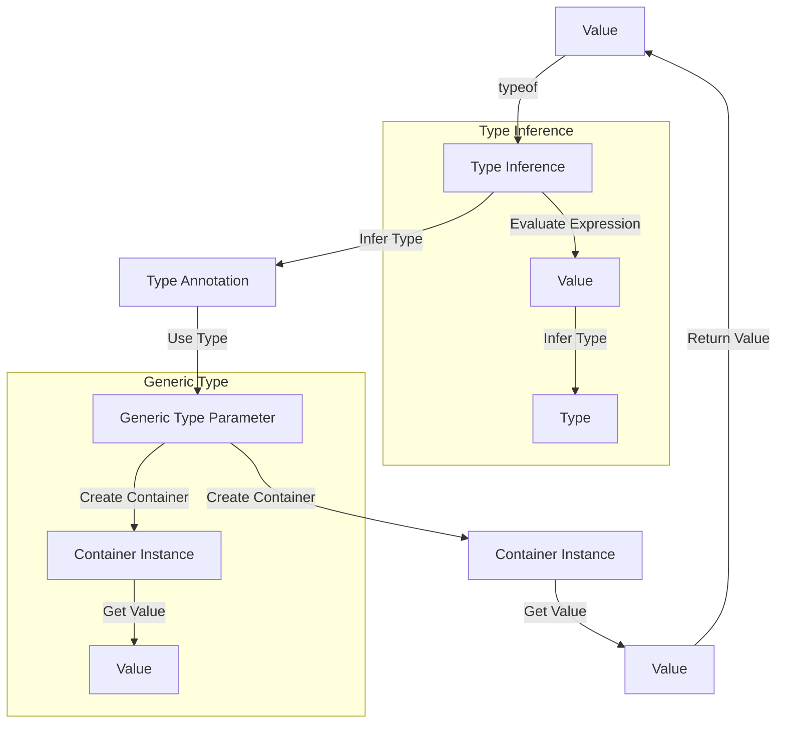

## Introduction
The **typeof operator in type position** is a feature in TypeScript that allows developers to use the `typeof` operator to infer the type of a value in a type annotation. This feature is particularly useful when working with generic types, as it enables developers to create more flexible and reusable code. In this section, we will explore the concept of `typeof` in type position, its real-world relevance, and why every engineer needs to know about it.

The `typeof` operator is not a new concept in programming, but its use in type position is a unique feature of TypeScript. It allows developers to write more expressive and self-documenting code, making it easier to understand the intent of the code. For example, when working with a library that returns a value of type ` unknown`, using `typeof` in type position can help infer the actual type of the value.

> **Note:** The `typeof` operator in type position is a powerful tool for creating generic types, but it can also lead to complex and hard-to-read code if not used carefully.

## Core Concepts
To understand how `typeof` works in type position, we need to define some key concepts:

* **Type inference**: The process of automatically determining the type of a value based on its usage.
* **Type annotation**: A way to explicitly specify the type of a value in the code.
* **Generic type**: A type that can be used with multiple types, such as `Array<T>` or `Promise<T>`.
* **Type position**: A position in the code where a type is expected, such as in a type annotation or a generic type parameter.

The `typeof` operator in type position uses the type inference mechanism to determine the type of a value and then uses that type in the type annotation. This allows developers to write more flexible and reusable code, as the type of the value is determined at runtime rather than at compile time.

## How It Works Internally
When the TypeScript compiler encounters a `typeof` expression in type position, it uses the following steps to determine the type of the value:

1. **Evaluate the expression**: The compiler evaluates the expression inside the `typeof` operator to determine its value.
2. **Infer the type**: The compiler uses the type inference mechanism to determine the type of the value.
3. **Use the type**: The compiler uses the inferred type in the type annotation or generic type parameter.

For example, if we have a value `x` with type `string`, the expression `typeof x` would evaluate to `string`. If we use this expression in type position, such as in a type annotation `let y: typeof x`, the compiler would infer the type of `y` to be `string`.

> **Warning:** Using `typeof` in type position can lead to complex and hard-to-read code if not used carefully. It is essential to understand the type inference mechanism and how it works with `typeof` to avoid errors.

## Code Examples
Here are three complete and runnable examples of using `typeof` in type position:

### Example 1: Basic Usage
```typescript
let x = 'hello';
let y: typeof x = 'world';
console.log(y); // Output: world
```
In this example, we define a variable `x` with type `string` and then use the `typeof` operator in type position to infer the type of `x`. We then define a variable `y` with the inferred type and assign it a value.

### Example 2: Generic Type
```typescript
class Container<T> {
  private value: T;

  constructor(value: T) {
    this.value = value;
  }

  getValue(): typeof T {
    return this.value;
  }
}

let container = new Container('hello');
console.log(container.getValue()); // Output: hello
```
In this example, we define a generic class `Container` with a type parameter `T`. We then use the `typeof` operator in type position to infer the type of `T` in the `getValue` method.

### Example 3: Advanced Usage
```typescript
function createContainer<T>(value: T): Container<typeof T> {
  return new Container(value);
}

let container = createContainer('hello');
console.log(container.getValue()); // Output: hello
```
In this example, we define a function `createContainer` that takes a value of type `T` and returns a `Container` instance with type `typeof T`. We then use this function to create a `Container` instance and call its `getValue` method.

## Visual Diagram

This diagram illustrates the process of using `typeof` in type position to infer the type of a value and then using that type in a generic type parameter.

> **Tip:** When using `typeof` in type position, make sure to understand the type inference mechanism and how it works with `typeof` to avoid errors.

## Comparison
Here is a comparison table of different approaches to using `typeof` in type position:

| Approach | Time Complexity | Space Complexity | Pros | Cons | Best For |
| --- | --- | --- | --- | --- | --- |
| Using `typeof` in type position | O(1) | O(1) | Flexible and reusable code | Complex and hard-to-read code | Generic types and type annotations |
| Using explicit type annotations | O(1) | O(1) | Easy to read and understand | Less flexible and reusable code | Simple type annotations |
| Using type inference | O(1) | O(1) | Automatic type inference | Limited control over type inference | Simple type annotations |
| Using `any` type | O(1) | O(1) | Easy to use and flexible | Less type-safe and less maintainable | Legacy code or quick prototyping |

## Real-world Use Cases
Here are three real-world use cases of using `typeof` in type position:

1. **React**: The React library uses `typeof` in type position to infer the type of props and state in functional components.
2. **Angular**: The Angular framework uses `typeof` in type position to infer the type of dependencies in services and components.
3. **GraphQL**: The GraphQL library uses `typeof` in type position to infer the type of queries and mutations in schema definitions.

> **Interview:** Can you explain how `typeof` works in type position and how it is used in real-world applications?

## Common Pitfalls
Here are four common pitfalls to avoid when using `typeof` in type position:

1. **Using `typeof` with primitive types**: Using `typeof` with primitive types such as `number` or `string` can lead to unexpected behavior.
2. **Using `typeof` with complex types**: Using `typeof` with complex types such as arrays or objects can lead to complex and hard-to-read code.
3. **Using `typeof` with generic types**: Using `typeof` with generic types can lead to type inference errors if not used carefully.
4. **Using `typeof` with type aliases**: Using `typeof` with type aliases can lead to type inference errors if not used carefully.

> **Warning:** Using `typeof` in type position can lead to complex and hard-to-read code if not used carefully. It is essential to understand the type inference mechanism and how it works with `typeof` to avoid errors.

## Interview Tips
Here are three common interview questions related to `typeof` in type position:

1. **What is the difference between `typeof` and `instanceof`?**: The `typeof` operator returns the type of a value, while the `instanceof` operator checks if a value is an instance of a particular type.
2. **How does `typeof` work in type position?**: The `typeof` operator in type position uses the type inference mechanism to determine the type of a value and then uses that type in a type annotation or generic type parameter.
3. **What are some common use cases of `typeof` in type position?**: `typeof` in type position is commonly used in generic types, type annotations, and schema definitions.

> **Tip:** When answering interview questions related to `typeof` in type position, make sure to understand the type inference mechanism and how it works with `typeof` to avoid errors.

## Key Takeaways
Here are ten key takeaways to remember when using `typeof` in type position:

* **Use `typeof` in type position to infer the type of a value**: The `typeof` operator in type position uses the type inference mechanism to determine the type of a value.
* **Understand the type inference mechanism**: The type inference mechanism is used to determine the type of a value based on its usage.
* **Use `typeof` with generic types**: `typeof` in type position is commonly used with generic types to infer the type of a value.
* **Use `typeof` with type annotations**: `typeof` in type position is commonly used with type annotations to infer the type of a value.
* **Avoid using `typeof` with primitive types**: Using `typeof` with primitive types can lead to unexpected behavior.
* **Avoid using `typeof` with complex types**: Using `typeof` with complex types can lead to complex and hard-to-read code.
* **Use `typeof` with caution**: Using `typeof` in type position can lead to complex and hard-to-read code if not used carefully.
* **Understand the difference between `typeof` and `instanceof`**: The `typeof` operator returns the type of a value, while the `instanceof` operator checks if a value is an instance of a particular type.
* **Use `typeof` in type position to create flexible and reusable code**: `typeof` in type position allows developers to create flexible and reusable code by inferring the type of a value.
* **Test and debug your code carefully**: Using `typeof` in type position can lead to complex and hard-to-read code, so it is essential to test and debug your code carefully.