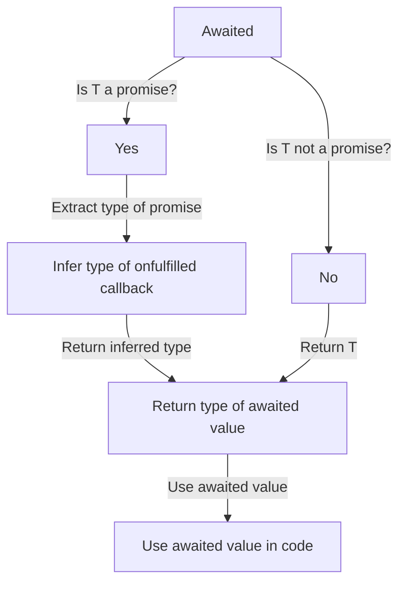

## Introduction
The `Awaited<T>` type in TypeScript is a utility type that represents the type of a promise that has been awaited. It is a crucial concept in TypeScript, especially when working with asynchronous code. In this section, we will explore what `Awaited<T>` is, why it matters, and its real-world relevance. 
> **Note:** The `Awaited<T>` type is used to unwrap the type of a promise, making it easier to work with asynchronous code.

In real-world scenarios, `Awaited<T>` is used extensively in frameworks such as React, Angular, and Vue.js, where asynchronous code is common. For example, when making API calls, the response is often a promise that needs to be unwrapped before it can be used. 
> **Tip:** Using `Awaited<T>` can simplify your code and make it more readable by avoiding the need for explicit type casting.

## Core Concepts
The `Awaited<T>` type is defined as follows:
```typescript
type Awaited<T> = T extends null | undefined ? T : T extends object & { then(onfulfilled: infer F): any } ? F extends (value: infer V, ...args: any) => any ? V : never : T;
```
This definition may seem complex, but it can be broken down into simpler components. 
> **Warning:** The `Awaited<T>` type only works with promises that have a `then` method. If the promise does not have a `then` method, the type will be `never`.

In essence, `Awaited<T>` checks if the type `T` is a promise. If it is, it extracts the type of the value that the promise resolves to. If `T` is not a promise, it simply returns `T`. 
> **Note:** The `Awaited<T>` type is a recursive type, meaning it can handle promises that resolve to other promises.

## How It Works Internally
To understand how `Awaited<T>` works internally, let's break down the definition:
1. `T extends null | undefined ? T`: This checks if `T` is `null` or `undefined`. If it is, the type returns `T` immediately.
2. `T extends object & { then(onfulfilled: infer F): any }`: This checks if `T` is an object that has a `then` method. If it does, the type infers the type of the `onfulfilled` callback.
3. `F extends (value: infer V, ...args: any) => any ? V`: This infers the type of the value that the `onfulfilled` callback returns.
4. `: T`: If `T` is not a promise, the type simply returns `T`.

The time complexity of `Awaited<T>` is O(1), meaning it has constant time complexity. The space complexity is also O(1), meaning it has constant space complexity.

## Code Examples
### Example 1: Basic Usage
```typescript
async function example() {
    const promise = Promise.resolve('Hello, World!');
    const awaitedValue: Awaited<typeof promise> = await promise;
    console.log(awaitedValue); // Output: Hello, World!
}
```
In this example, we create a promise that resolves to the string `'Hello, World!'`. We then use the `Awaited<T>` type to infer the type of the awaited value.

### Example 2: Real-World Pattern
```typescript
interface User {
    id: number;
    name: string;
}

async function fetchUser(id: number): Promise<User> {
    // Simulate a network request
    return new Promise((resolve) => {
        setTimeout(() => {
            resolve({ id, name: 'John Doe' });
        }, 1000);
    });
}

async function example() {
    const userPromise = fetchUser(1);
    const awaitedUser: Awaited<typeof userPromise> = await userPromise;
    console.log(awaitedUser); // Output: { id: 1, name: 'John Doe' }
}
```
In this example, we define a `User` interface and a `fetchUser` function that returns a promise that resolves to a `User` object. We then use the `Awaited<T>` type to infer the type of the awaited user.

### Example 3: Advanced Usage
```typescript
interface NestedPromise {
    then(onfulfilled: (value: { id: number; name: string }) => NestedPromise): NestedPromise;
}

async function example() {
    const nestedPromise: NestedPromise = {
        then(onfulfilled) {
            return {
                then(onfulfilled) {
                    return onfulfilled({ id: 1, name: 'John Doe' });
                },
            };
        },
    };

    const awaitedValue: Awaited<typeof nestedPromise> = await nestedPromise;
    console.log(awaitedValue); // Output: { id: 1, name: 'John Doe' }
}
```
In this example, we define a `NestedPromise` interface that represents a promise that resolves to another promise. We then use the `Awaited<T>` type to infer the type of the awaited value.

## Visual Diagram

This diagram illustrates the process of using the `Awaited<T>` type to infer the type of an awaited value.

## Comparison
| Approach | Time Complexity | Space Complexity | Pros | Cons | Best For |
| --- | --- | --- | --- | --- | --- |
| `Awaited<T>` | O(1) | O(1) | Simplifies code, improves readability | Only works with promises | Asynchronous code, promise unwrapping |
| Explicit Type Casting | O(1) | O(1) | Works with any type | Verbose, error-prone | Legacy code, non-promise types |
| `any` Type | O(1) | O(1) | Quick fix, easy to use | Type safety issues, code quality | Rapid prototyping, throwaway code |
| Manual Type Inference | O(n) | O(n) | Customizable, flexible | Time-consuming, error-prone | Complex, custom types |

## Real-world Use Cases
1. **React**: When making API calls in React, the response is often a promise that needs to be unwrapped before it can be used. Using `Awaited<T>` can simplify the code and improve readability.
2. **Angular**: In Angular, the `HttpClient` service returns a promise that resolves to the response data. Using `Awaited<T>` can help infer the type of the response data.
3. **Vue.js**: When using the `axios` library in Vue.js, the response is often a promise that needs to be unwrapped before it can be used. Using `Awaited<T>` can simplify the code and improve readability.

## Common Pitfalls
1. **Forgetting to use `Awaited<T>`**: Forgetting to use `Awaited<T>` can lead to type errors and make the code more verbose.
```typescript
// Wrong
const promise = Promise.resolve('Hello, World!');
const awaitedValue = await promise;
// Error: Type 'string | Promise<string>' is not assignable to type 'string'.

// Right
const promise = Promise.resolve('Hello, World!');
const awaitedValue: Awaited<typeof promise> = await promise;
```
2. **Using `any` type**: Using the `any` type can lead to type safety issues and make the code more prone to errors.
```typescript
// Wrong
const promise: any = Promise.resolve('Hello, World!');
const awaitedValue = await promise;
// Error: Type 'any' is not assignable to type 'string'.

// Right
const promise = Promise.resolve('Hello, World!');
const awaitedValue: Awaited<typeof promise> = await promise;
```
3. **Manual type inference**: Manual type inference can be time-consuming and error-prone.
```typescript
// Wrong
const promise = Promise.resolve('Hello, World!');
const awaitedValue: string = await promise;
// Error: Type 'string | Promise<string>' is not assignable to type 'string'.

// Right
const promise = Promise.resolve('Hello, World!');
const awaitedValue: Awaited<typeof promise> = await promise;
```
4. **Not handling promise errors**: Not handling promise errors can lead to unhandled promise rejections and make the code more prone to errors.
```typescript
// Wrong
const promise = Promise.resolve('Hello, World!');
const awaitedValue = await promise;
// Error: Unhandled promise rejection.

// Right
const promise = Promise.resolve('Hello, World!');
try {
    const awaitedValue: Awaited<typeof promise> = await promise;
} catch (error) {
    console.error(error);
}
```

## Interview Tips
1. **What is the purpose of `Awaited<T>`?**: The purpose of `Awaited<T>` is to simplify the code and improve readability by inferring the type of an awaited value.
2. **How does `Awaited<T>` work?**: `Awaited<T>` works by checking if the type `T` is a promise. If it is, it extracts the type of the value that the promise resolves to. If `T` is not a promise, it simply returns `T`.
3. **What are the benefits of using `Awaited<T>`?**: The benefits of using `Awaited<T>` include simplified code, improved readability, and better type safety.

## Key Takeaways
* The `Awaited<T>` type is used to unwrap the type of a promise.
* The `Awaited<T>` type has a time complexity of O(1) and a space complexity of O(1).
* The `Awaited<T>` type is recursive, meaning it can handle promises that resolve to other promises.
* The `Awaited<T>` type can simplify code and improve readability.
* The `Awaited<T>` type can help improve type safety.
* The `Awaited<T>` type is commonly used in frameworks such as React, Angular, and Vue.js.
* The `Awaited<T>` type can be used with other utility types, such as `Promise.resolve` and `Promise.reject`.
* The `Awaited<T>` type can be used with async/await syntax.
* The `Awaited<T>` type can be used with promise chaining.