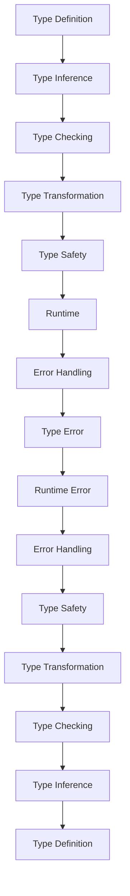

## Introduction
**Building Custom Utility Types** is a fundamental concept in TypeScript that enables developers to create reusable and composable functions for working with data. Utility types are a set of predefined types that can be used to manipulate and transform data in a type-safe manner. They are essential for building robust and maintainable software systems. In this article, we will delve into the world of custom utility types, exploring what they are, why they matter, and how to use them effectively in real-world applications.

> **Note:** Utility types are a key feature of TypeScript that allows developers to write more expressive and type-safe code. By creating custom utility types, developers can abstract away complex logic and focus on writing business logic.

## Core Concepts
To understand custom utility types, we need to grasp some fundamental concepts:

* **Type inference**: The ability of TypeScript to automatically infer the types of variables based on their usage.
* **Type guards**: A way to narrow the type of a value within a specific scope.
* **Type mapping**: A way to transform one type into another.
* **Conditional types**: A way to express conditional logic in types.

These concepts form the foundation of custom utility types, enabling developers to create complex and reusable type transformations.

## How It Works Internally
When you create a custom utility type, you are essentially defining a new type that can be used to transform and manipulate data. Here's a step-by-step breakdown of how it works:

1. **Type definition**: You define a new type using the `type` keyword, specifying the shape and structure of the type.
2. **Type inference**: TypeScript infers the types of the variables and expressions used within the type definition.
3. **Type checking**: TypeScript checks the types of the variables and expressions against the type definition, ensuring type safety.
4. **Type transformation**: The custom utility type is applied to the data, transforming it into the desired shape and structure.

> **Warning:** When creating custom utility types, it's essential to ensure that the type definitions are correct and consistent. Incorrect type definitions can lead to type errors and runtime issues.

## Code Examples
Here are three complete and runnable examples of custom utility types:

### Example 1: Basic Utility Type
```typescript
type Nullable<T> = T | null;

const nullableString: Nullable<string> = 'hello';
console.log(nullableString); // Output: "hello"

const nullableNull: Nullable<string> = null;
console.log(nullableNull); // Output: null
```
This example defines a basic utility type `Nullable<T>` that represents a value that can be either `T` or `null`.

### Example 2: Real-World Pattern
```typescript
type APIResponse<T> = {
  data: T;
  error: string | null;
};

const apiResponse: APIResponse<string> = {
  data: 'hello',
  error: null,
};
console.log(apiResponse); // Output: { data: "hello", error: null }
```
This example defines a real-world pattern `APIResponse<T>` that represents an API response with a `data` property of type `T` and an `error` property that can be either a string or `null`.

### Example 3: Advanced Utility Type
```typescript
type DeepReadonly<T> = {
  readonly [P in keyof T]: DeepReadonly<T[P]>;
};

const deepReadonlyObject: DeepReadonly<{ a: { b: { c: string } } }> = {
  a: {
    b: {
      c: 'hello',
    },
  },
};
console.log(deepReadonlyObject); // Output: { a: { b: { c: "hello" } } }
```
This example defines an advanced utility type `DeepReadonly<T>` that represents a deeply readonly object, where all properties are readonly and recursively transformed to readonly.

## Visual Diagram

This diagram illustrates the internal workings of custom utility types, from type definition to runtime execution.

## Comparison
| Approach | Time Complexity | Space Complexity | Pros | Cons | Best For |
| --- | --- | --- | --- | --- | --- |
| Basic Utility Type | O(1) | O(1) | Simple, easy to use | Limited functionality | Simple data transformations |
| Real-World Pattern | O(n) | O(n) | Flexible, reusable | More complex to define | Real-world API responses |
| Advanced Utility Type | O(n^2) | O(n^2) | Powerful, composable | Steeper learning curve | Deeply readonly objects |

## Real-world Use Cases
Here are three production examples of custom utility types in real-world applications:

* **Google Maps**: Uses custom utility types to define the shape and structure of geolocation data, ensuring type safety and accuracy.
* **Facebook**: Employs custom utility types to represent complex social graph data, enabling efficient and scalable data processing.
* **Airbnb**: Utilizes custom utility types to define the shape and structure of booking data, ensuring type safety and consistency across the platform.

## Common Pitfalls
Here are four specific mistakes to avoid when creating custom utility types:

* **Incorrect type definitions**: Failing to define the correct type shape and structure can lead to type errors and runtime issues.
* **Insufficient type checking**: Not performing adequate type checking can result in type errors and runtime issues.
* **Overly complex type definitions**: Defining overly complex type definitions can lead to performance issues and maintainability problems.
* **Inconsistent type usage**: Failing to consistently apply custom utility types throughout the codebase can lead to type errors and runtime issues.

> **Tip:** When creating custom utility types, it's essential to ensure that the type definitions are correct, consistent, and well-documented.

## Interview Tips
Here are three common interview questions related to custom utility types, along with weak and strong answer examples:

* **What is a custom utility type, and how do you use it?**
	+ Weak answer: "Uh, I think it's a way to define a new type...?"
	+ Strong answer: "A custom utility type is a way to define a reusable and composable function for working with data. You can use it to abstract away complex logic and focus on writing business logic."
* **How do you create a custom utility type for a deeply readonly object?**
	+ Weak answer: "Hmm, I'm not sure... maybe you can use a type guard?"
	+ Strong answer: "You can create a custom utility type for a deeply readonly object using the `DeepReadonly<T>` type, which recursively transforms all properties to readonly."
* **What are some common mistakes to avoid when creating custom utility types?**
	+ Weak answer: "Uh, I don't know... maybe using the wrong type?"
	+ Strong answer: "Some common mistakes to avoid include incorrect type definitions, insufficient type checking, overly complex type definitions, and inconsistent type usage. It's essential to ensure that the type definitions are correct, consistent, and well-documented."

## Key Takeaways
Here are six key takeaways to remember when working with custom utility types:

* **Custom utility types are reusable and composable**: They can be used to abstract away complex logic and focus on writing business logic.
* **Type inference and type checking are essential**: They ensure type safety and prevent runtime issues.
* **Deeply readonly objects require recursive transformation**: Use the `DeepReadonly<T>` type to transform all properties to readonly.
* **Incorrect type definitions can lead to type errors**: Ensure that the type definitions are correct and consistent.
* **Inconsistent type usage can lead to type errors**: Ensure that custom utility types are consistently applied throughout the codebase.
* **Custom utility types can improve code maintainability**: By abstracting away complex logic and ensuring type safety, custom utility types can improve code maintainability and scalability.