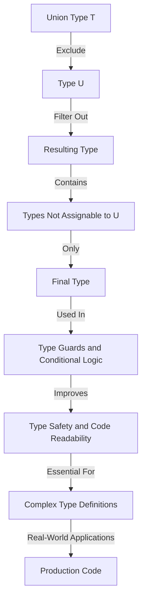

## Introduction
The **Exclude<T, U>** type in TypeScript is a utility type that constructs a type by excluding from **T** all union members that are assignable to **U**. It's a powerful tool for working with union types, allowing you to filter out unwanted types from a union. This type is particularly useful when you need to remove certain types from a union, making it easier to work with complex type definitions. In real-world scenarios, **Exclude<T, U>** can be used in various situations, such as refining types after conditional checks or creating more specific types from broader unions.

> **Note:** Understanding **Exclude<T, U>** is crucial for mastering TypeScript's type system, especially when dealing with complex, conditional logic and type guards.

## Core Concepts
To grasp **Exclude<T, U>**, you need to understand the following concepts:
- **Union Types**: A union type is a type that can be one of several types. It is defined using the `|` character.
- **Type Inference**: TypeScript can often infer types automatically, but sometimes you need to use utility types like **Exclude<T, U>** to help the compiler understand your intentions.
- **Type Guards**: Type guards are functions that narrow the type of a value within a specific scope, which can be useful in conjunction with **Exclude<T, U>**.

> **Tip:** When working with **Exclude<T, U>**, think of it as a filter for union types. You're essentially telling TypeScript to exclude certain types from a union based on another type or set of types.

## How It Works Internally
Internally, **Exclude<T, U>** works by iterating over each member of the union type **T** and checking if it is assignable to **U**. If a member is not assignable to **U**, it is included in the resulting type; otherwise, it is excluded. This process effectively filters out the types in **T** that are assignable to **U**, resulting in a new union type that contains only the types from **T** that are not assignable to **U**.

> **Warning:** Be cautious when using **Exclude<T, U>** with very large union types, as it can lead to complex type computations that might slow down your development environment or even cause TypeScript to exceed its maximum type complexity.

## Code Examples
### Example 1: Basic Usage
```typescript
type T = 'a' | 'b' | 'c';
type U = 'a' | 'b';

type Result = Exclude<T, U>; // type Result = "c"
console.log(Result); // "c"
```
This example demonstrates the basic usage of **Exclude<T, U>**, where we exclude types `'a'` and `'b'` from the union type **T**, resulting in a type that only contains `'c'`.

### Example 2: Real-world Pattern
```typescript
interface User {
    id: number;
    name: string;
}

interface Admin {
    id: number;
    name: string;
    role: 'admin';
}

type UserType = User | Admin;

type NonAdminUser = Exclude<UserType, Admin>; // type NonAdminUser = User
const nonAdminUser: NonAdminUser = { id: 1, name: 'John' };
console.log(nonAdminUser); // { id: 1, name: 'John' }
```
In this example, we use **Exclude<T, U>** to create a type **NonAdminUser** that excludes the **Admin** type from the **UserType** union, effectively giving us a type that represents non-admin users.

### Example 3: Advanced Usage with Type Guards
```typescript
function isAdmin(user: UserType): user is Admin {
    return 'role' in user && user.role === 'admin';
}

const users: UserType[] = [
    { id: 1, name: 'John' },
    { id: 2, name: 'Jane', role: 'admin' },
];

const nonAdminUsers: Exclude<UserType, Admin>[] = users.filter(user => !isAdmin(user));
console.log(nonAdminUsers); // [{ id: 1, name: 'John' }]
```
Here, we combine **Exclude<T, U>** with a type guard **isAdmin** to filter out admin users from an array of **UserType**, resulting in an array of non-admin users.

## Visual Diagram

This diagram illustrates the process of using **Exclude<T, U>** to filter out unwanted types from a union, resulting in a more refined type that can be used in type guards and conditional logic to improve type safety and code readability.

## Comparison
| Approach | Time Complexity | Space Complexity | Pros | Cons | Best For |
|----------|----------------|-----------------|------|------|----------|
| **Exclude<T, U>** | O(n) | O(n) | Powerful type filtering, improves type safety | Can be complex, depends on TypeScript version | Complex type definitions, conditional logic |
| **Type Guards** | O(1) | O(1) | Improves type safety, flexible | Requires manual implementation, can be verbose | Simple conditional logic, type refinement |
| **Union Types** | O(1) | O(1) | Simple, flexible | Can lead to complex types, lacks filtering | Basic type definitions, simple conditional logic |
| **Intersection Types** | O(n) | O(n) | Combines types, flexible | Can lead to complex types, lacks filtering | Complex type definitions, combining types |

## Real-world Use Cases
1. **Facebook's TypeScript Migration**: When Facebook migrated its codebase to TypeScript, it heavily utilized utility types like **Exclude<T, U>** to refine and simplify complex type definitions, ensuring better code readability and maintainability.
2. **Microsoft's TypeScript Adoption**: Microsoft, in its adoption of TypeScript, used **Exclude<T, U>** and other utility types to create robust and scalable type systems for its products, enhancing developer productivity and code quality.
3. **Google's Angular Framework**: The Angular framework, developed by Google, utilizes TypeScript extensively, including **Exclude<T, U>**, to provide developers with a robust and maintainable framework for building complex web applications.

## Common Pitfalls
1. **Incorrect Type Parameters**: Using incorrect type parameters with **Exclude<T, U>** can lead to unexpected type results, affecting the overall type safety of your code.
2. **Overly Complex Unions**: Working with overly complex unions can make it difficult to understand and predict the behavior of **Exclude<T, U>**, potentially leading to type errors.
3. **TypeScript Version Compatibility**: **Exclude<T, U>** might behave differently across various TypeScript versions, so it's essential to check the documentation for the version you're using.
4. **Lack of Type Guards**: Failing to use type guards in conjunction with **Exclude<T, U>** can limit the effectiveness of type refinement and conditional logic.

## Interview Tips
1. **Understanding Exclude<T, U>**: Be prepared to explain how **Exclude<T, U>** works, including its parameters and return type.
2. **Type System Knowledge**: Demonstrate a solid understanding of TypeScript's type system, including union types, intersection types, and type guards.
3. **Real-world Applications**: Be ready to provide examples of how **Exclude<T, U>** can be used in real-world scenarios to improve code quality and maintainability.

> **Interview:** Can you explain how **Exclude<T, U>** differs from **Extract<T, U>**, and provide an example of when you would use each?

## Key Takeaways
- **Exclude<T, U>** is a utility type that filters out types from a union based on another type.
- It's essential for complex type definitions and conditional logic.
- Understanding **Exclude<T, U>** requires knowledge of TypeScript's type system, including union types and type guards.
- Real-world applications include refining types after conditional checks and creating more specific types from broader unions.
- Time and space complexity for **Exclude<T, U>** are O(n), where n is the number of types in the union.
- **Exclude<T, U>** should be used in conjunction with type guards for effective type refinement.
- Always check the TypeScript version documentation for compatibility and behavior specifics.