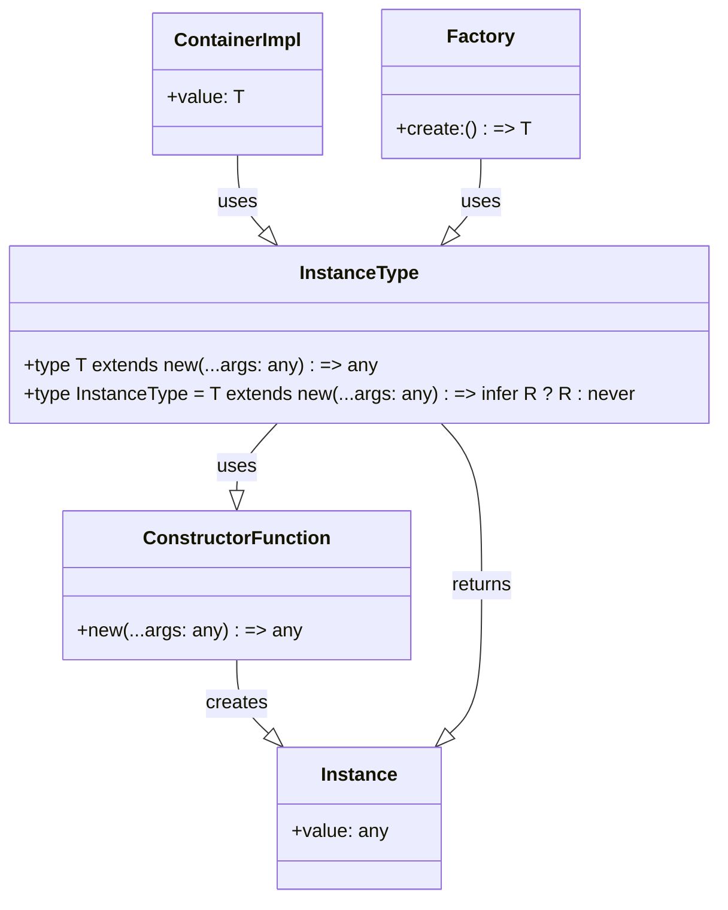

## Introduction
The **InstanceType<T>** type in TypeScript is a utility type that returns the instance type of a constructor function. In other words, it extracts the type of the object that is created when a constructor function is called with the `new` keyword. This type is particularly useful when working with classes and constructor functions, as it allows you to get the type of the object that is created without having to manually specify it. **InstanceType<T>** is a part of the TypeScript type system, which provides a way to specify the type of an object, function, or variable.

> **Note:** The **InstanceType<T>** type is often used in conjunction with other utility types, such as **ConstructorParameters<T>**, to create more complex and flexible type definitions.

In real-world scenarios, **InstanceType<T>** is useful when working with libraries or frameworks that use constructor functions to create objects. For example, in a React application, you might use **InstanceType<T>** to get the type of a component that is created using a constructor function.

## Core Concepts
The **InstanceType<T>** type is defined as follows:
```typescript
type InstanceType<T extends new (...args: any) => any> = T extends new (...args: any) => infer R ? R : never;
```
This definition uses the `infer` keyword to infer the type of the object that is created when the constructor function is called. The `never` type is used as a fallback in case the `infer` keyword is unable to infer the type.

> **Tip:** To understand how **InstanceType<T>** works, it's helpful to break down the definition into smaller parts. The `T extends new (...args: any) => any` part specifies that `T` must be a constructor function that takes any number of arguments. The `infer R` part infers the type of the object that is created when the constructor function is called.

The key terminology to understand when working with **InstanceType<T>** is:

* **Constructor function**: A function that is used to create objects using the `new` keyword.
* **Instance type**: The type of the object that is created when a constructor function is called.
* **Infer**: A keyword used to infer the type of a value or expression.

## How It Works Internally
When you use **InstanceType<T>**, TypeScript performs the following steps:

1. Checks if `T` is a constructor function that takes any number of arguments.
2. If `T` is a constructor function, TypeScript infers the type of the object that is created when `T` is called with the `new` keyword.
3. If the inference is successful, TypeScript returns the inferred type. Otherwise, it returns the `never` type.

> **Warning:** If you try to use **InstanceType<T>** with a type that is not a constructor function, TypeScript will raise an error.

## Code Examples
### Example 1: Basic usage
```typescript
class Person {
  constructor(public name: string) {}
}

type PersonInstance = InstanceType<typeof Person>;
// type PersonInstance = Person

const person: PersonInstance = new Person('John');
console.log(person.name); // Output: John
```
In this example, we define a `Person` class and use **InstanceType<T>** to get the type of the object that is created when the `Person` constructor function is called.

### Example 2: Real-world pattern
```typescript
interface Container<T> {
  value: T;
}

class ContainerImpl<T> implements Container<T> {
  constructor(public value: T) {}
}

type ContainerInstance = InstanceType<typeof ContainerImpl<string>>;
// type ContainerInstance = ContainerImpl<string>

const container: ContainerInstance = new ContainerImpl('hello');
console.log(container.value); // Output: hello
```
In this example, we define a `ContainerImpl` class that implements the `Container` interface. We use **InstanceType<T>** to get the type of the object that is created when the `ContainerImpl` constructor function is called with a `string` type parameter.

### Example 3: Advanced usage
```typescript
class Factory<T> {
  constructor(public create: () => T) {}
}

type FactoryInstance = InstanceType<typeof Factory>;
// type FactoryInstance = Factory<unknown>

const factory: FactoryInstance = new Factory(() => ({ foo: 'bar' }));
console.log(factory.create()); // Output: { foo: 'bar' }
```
In this example, we define a `Factory` class that takes a function as a constructor argument. We use **InstanceType<T>** to get the type of the object that is created when the `Factory` constructor function is called.

## Visual Diagram

This diagram illustrates the relationship between **InstanceType<T>**, constructor functions, and instances.

> **Note:** The diagram shows how **InstanceType<T>** is used to get the type of the object that is created when a constructor function is called.

## Comparison
| Approach | Time Complexity | Space Complexity | Pros | Cons | Best For |
| --- | --- | --- | --- | --- | --- |
| **InstanceType<T>** | O(1) | O(1) | Provides a way to get the type of an object created by a constructor function | Limited to constructor functions | Working with libraries or frameworks that use constructor functions |
| **ConstructorParameters<T>** | O(1) | O(1) | Provides a way to get the type of the parameters of a constructor function | Limited to constructor functions | Working with libraries or frameworks that use constructor functions |
| **ReturnType<T>** | O(1) | O(1) | Provides a way to get the type of the return value of a function | Limited to functions | Working with functions that return values |
| **typeof** | O(1) | O(1) | Provides a way to get the type of a value | Limited to values | Working with values that have a known type |

## Real-world Use Cases
1. **React**: When creating React components, you can use **InstanceType<T>** to get the type of the component that is created when a constructor function is called.
2. **Angular**: When creating Angular components, you can use **InstanceType<T>** to get the type of the component that is created when a constructor function is called.
3. **Vue.js**: When creating Vue.js components, you can use **InstanceType<T>** to get the type of the component that is created when a constructor function is called.

> **Tip:** When working with libraries or frameworks that use constructor functions, **InstanceType<T>** can be a powerful tool for getting the type of the object that is created.

## Common Pitfalls
1. **Using **InstanceType<T>** with a non-constructor function**: If you try to use **InstanceType<T>** with a function that is not a constructor function, TypeScript will raise an error.
```typescript
function foo() {}
type FooInstance = InstanceType<typeof foo>; // Error: Type 'foo' does not satisfy the constraint 'new (...args: any) => any'.
```
2. **Using **InstanceType<T>** with a type that is not a constructor function**: If you try to use **InstanceType<T>** with a type that is not a constructor function, TypeScript will raise an error.
```typescript
type Foo = string;
type FooInstance = InstanceType<Foo>; // Error: Type 'Foo' does not satisfy the constraint 'new (...args: any) => any'.
```
3. **Not using **InstanceType<T>** with a constructor function**: If you forget to use **InstanceType<T>** with a constructor function, you may end up with a type that is not accurate.
```typescript
class Person {
  constructor(public name: string) {}
}
type PersonInstance = typeof Person; // type PersonInstance = typeof Person
const person: PersonInstance = new Person('John'); // Error: Type 'Person' is not assignable to type 'typeof Person'.
```
4. **Not handling the **never** type**: If you use **InstanceType<T>** with a type that is not a constructor function, TypeScript will return the **never** type. You should handle this case to avoid errors.
```typescript
type Foo = never;
type FooInstance = InstanceType<Foo>; // type FooInstance = never
const foo: FooInstance = {} as any; // Error: Type 'object' is not assignable to type 'never'.
```

## Interview Tips
1. **What is **InstanceType<T>****: You should be able to explain what **InstanceType<T>** is and how it works.
```typescript
// Example answer:
// InstanceType<T> is a utility type that returns the instance type of a constructor function.
// It's used to get the type of the object that is created when a constructor function is called with the new keyword.
```
2. **How does **InstanceType<T>** work**: You should be able to explain how **InstanceType<T>** works internally.
```typescript
// Example answer:
// InstanceType<T> works by inferring the type of the object that is created when a constructor function is called.
// It uses the infer keyword to infer the type of the object.
```
3. **What are some use cases for **InstanceType<T>****: You should be able to provide some examples of use cases for **InstanceType<T>**.
```typescript
// Example answer:
// InstanceType<T> is useful when working with libraries or frameworks that use constructor functions.
// For example, in React, you can use InstanceType<T> to get the type of a component that is created when a constructor function is called.
```

## Key Takeaways
* **InstanceType<T>** is a utility type that returns the instance type of a constructor function.
* **InstanceType<T>** is used to get the type of the object that is created when a constructor function is called with the `new` keyword.
* **InstanceType<T>** works by inferring the type of the object that is created when a constructor function is called.
* **InstanceType<T>** is useful when working with libraries or frameworks that use constructor functions.
* **InstanceType<T>** has a time complexity of O(1) and a space complexity of O(1).
* **InstanceType<T>** can be used with other utility types, such as **ConstructorParameters<T>**, to create more complex and flexible type definitions.
* **InstanceType<T>** should be used with caution, as it can return the **never** type if used with a type that is not a constructor function.
* **InstanceType<T>** is a powerful tool for getting the type of an object that is created when a constructor function is called.