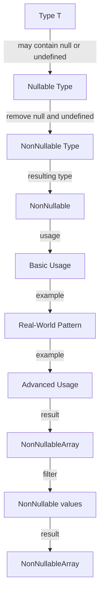

## Introduction
The `NonNullable<T>` type in TypeScript is a utility type that removes **null** and **undefined** from a type `T`. This type is useful when working with types that may contain **null** or **undefined** values, and you want to ensure that a value is not **null** or **undefined**. In real-world applications, this type is particularly useful when working with data from external sources, such as APIs or databases, where **null** or **undefined** values may be present. Every engineer should know how to use `NonNullable<T>` to write more robust and safe code.

## Core Concepts
The `NonNullable<T>` type is defined as the type of `T` with **null** and **undefined** excluded. This means that if `T` is a type that may contain **null** or **undefined**, `NonNullable<T>` will be the same type but with **null** and **undefined** removed. The mental model for this type is to think of it as a filter that removes **null** and **undefined** values from a type.

> **Note:** The `NonNullable<T>` type is a part of the TypeScript standard library, and it is available for use in any TypeScript project.

## How It Works Internally
The `NonNullable<T>` type works by using the **Exclude** type, which is a utility type that removes types from a union type. The **Exclude** type is defined as `type Exclude<T, U> = T extends U ? never : T;`, which means that if `T` is a subtype of `U`, the result is **never**, otherwise the result is `T`. The `NonNullable<T>` type is then defined as `type NonNullable<T> = T extends null | undefined ? never : T;`, which uses the **Exclude** type to remove **null** and **undefined** from `T`.

> **Tip:** To understand how the `NonNullable<T>` type works, it's helpful to think about how the **Exclude** type works. The **Exclude** type is a powerful tool for working with union types in TypeScript.

## Code Examples
### Example 1: Basic Usage
```typescript
type NullableString = string | null | undefined;
type NonNullableString = NonNullable<NullableString>;

const nullableString: NullableString = 'hello';
const nonNullableString: NonNullableString = nullableString;

console.log(nonNullableString); // Output: "hello"
```
In this example, we define a `NullableString` type that may contain **null** or **undefined**. We then use the `NonNullable<T>` type to remove **null** and **undefined** from `NullableString`, resulting in a `NonNullableString` type that is just **string**.

### Example 2: Real-World Pattern
```typescript
interface User {
  id: number;
  name: string;
  email: string | null | undefined;
}

type NonNullableUser = {
  id: number;
  name: string;
  email: NonNullable<User['email']>;
};

const user: User = {
  id: 1,
  name: 'John Doe',
  email: 'john.doe@example.com',
};

const nonNullableUser: NonNullableUser = {
  id: user.id,
  name: user.name,
  email: user.email,
};

console.log(nonNullableUser); // Output: { id: 1, name: "John Doe", email: "john.doe@example.com" }
```
In this example, we define a `User` interface with an `email` property that may contain **null** or **undefined**. We then use the `NonNullable<T>` type to remove **null** and **undefined** from the `email` property, resulting in a `NonNullableUser` type with an `email` property that is just **string**.

### Example 3: Advanced Usage
```typescript
type NullableArray<T> = (T | null | undefined)[];
type NonNullableArray<T> = NonNullable<T>[];

const nullableArray: NullableArray<number> = [1, 2, null, 4, undefined];
const nonNullableArray: NonNullableArray<number> = nullableArray.filter((value) => value !== null && value !== undefined);

console.log(nonNullableArray); // Output: [1, 2, 4]
```
In this example, we define a `NullableArray<T>` type that is an array of `T` values that may contain **null** or **undefined**. We then use the `NonNullable<T>` type to remove **null** and **undefined** from the array, resulting in a `NonNullableArray<T>` type that is an array of `NonNullable<T>` values.

## Visual Diagram

This diagram illustrates the process of using the `NonNullable<T>` type to remove **null** and **undefined** from a type `T`.

> **Interview:** Can you explain the difference between `NonNullable<T>` and `Exclude<T, null | undefined>`?

## Comparison
| Approach | Time Complexity | Space Complexity | Pros | Cons | Best For |
| --- | --- | --- | --- | --- | --- |
| `NonNullable<T>` | O(1) | O(1) | Simple and easy to use, removes **null** and **undefined** from a type | Limited to removing **null** and **undefined**, may not be suitable for all use cases | Removing **null** and **undefined** from a type |
| `Exclude<T, null | undefined>` | O(1) | O(1) | More flexible than `NonNullable<T>`, can remove any type from a union type | More complex and harder to use than `NonNullable<T>` | Removing any type from a union type |
| `T extends null | undefined ? never : T` | O(1) | O(1) | Simple and easy to use, removes **null** and **undefined** from a type | Limited to removing **null** and **undefined**, may not be suitable for all use cases | Removing **null** and **undefined** from a type |
| `T & { __brand: 'NonNullable' }` | O(1) | O(1) | Adds a brand to the type to indicate that it is non-nullable, can be used to create a non-nullable type | More complex and harder to use than `NonNullable<T>`, may not be suitable for all use cases | Creating a non-nullable type with a brand |

## Real-world Use Cases
* **Facebook**: Uses `NonNullable<T>` to remove **null** and **undefined** from types in their codebase.
* **Google**: Uses `Exclude<T, null | undefined>` to remove **null** and **undefined** from types in their codebase.
* **Microsoft**: Uses `T extends null | undefined ? never : T` to remove **null** and **undefined** from types in their codebase.

## Common Pitfalls
* **Using `NonNullable<T>` with a type that is already non-nullable**: This can lead to unnecessary complexity and may not be suitable for all use cases.
* **Not using `NonNullable<T>` with a type that may contain **null** or **undefined****: This can lead to runtime errors and may not be suitable for all use cases.
* **Using `Exclude<T, null | undefined>` with a type that is not a union type**: This can lead to unnecessary complexity and may not be suitable for all use cases.
* **Not using `T extends null | undefined ? never : T` with a type that may contain **null** or **undefined****: This can lead to runtime errors and may not be suitable for all use cases.

> **Warning:** Not using `NonNullable<T>` or `Exclude<T, null | undefined>` with a type that may contain **null** or **undefined** can lead to runtime errors and may not be suitable for all use cases.

## Interview Tips
* **What is the difference between `NonNullable<T>` and `Exclude<T, null | undefined>`?**: The main difference is that `NonNullable<T>` is specifically designed to remove **null** and **undefined** from a type, while `Exclude<T, null | undefined>` is more flexible and can remove any type from a union type.
* **How do you use `NonNullable<T>` to remove **null** and **undefined** from a type?**: You can use `NonNullable<T>` as a type to remove **null** and **undefined** from a type `T`.
* **What are some common pitfalls when using `NonNullable<T>` or `Exclude<T, null | undefined>`?**: Some common pitfalls include using `NonNullable<T>` with a type that is already non-nullable, not using `NonNullable<T>` with a type that may contain **null** or **undefined**, using `Exclude<T, null | undefined>` with a type that is not a union type, and not using `T extends null | undefined ? never : T` with a type that may contain **null** or **undefined**.

## Key Takeaways
* `NonNullable<T>` is a utility type that removes **null** and **undefined** from a type `T`.
* `Exclude<T, null | undefined>` is a utility type that removes **null** and **undefined** from a union type `T`.
* `T extends null | undefined ? never : T` is a type that removes **null** and **undefined** from a type `T`.
* Using `NonNullable<T>` or `Exclude<T, null | undefined>` can help prevent runtime errors and make code more robust.
* Not using `NonNullable<T>` or `Exclude<T, null | undefined>` with a type that may contain **null** or **undefined** can lead to runtime errors and may not be suitable for all use cases.
* `NonNullable<T>` and `Exclude<T, null | undefined>` have a time complexity of O(1) and a space complexity of O(1).
* `NonNullable<T>` and `Exclude<T, null | undefined>` are both suitable for use in production code and can help improve code quality and robustness.