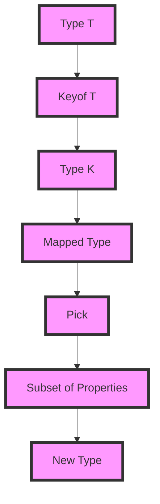

## Introduction
The **Pick<T, K>** utility type in TypeScript is a powerful tool for creating subsets of properties from existing types. It allows you to select a subset of properties from a type `T` based on a type `K`, which represents the keys of the properties you want to select. This utility type is essential in real-world applications where you need to work with complex data structures and need to extract specific properties from them. For instance, when working with large objects, you might want to create a new object that only contains a specific set of properties. **Pick<T, K>** makes this process straightforward and type-safe.

## Core Concepts
To understand **Pick<T, K>**, you need to grasp the concepts of **type parameters**, **keyof**, and **mapped types**. 
- **Type parameters** are placeholders for types that are specified when a type or function is instantiated.
- The **keyof** operator returns a type that represents the union of the property names of a type.
- **Mapped types** are a way to transform one type into another by applying a transformation to each property.

The **Pick<T, K>** type uses these concepts to create a new type that includes only the properties specified by the type `K`.

## How It Works Internally
Internally, **Pick<T, K>** uses mapped types to create a new type that includes only the properties specified by `K`. The process can be broken down into the following steps:
1. **Keyof T**: Get the type that represents the union of the property names of `T`.
2. **K**: Specify the type that represents the keys of the properties you want to select.
3. **Mapped Type**: Create a new type that includes only the properties where the key is in `K`.

This process ensures that the resulting type only includes the properties specified by `K`, making it a powerful tool for creating subsets of properties.

## Code Examples
### Example 1: Basic Usage
```typescript
interface User {
    id: number;
    name: string;
    age: number;
}

type UserName = Pick<User, 'name'>;
// type UserName = { name: string; }

const user: UserName = { name: 'John Doe' };
console.log(user); // { name: 'John Doe' }
```
In this example, we use **Pick<T, K>** to create a new type `UserName` that only includes the `name` property from the `User` interface.

### Example 2: Real-world Pattern
```typescript
interface Product {
    id: number;
    name: string;
    description: string;
    price: number;
}

type ProductSummary = Pick<Product, 'id' | 'name' | 'price'>;
// type ProductSummary = { id: number; name: string; price: number; }

const productSummary: ProductSummary = {
    id: 1,
    name: 'Example Product',
    price: 19.99,
};
console.log(productSummary); // { id: 1, name: 'Example Product', price: 19.99 }
```
In this example, we use **Pick<T, K>** to create a new type `ProductSummary` that includes only the `id`, `name`, and `price` properties from the `Product` interface.

### Example 3: Advanced Usage
```typescript
interface User {
    id: number;
    name: string;
    age: number;
    address: {
        street: string;
        city: string;
        state: string;
        zip: string;
    };
}

type UserAddress = Pick<User, 'address'>;
// type UserAddress = { address: { street: string; city: string; state: string; zip: string; }; }

const userAddress: UserAddress = {
    address: {
        street: '123 Main St',
        city: 'Anytown',
        state: 'CA',
        zip: '12345',
    },
};
console.log(userAddress); // { address: { street: '123 Main St', city: 'Anytown', state: 'CA', zip: '12345' } }
```
In this example, we use **Pick<T, K>** to create a new type `UserAddress` that only includes the `address` property from the `User` interface.

> **Note:** The **Pick<T, K>** type is a powerful tool for creating subsets of properties, but it can also be used to create complex types that are difficult to understand. Use it judiciously and always consider the readability of your code.

## Visual Diagram

This diagram illustrates the process of creating a subset of properties using the **Pick<T, K>** type.

## Comparison
| Approach | Time Complexity | Space Complexity | Pros | Cons | Best For |
| --- | --- | --- | --- | --- | --- |
| **Pick<T, K>** | O(1) | O(1) | Easy to use, type-safe | Can be complex to understand | Creating subsets of properties |
| **Mapped Type** | O(n) | O(n) | Flexible, powerful | Can be verbose | Creating complex types |
| **Interface** | O(1) | O(1) | Simple, easy to understand | Limited flexibility | Creating simple types |
| **Type Alias** | O(1) | O(1) | Simple, easy to understand | Limited flexibility | Creating simple types |

> **Tip:** When deciding which approach to use, consider the complexity of your type and the readability of your code. **Pick<T, K>** is a good choice when you need to create a subset of properties, but **Mapped Type** may be a better choice when you need to create a complex type.

## Real-world Use Cases
1. **Facebook**: Facebook uses TypeScript to build its web applications, and **Pick<T, K>** is likely used to create subsets of properties in their codebase.
2. **Microsoft**: Microsoft uses TypeScript to build its Azure cloud platform, and **Pick<T, K>** is likely used to create subsets of properties in their codebase.
3. **Google**: Google uses TypeScript to build its Google Cloud Platform, and **Pick<T, K>** is likely used to create subsets of properties in their codebase.

## Common Pitfalls
1. **Using Pick<T, K> with a type that has no properties**: This will result in an empty type, which can lead to errors if not handled properly.
```typescript
interface Empty {}
type EmptyPick = Pick<Empty, 'nonexistent'>;
// type EmptyPick = {}
```
2. **Using Pick<T, K> with a type that has properties that are not keys**: This will result in a type error, as **Pick<T, K>** expects `K` to be a type that represents the keys of the properties.
```typescript
interface User {
    id: number;
    name: string;
}
type UserPick = Pick<User, 'nonexistent'>;
// Error: Type '"nonexistent"' is not assignable to type 'keyof User'.
```
3. **Using Pick<T, K> with a type that has properties that are not optional**: This will result in a type that has required properties, which can lead to errors if not handled properly.
```typescript
interface User {
    id: number;
    name: string;
}
type UserPick = Pick<User, 'id' | 'name'>;
// type UserPick = { id: number; name: string; }
```
4. **Not using Pick<T, K> with a type that has a large number of properties**: This can lead to performance issues, as **Pick<T, K>** has to iterate over all the properties of the type.

> **Warning:** Be careful when using **Pick<T, K>** with complex types, as it can lead to performance issues and type errors.

## Interview Tips
1. **What is the purpose of Pick<T, K>?**: The purpose of **Pick<T, K>** is to create a subset of properties from a type `T` based on a type `K`.
2. **How does Pick<T, K> work internally?**: **Pick<T, K>** uses mapped types to create a new type that includes only the properties specified by `K`.
3. **What are some common use cases for Pick<T, K>?**: **Pick<T, K>** is commonly used to create subsets of properties in web applications, such as creating a summary of a product or a user.

> **Interview:** When asked about **Pick<T, K>**, be sure to explain its purpose, how it works internally, and its common use cases.

## Key Takeaways
* **Pick<T, K>** is a utility type that creates a subset of properties from a type `T` based on a type `K`.
* **Pick<T, K>** uses mapped types to create a new type that includes only the properties specified by `K`.
* **Pick<T, K>** has a time complexity of O(1) and a space complexity of O(1).
* **Pick<T, K>** is commonly used to create subsets of properties in web applications.
* **Pick<T, K>** can lead to performance issues and type errors if not used carefully.
* **Pick<T, K>** is a powerful tool for creating complex types, but it requires careful consideration of its usage and implications.
* **Pick<T, K>** is a type-safe way to create subsets of properties, which can help prevent type errors and improve code maintainability.
* **Pick<T, K>** can be used with other utility types, such as **Omit<T, K>**, to create complex types.
* **Pick<T, K>** is a part of the TypeScript standard library, which means it is widely supported and well-documented.